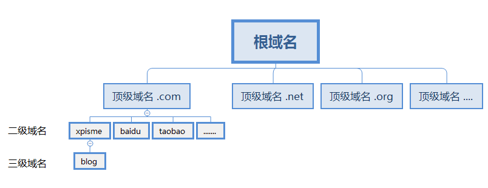
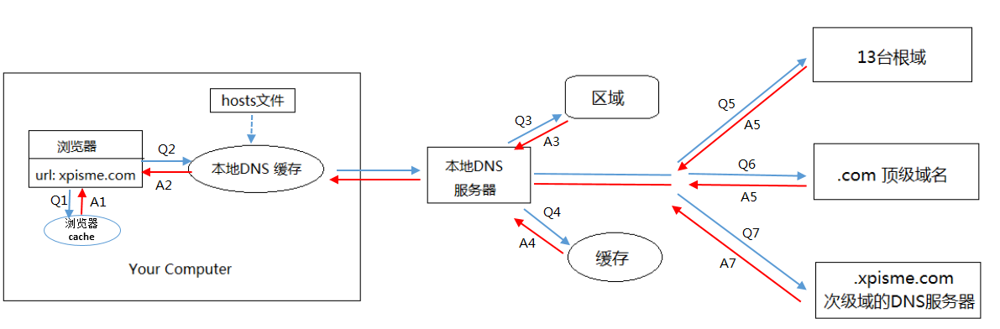
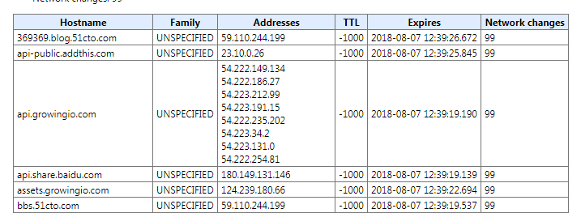
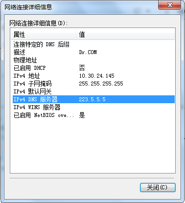
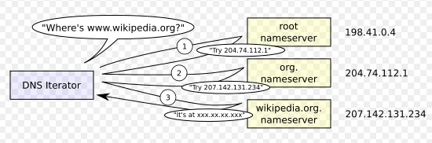

 一起聊聊DNS 
<!-- more -->
## hosts文件
在网络中，联网的计算机之间都是经过IP地址进行通信的。但是IP地址是一串数字，不容易记忆。

如果每个IP都有一个名字的话，就容易记住了。因此对每个IP地址均有一个名字。例如
```
220.181.57.216  zhangsan
106.39.167.118  lisi
140.205.220.96  wangwu
...
```

在互联网发展早期，上述这些对应信息，存在hosts文件中。联网的计算机本地都有hosts文件，hosts文件的信息由**互联网信息中心**管理一份完整hosts文件。如果新加入一台计算机，则所有的计算机都需要从**互联网信息中心**拉取最新hosts文件。

例如：`220.181.57.216  zhangsan`要向`140.205.220.96  wangwu`进行通信， `zhangsan`只知道向`wangwu`通信，先在hosts文件中查找`wangwu`对应的IP地址`140.205.220.96`，然后在向`140.205.220.96`通信即可。

- 现在的windows中 `C:\Windows\System32\drivers\etc\hosts` 文件就是早期互联网发展的产物

随着联网的计算机越来越多，这种集中管理主机名和IP地址的弊端就出现了。
1. 处理的效率低下，由此演化出DNS系统。
2. 名字没有统一管理，后面设计成域名。

## DNS 系统
DNS系统是维护一个用来表示主机名和IP对应关系的数据库。如果新联网一台主机，只需要将主机名和IP地址在数据库中新增一条记录即可。
根据域名查找IP，简单可理解为根据主机名从数据库中获取IP地址。

## 主机名被设计成域名
域名的组成为
```
主机名.二级域名.顶级域名.根域名
```

例子： `www.xpisme.com`真正的域名是`www.xpisme.com.root`。因为所有的域名后缀都是`.root`，所以就省略了。

`.root`是根域名，
`.com`是顶级域名`top-level domain`，除了`.com`是顶级域名外，`.com`、`.org`、`.net`、`.gov`、`.edu`也是顶级域名。
`xpisme`是二级域名，二级域名是可以申请注册的。`www.fourth.blog.xpisme.com` `.blog`是三级域名，`.fourth`是四级域名，依次类推。
`www`是主机名 `host name`

- 练练手
URL: http://www.example.net/index.html
顶级域名(Top-level domain): net
二级域名(Second-level domain): example
主机名(Host name): www



## 域名查找IP地址
从浏览器中输入域名，经历了什么，找到了IP地址。都知道中间有很多缓存，具体是哪些缓存，咱们一起剖析一下。



1. 在浏览器中输入`xpisme.com`域名，首先会找浏览器缓存的DNS信息。以chrome为例，可通过`chrome://net-internals/#dns`查看。

2. 然后在本机dns缓存中查找。其中hosts文件会加载到内存中，也就是本机dns缓存。查看（windows）本机dns缓存`ipconfig/displaydns`。
3. 若上面方式没找到。则会在本地DNS服务器查找，DNS服务器的地址。如果要查询的域名，包含在本地配置区域资源中，则返回解析结果给客户机，完成域名解析，此解析具有权威性。

4. 若上面方式没找到。则会在该DNS服务器有缓存服务器查找，若存在IP地址映射，则直接返回，此解析不具有权威性。
5. 若上面方式没找到。则会向13台根DNS域名服务器请求。13台根域名服务器会告诉`.com`的顶级域名服务器的IP地址。
6. 然后在顶级域名服务器的IP地址查找，顶级域名服务器会告诉`xpisme.com`的次级域名服务器地址。
7. 找到次级域名服务器地址，找到`xpisme.com`域名对应的IP地址，则返回。

5、6、7 三步是服务器之间迭代查询的过程。维基百科图片奉上



参考文献
http://blog.51cto.com/xuweitao/1911227
https://en.wikipedia.org/wiki/Domain_Name_System
http://blog.51cto.com/369369/812889
http://www.ruanyifeng.com/blog/2016/06/dns.html
