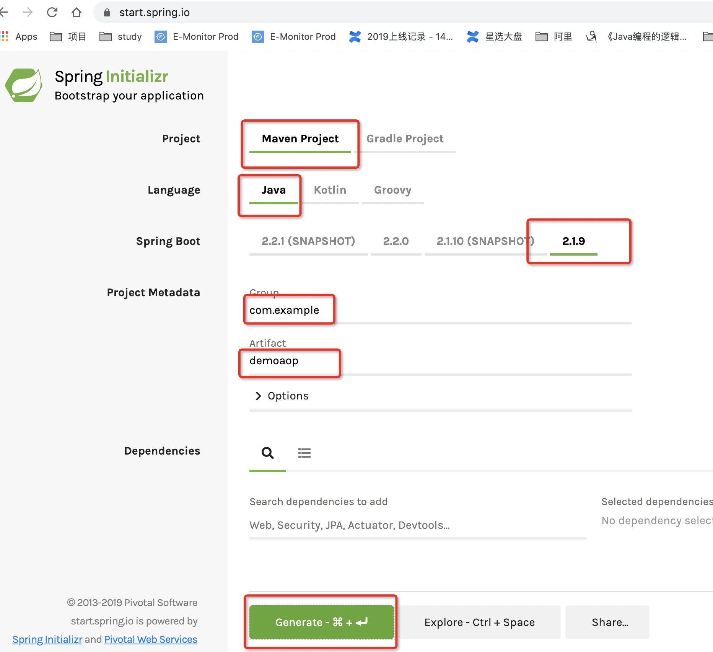
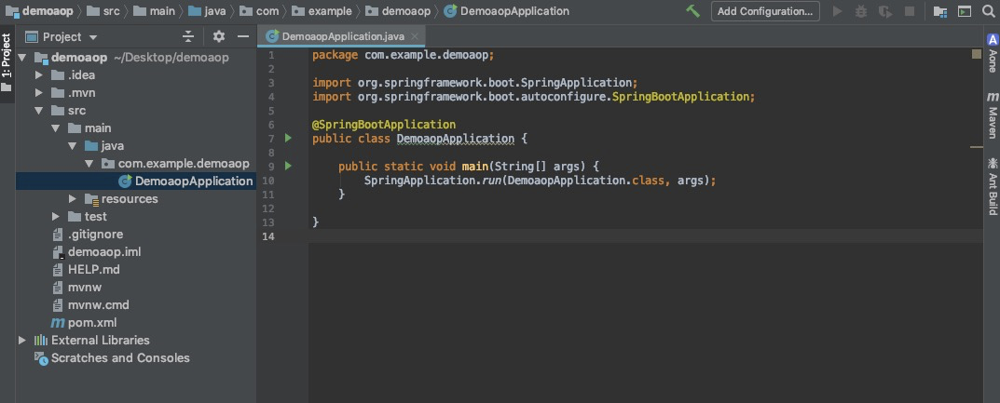
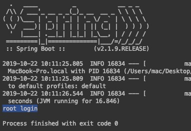

<!-- more -->
> AOP (Aspect Oriented Programming) 面向切面编程。

> 感觉名字吊的不行，其实也就那样。

> 说下自己的理解：其实就是不侵入业务代码，针对业务代码做的一些操作。做的这些操作也是写的一些代码,

> 写的这些代码和业务代码一起编译的时候，这些代码就会找到业务代码中具体的位置，植入到业务代码中，

> 最终编译成JAVA的字节码，就可以实现相应的功能。

- 概念只是概念，动手操作，才能加深理解。

## 使用

### 下载spring [https://start.spring.io](https://start.spring.io)



### 解压&idea 打开




### 写业务代码
- 用户登录的service

```java
package com.example.demoaop;

import org.springframework.stereotype.Service;

/**
 * @author xinpeng.guo
 * @date 2019-10-22 10:06
 */
@Service
public class LoginService {
    public void login(String user) {
        System.out.println( user + " login");
    }
}
```

- Application.java

```java
package com.example.demoaop;

import org.springframework.boot.SpringApplication;
import org.springframework.boot.autoconfigure.SpringBootApplication;
import org.springframework.context.ApplicationContext;

@SpringBootApplication
public class DemoaopApplication {

	public static void main(String[] args) {
		ApplicationContext applicationContext = SpringApplication.run(DemoaopApplication.class, args);

		LoginService loginService = applicationContext.getBean(LoginService.class);
		loginService.login("root");
	}
}
```

- 执行


- 执行结果




## 定义切面
想要登录成功之后打个日志

### pom 引入依赖
```java
		<dependency>
			<groupId>org.springframework.boot</groupId>
			<artifactId>spring-boot-starter-aop</artifactId>
			<version>2.2.0.RELEASE</version>
		</dependency>
```

### 切面类ServiceAspect
```java
package com.example.demoaop;

import org.aspectj.lang.annotation.AfterReturning;
import org.aspectj.lang.annotation.Aspect;
import org.springframework.stereotype.Service;

/**
 * @author xinpeng.guo
 * @date 2019-10-22 10:14
 */
@Aspect
@Service
public class ServiceAspect {
    @AfterReturning("execution(public void LoginService.login(String))")
    public void log() {
        System.out.println("log");
    }
}
```

### 执行结果

- LoginService 输出 root login
- ServiceAspect 输出 log


### 详解
很清楚看到ServiceAspect.java是和业务代码分离，但是能够起到在业务代码中编写的作用。实际上的原理就是java是编译执行的语言，在编译的时候，把这个切面的代码按照规则插入到业务代码中。这样生成的字节码，就可以执行切面的代码了。

其中重要的有几个点

1. 定义的切面类，要引入两个注解，一个是 `@Aspect`  用来定义这个类是切面类，另一个是`@Service` 用来说明是一个bean。

2. 定义的方法名可以是任意的 `log()`

3. 注解 `@AfterReturning` 表示执行这个方法的时机，方法返回之后在执行，那是什么方法呢？

4. 具体方法定义为 `(``"execution(public void LoginService.login(String))"``)`  就是在执行 这个方法的时候。

总结：把切面类中的方法放在指定类，指定时机执行。


## 触发时机
> 这个触发时机，就是切面的代码植入到业务代码哪个部分。

- Before
- After
- Around
- AfterReturning
- AfterThrowing

### Before
> Run advice before the a method execution.

> 在一个方法前执行


```java
    @Before("execution(public void LoginService.login(String))")
    public void beforeExec() {
        System.out.println("@Before 在方法前执行");
    }
```

### After
> Run advice after the method execution, regardless of its outcome.

> 不管方法是否成功，都会在方法结束后执行


```java
    @After("execution(public void LoginService.login(String))")
    public void afterExec() {
        System.out.println("@After 在执行方法后执行");
    }
```

### Around
> Run advice before and after the advised method is invoked.

> 写调用函数，然后想怎么写其他逻辑就怎么写其他逻辑


```java
    @Around("execution(public void LoginService.login(String))")
    public void round(ProceedingJoinPoint point) throws Throwable{
        System.out.println("@Around 环绕开始");
        point.proceed(); //执行目标方法
        System.out.println("@Around 环绕结束");
    }
```

- 这里引入了ProceedingJoinPoint，这个方法中有`proceed()`方法，就是直接调用对应的函数。

- 自己试一下这些代码，对理解起来非常有帮助

**其实这个代码是有问题的？如果有返回值呢，咋办？**

```java
    @Around("execution(public void LoginService.login(String))")
    public void round(ProceedingJoinPoint point) throws Throwable{
        Object result = null;
        System.out.println("@Around 环绕开始");
        point.proceed(); //执行目标方法
        System.out.println("@Around 环绕结束");
        return result;
    }
```

### AfterReturning

> Run advice after the a method execution only if method completes successfully.

> 只有在方法执行成功后，才会执行


```java
    @AfterReturning("execution(public void LoginService.login(String))")
    public void afterReturn() {
        System.out.println("@afterReturn 在执行方法结束 该方法必须是成功执行的");
    }
```

### AfterThrowing
> Run advice after the a method execution only if method exits by throwing an exception.

> 当方法抛出异常时，才会执行该方法


```java
    @AfterThrowing("execution(public void LoginService.login(String))")
    public void afterThrow() {
        System.out.println("@afterThrow 在抛出异常时执行");
    }
```

### 总结
这些都是触发的时机，按照英文原来的意思就是advice，advice分为以下5种

- Before
- After
- Around
- AfterReturning
- AfterThrowing

大部分文档advice翻译过来称作增强，增强分几种，就是上面这5种。大概意思也就清楚了，这5中增强指的是什么时机增强，什么情况下触发。<br />这种切面的方式就非常好了，可以统一操作，也不用切入业务代码，非常好玩。

上面的这些例子都是指定的方法`execution(public void LoginService.login(String))`当然除了这些指定，还有更丰富的指定玩法。

## 指定规则
在上面的例子中可以看到`execution(public void LoginService.login(String))` 当然除了这样的方式更丰富的方式

- execution
- within
- target
- this
- args

### execution
#### 通过方法签名定义切点

- `execution(public * *(..)) `匹配所有目标类的public方法。 第一个*代表返回类型，第二个*代表方法名，而..代表任意入参的方法
- `execution(* *To(..))` 匹配目标类所有以To为后缀的方法。 第一个*代表返回类型，而*To代表任意以To为后缀的方法。

```java
	// log为开头
	@After("execution(* log* (..))")
    public void after() {
        System.out.println("xxxx");
    }
```

#### 通过类定义切点

- `execution(* LoginService.*(..))`匹配Cleaner接口的所有方法（包括实现类中覆写的方法）， 第一个`*` 代表返回任意类型 ，`LoginService.*`代表Cleaner接口中的所有方法

```java
    @After("execution(* LoginService.* (..))")
    public void after() {
        System.out.println("xxxx");
    }
```

#### 通过类包定义切点

- 在类名模式串中，`.*`表示包下的所有类，`..*`表示包、子孙包下的所有类
- `execution(* com.xgj.*(..))`匹配`com.xgj`包下所有类的所有方法
- `execution(* com.xgj..*(..))`匹配`com.xgj`包、子孙包下所有类的所有方法.比如 `com.xgj.dao` ,`com.xgj.service,com.xgj.dao.user`包下所有类的所有方法都匹配。 当 ..出现在类名中时，必须后面跟*表示子孙包下的所有类。
- `execution(* com..*Dao.find*(..))`匹配包名前缀为`com`的任何包下类名后缀为`Dao`的方法，方法名必须以`find`为前缀， 比如`com.xgj.UserDao#findUserById()`方法都是匹配切点。

```java
    @After("execution(* com.example..* (..))")
    public void after() {
        System.out.println("xxxx");
    }
```


## 参考资料
[https://docs.spring.io/spring/docs/current/spring-framework-reference/core.html#aop](https://docs.spring.io/spring/docs/current/spring-framework-reference/core.html#aop)


