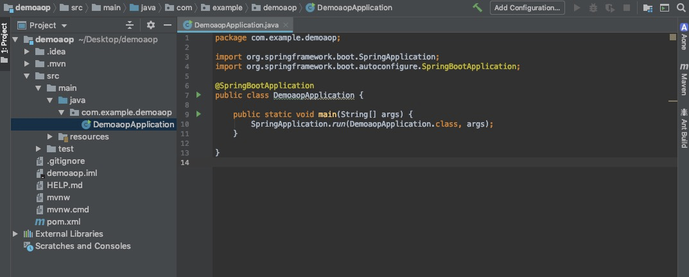
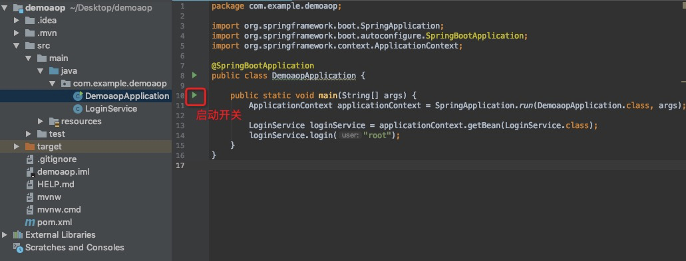
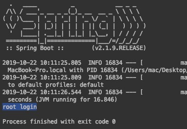
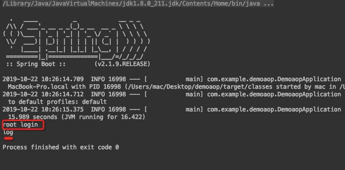

# java动态代理 AOP原理


# 静态代理

> 先说静态代理，早说动态代理。

## 基础的类

### 定义接口
```
public interface IService {
    public void sayHello();
}
```
### 定义类（一定要实现IService接口）
```
/**
 * 正常的情况下，只要直接调用这个就可以了。
 */
public class RealService implements IService {
    @Override
    public void sayHello() {
        System.out.println("say Hello");
    }
}
```

### 定义代理类(一定要实现IService接口)
```

/**
 * 代理类必须实现Iservice接口
 */
public class TraceProxy implements IService {
    /**
     * 存储真正类的对象(现实的情况是 直接new该对象，然后进行调用)
     * 
     * 但是咱们想通过代理来实现
     */
    private IService realService;

    /**
     * 创建的时候，就把该真正的对象放到该代理类的一个属性里。
     * @param realService
     */
    public TraceProxy(IService realService) {
        this.realService = realService;
    }

    /**
     * 由于实现了IService接口，所以一定会有和真正类相同的接口，因为他们都实现了IService接口。
     * 在代理类调用的时候也非常方便
     */
    @Override
    public void sayHello() {
        // 加一些操作：比如加个log
        System.out.println("entering sayHello");
        // 这里才是 真正类 调用的地方
        this.realService.sayHello();
        // 加一些操作：比如加个log
        System.out.println("leaving sayHello");
    }
}

```

## 调用的地方
```
public class SimpleStaticProxyDemo {

    /**
     * 调用的地方
     * @param args
     */
    public static void main(String[] args) {
        // 创建需要代理的对象
        IService realService = new RealService();
        // 创建代理
        TraceProxy traceProxy = new TraceProxy(realService);
        // 代理进行访问
        traceProxy.sayHello();
    }
}
```

## 输出
```
entering sayHello
say Hello
leaving sayHello
```

## 总结
- 因为上述都是静态编码的，每次针对一个接口有**额外操作**的时候，都需要编码。上面这种说的情况就是静态代理。
- 如果能够针对某一些特殊的类或者接口能够动态代理增加**额外操作**，对业务代码无侵入，并且还能够**额外操作**，岂不完美。

> 看下接下来的动态代理的原理，以及实现。

# 动态代理
> 动态代理分为两种，分别是JDK动态代理和CGLIB动态代理

## JDK动态代理
### 基础的类
```
// 这是定义的接口
public interface IService {
    public void sayHello();
}
```
```
/**
 * 正常的情况下，只要直接调用这个就可以了。
 */
public class RealService implements IService {
    @Override
    public void sayHello() {
        System.out.println("hello");
    }
}
```
```
/**
 * 静态代理：之前是固定的一个代理类，需要实现统一interface的
 *
 * 需要实现InvocationHandler，其实里面只有一个invoke方法。
 *
 */
public class SimpleInvocationHandler implements InvocationHandler {
    /**
     * 静态代理这里是指定的Interface
     *
     * 但这里动态代理是Object用来代表
     * 该类属性 存储真正类的对象(现实的情况是 直接new该对象，然后进行调用)
     */
    private Object realObject;

    /**
     * 该对象创建的时候就把对象放进来
     *
     * @param realObject
     */
    public SimpleInvocationHandler(Object realObject) {
        this.realObject = realObject;
    }

    /**
     * 统一的调用方法
     * @param proxy 代理，代码里没有用到
     * @param method 需要调用的方法
     * @param args 调用方法传的参数
     * @return
     * @throws Throwable
     */
    @Override
    public Object invoke(Object proxy, Method method, Object[] args) throws Throwable {
        System.out.println("entering " + method.getName());
        Object result = method.invoke(realObject, args);
        System.out.println("leaving " + method.getName());
        return result;
    }
}
```

### 调用的地方
```
public class SimpleJDKDynamicProxyDemo {

    public static void main(String[] args) {
        // 创建一个真正的对象
        RealService realService = new RealService();

        /**
         * 创建代理对象
         *
         * 强制转化为IService RealService实现了这个IService
         */
        IService proxyInstance = (IService)Proxy.newProxyInstance(
                // loader 表示类加载器, 使用和IService一样的类加载器
                IService.class.getClassLoader(),
                // interfaces 表示代理类要实现的接口列表，是一个数组，元素的类型只能是接口，不能是普通的类，IService是一个接口
                new Class<?>[]{IService.class},
                // 第三个参数类型是InvocationHandler，它是一个接口，它只包含了一个方法invoke，对代理接口所有方法的调用都会转给该方法
                // SimpleInvocationHandler对标的是静态代理类的TraceProxy
                new SimpleInvocationHandler(realService)
        );

        // 代理类调用
        proxyInstance.sayHello();
    }
}
```

#### Proxy.newProxyInstance
这个其实就是创建一个代理对象，这个代理对象时动态创建的。
这个代理类其实就是获取构造方法，创建代理对象。

### 动态代理的使用
使用它，可以编写通用的代理逻辑，用于各种类型的被代理对象，而不需要为每个被代理的类型都创建一个静态代理类。

```
// 定义两个接口
public interface IServiceA {
    public void sayHello();
}

public interface IServiceB {
    public void fly();
}

```

```
// 两个接口对应两个类的实现
public class ServiceAImpl implements IServiceA {
    @Override
    public void sayHello() {
        System.out.println("hello");
    }
}

public class ServiceBImpl implements IServiceB {
    @Override
    public void fly() {
        System.out.println("fly");
    }
}

```

```
// 针对类/接口的附加操作
public class SimpleInvocationHandler implements InvocationHandler {
    private Object obj;

    public SimpleInvocationHandler(Object obj) {
        this.obj = obj;
    }

    @Override
    public Object invoke(Object proxy, Method method, Object[] args) throws Throwable {
        System.out.println("entering " + obj.getClass().getSimpleName() + " :: " + method.getName());
        Object res = method.invoke(obj, args);
        System.out.println("leaving " + obj.getClass().getSimpleName() + " :: " + method.getName());
        return res;
    }
}

```


```
// 统一调用，动态创建代理类，代理类调用
public class Demo {
    public static void main(String[] args) {
    
    	// new该对象，然后将该对象放到代理类中，然后用代理类调用
        ServiceAImpl serviceA = new ServiceAImpl();
        IServiceA proxyInstanceA = (IServiceA)Proxy.newProxyInstance(
                IServiceA.class.getClassLoader(),
                new Class<?>[]{IServiceA.class},
                new SimpleInvocationHandler(serviceA)
        );
        proxyInstanceA.sayHello();

        ServiceBImpl serviceB = new ServiceBImpl();
        IServiceB proxyInstanceB = (IServiceB) Proxy.newProxyInstance(
                IServiceB.class.getClassLoader(),
                new Class<?>[]{IServiceB.class},
                new SimpleInvocationHandler(serviceB)
        );
        proxyInstanceB.fly();
    }
}
```

### JDK动态代理的使用范围
看上面的各种情况，能够看出来只是针对接口做的代理。
实现的原理就是动态创建一个个代理类。

### 问答

```
- 问题1：能直接对类进行代理吗？
- 答案1：不能。只能作用于接口类的实现。

- 问题2：JDK动态代理是基于什么实现的？
- 答案2：基于动态创建一个个代理类来实现的。
```

## CGLIB动态代理
### 看简单代码实现
```
// 真正的类，只含有一个函数
public class RealService {
    public void sayHello() {
        System.out.println("hello");
    }
}
```

```
// 简单的方法拦截类，
public class SimpleInterceptor implements MethodInterceptor {
    @Override
    public Object intercept(Object o, Method method, Object[] args, MethodProxy methodProxy) throws Throwable {
        System.out.println("1");
        
        // 通过该函数，调用原始方法
        Object result = methodProxy.invokeSuper(o, args);
        
        System.out.println("2");
        return result;
    }
}
```

```
public class Demo {

    public static void main(String[] args) {
    	// 其实目的就是创建一个子类对象实例
        Enhancer enhancer = new Enhancer();
        // 设置父类是RealService
        enhancer.setSuperclass(RealService.class);
        // 设置回调是拦截类（拦截类中有调用原始方法的实现）
        enhancer.setCallback(new SimpleInterceptor());
        // 创建子对象实例
        RealService realService = (RealService) enhancer.create();
        // 开始调用
        realService.sayHello();
    }
}
```

### 总结
- Java SDK动态代理的局限在于，它只能为接口创建代理，返回的代理对象也只能转换到某个接口类型
- cglib的实现机制与Java SDK不同，它是通过继承实现的，它也是动态创建了一个类，但这个类的父类是被代理的类，代理类重写了父类的所有public非final方法，改为调用Callback中的相关方法
- 从代理的角度看，Java SDK代理的是对象，需要先有一个实际对象，自定义的InvocationHandler引用该对象，然后创建一个代理类和代理对象，客户端访问的是代理对象，代理对象最后再调用实际对象的方法，cglib代理的是类，创建的对象只有一个。


#### 如何理解：SDK代理的是对象，cglib代理的是类，创建的对象只有一个？
SDK代理时，会有个对象就创建个代理对象。
cglib代理时，有个类就会创建个子类。

假设有一个类Apple。

SDK代理时，A = SDKProxy(Apple), B = SDKProxy(Apple) 会创建两个**Apple实例**，两个代理实例
（如果创建N个，那么就会存在**N个Apple**实例，并且会存在N个代理实例）

cglib代理时，A = cglibProxy(Apple), B = cglibProxy(Apple) 会创建两个**Apple子实例**。
（如果创建N个，就会存在**N个子Apple**实例，其实**不会有Apple实例**的）


# AOP 基于 CGLIB 的简单实现

> **强烈建议自己手写一遍**
> 
> **强烈建议自己手写一遍**
> 
> **强烈建议自己手写一遍**

```
public class A {
    private String singer = "果冻";

    public Integer sing(String name) {
        System.out.println(name + " " + singer + " sing");
        return 123;
    }
}
```

```
@Retention(RetentionPolicy.RUNTIME)
@Target(ElementType.TYPE)
public @interface MyAspect {
    Class<?>[] value();
}
```

```
@MyAspect({A.class})
public class ServiceLogAspect {

    public static void before(Object object, Method method, Object[] args) {
        System.out.println("entering " + method.getDeclaringClass().getSimpleName() + "::" + method.getName() + " , args: " + Arrays.toString(args));
    }

    public static void after(Object object, Method method, Object[] args, Object result) {
        System.out.println("leaving " + method.getDeclaringClass().getSimpleName() + "::" + method.getName() + " , result: " + result);
    }
}
```

```
public class CGLibContainer {

    /**
     * 定义拦截点
     */
    public static enum InterceptPoint {
        BEFORE, AFTER
    }

    /**
     * aspects 记录了拦截类
     */
    private static Class<?>[] aspects = new Class<?>[] {
            ServiceLogAspect.class
    };

    /**
     * interceptMethodsMap 记录了拦截的方法
     */
    private static Map<Class<?>, Map<InterceptPoint, List<Method>>> interceptMethodsMap = new HashMap<>();

    static {
        // 这里在类加载的时候就会执行  aspects是所有的拦截类实现
        for (Class<?> cls : aspects) {

            // 查询拦截类是否有对类进行绑定
            MyAspect aspect = cls.getAnnotation(MyAspect.class);
            if (aspect != null) {
                // 不为空 就是有绑定

                // 从拦截类中获取方法
                Method before = null;
                try {
                    before = cls.getMethod("before", new Class<?>[]{Object.class, Method.class, Object[].class});
                } catch (NoSuchMethodException e) {
                }
                Method after = null;
                try {
                    after = cls.getMethod("after", new Class<?>[]{Object.class, Method.class, Object[].class, Object.class});
                } catch (NoSuchMethodException e) {
                }

                // 拦截类绑定的一些类
                Class<?>[] intercepttedArr = aspect.value();

                // 遍历类，将类中的方法 需要拦截的 存储下来
                // 若类中有个方法，这个方法都会被BEFORE、AFTER拦截
                for (Class<?> interceptted : intercepttedArr) {
                    addInterceptMethod(interceptted, InterceptPoint.BEFORE, before);
                    addInterceptMethod(interceptted, InterceptPoint.AFTER, after);
                }
            }
        }
    }

    /**
     * 添加拦截方法
     *
     * @param cls
     * @param point
     * @param method
     */
    private static void addInterceptMethod(Class<?> cls, InterceptPoint point, Method method) {
        if (method == null) {
            return;
        }

        Map<InterceptPoint, List<Method>> map = interceptMethodsMap.get(cls);
        if (map == null) {
            map = new HashMap<>();
            interceptMethodsMap.put(cls, map);
        }
        List<Method> methods = map.get(point);
        if (methods == null) {
            methods = new ArrayList<>();
            map.put(point, methods);
        }

        methods.add(method);
    }

    /**
     * 获取拦截方法
     * @param cls
     * @param point
     * @return
     */
    public static List<Method> getInterceptMethods(Class<?> cls, InterceptPoint point) {
        Map<InterceptPoint, List<Method>> map = interceptMethodsMap.get(cls);
        if (map == null) {
            return Collections.emptyList();
        }

        List<Method> methods = map.get(point);
        if (methods == null) {
            return Collections.emptyList();
        }
        return methods;
    }

    static class AspectInterceptor implements MethodInterceptor {
        @Override
        public Object intercept(Object o, Method method, Object[] args, MethodProxy methodProxy) throws Throwable {
            // 执行before方法  从拦截点获取拦截的方法
            List<Method> beforeMethods = getInterceptMethods(o.getClass().getSuperclass(), InterceptPoint.BEFORE);
            for (Method m : beforeMethods) {
                m.invoke(null, new Object[]{o, method, args});
            }

            try {
                // 调用原始方法
                Object result = methodProxy.invokeSuper(o, args);

                // 执行after方法 从拦截点获取拦截的方法
                List<Method> afterMethods = getInterceptMethods(o.getClass().getSuperclass(), InterceptPoint.AFTER);
                for (Method m : afterMethods) {
                    m.invoke(null, new Object[]{o, method, args, result});
                }

                return result;
            } catch (Throwable e) {
                throw e;
            }
        }
    }

    @SneakyThrows
    public static <T> T getInstance(Class<T> cls) {
        T obj;
        if (!interceptMethodsMap.containsKey(cls)) {
            // 如果不包含，证明没有拦截到，则正常创建类，跟平常一样
            obj = cls.newInstance();
        } else {
            // 如果包含，证明拦截到了，就如下创建（原理还是创建了子类）
            Enhancer enhancer = new Enhancer();
            enhancer.setSuperclass(cls);
            enhancer.setCallback(new AspectInterceptor());
            obj = (T) enhancer.create();
        }

        return obj;
    }

}
```

# Spring 切面 AOP


> AOP (Aspect Oriented Programming) 面向切面编程。
> 感觉名字吊的不行，其实也就那样。
> 说下自己的理解：其实就是不侵入业务代码，针对业务代码做的一些操作。做的这些操作也是写的一些代码,
> 写的这些代码和业务代码一起编译的时候，这些代码就会找到业务代码中具体的位置，植入到业务代码中，
> 最终编译成JAVA的字节码，就可以实现相应的功能。

## 使用

### 下载spring [https://start.spring.io](https://start.spring.io)


### 解压&idea 打开




### 写业务代码
- 用户登录的service

```java
package com.example.demoaop;

import org.springframework.stereotype.Service;

/**
 * @author xinpeng.guo
 * @date 2019-10-22 10:06
 */
@Service
public class LoginService {
    public void login(String user) {
        System.out.println( user + " login");
    }
}
```

- Application.java

```java
package com.example.demoaop;

import org.springframework.boot.SpringApplication;
import org.springframework.boot.autoconfigure.SpringBootApplication;
import org.springframework.context.ApplicationContext;

@SpringBootApplication
public class DemoaopApplication {

	public static void main(String[] args) {
		ApplicationContext applicationContext = SpringApplication.run(DemoaopApplication.class, args);

		LoginService loginService = applicationContext.getBean(LoginService.class);
		loginService.login("root");
	}
}
```

- 执行



- 执行结果




## 定义切面
想要登录成功之后打个日志

### pom 引入依赖
```java
		<dependency>
			<groupId>org.springframework.boot</groupId>
			<artifactId>spring-boot-starter-aop</artifactId>
			<version>2.2.0.RELEASE</version>
		</dependency>
```

### 切面类ServiceAspect
```java
package com.example.demoaop;

import org.aspectj.lang.annotation.AfterReturning;
import org.aspectj.lang.annotation.Aspect;
import org.springframework.stereotype.Service;

/**
 * @author xinpeng.guo
 * @date 2019-10-22 10:14
 */
@Aspect
@Service
public class ServiceAspect {
    @AfterReturning("execution(public void LoginService.login(String))")
    public void log() {
        System.out.println("log");
    }
}
```

### 执行结果

- LoginService 输出 root login
- ServiceAspect 输出 log




### 详解
很清楚看到ServiceAspect.java是和业务代码分离，但是能够起到在业务代码中编写的作用。实际上的原理就是java是编译执行的语言，在编译的时候，把这个切面的代码按照规则插入到业务代码中。这样生成的字节码，就可以执行切面的代码了。

其中重要的有几个点

1. 定义的切面类，要引入两个注解，一个是 `@Aspect`  用来定义这个类是切面类，另一个是`@Service` 用来说明是一个bean。

2. 定义的方法名可以是任意的 `log()`

3. 注解 `@AfterReturning` 表示执行这个方法的时机，方法返回之后在执行，那是什么方法呢？

4. 具体方法定义为 `(``"execution(public void LoginService.login(String))"``)`  就是在执行 这个方法的时候。

总结：把切面类中的方法放在指定类，指定时机执行。


## 触发时机
> 这个触发时机，就是切面的代码植入到业务代码哪个部分。

- Before
- After
- Around
- AfterReturning
- AfterThrowing

### Before
> Run advice before the a method execution.

> 在一个方法前执行


```java
    @Before("execution(public void LoginService.login(String))")
    public void beforeExec() {
        System.out.println("@Before 在方法前执行");
    }
```

### After
> Run advice after the method execution, regardless of its outcome.

> 不管方法是否成功，都会在方法结束后执行


```java
    @After("execution(public void LoginService.login(String))")
    public void afterExec() {
        System.out.println("@After 在执行方法后执行");
    }
```

### Around
> Run advice before and after the advised method is invoked.

> 写调用函数，然后想怎么写其他逻辑就怎么写其他逻辑


```java
    @Around("execution(public void LoginService.login(String))")
    public void round(ProceedingJoinPoint point) throws Throwable{
        System.out.println("@Around 环绕开始");
        point.proceed(); //执行目标方法
        System.out.println("@Around 环绕结束");
    }
```

- 这里引入了ProceedingJoinPoint，这个方法中有`proceed()`方法，就是直接调用对应的函数。

- 自己试一下这些代码，对理解起来非常有帮助

**其实这个代码是有问题的？如果有返回值呢，咋办呢？记录返回值，然后返回**

```java
    @Around("execution(public void LoginService.login(String))")
    public Object round(ProceedingJoinPoint point) throws Throwable{
        Object result = null;
        System.out.println("@Around 环绕开始");
	result = point.proceed(); //执行目标方法
        System.out.println("@Around 环绕结束");
        return result;
    }
```

### AfterReturning

> Run advice after the a method execution only if method completes successfully.

> 只有在方法执行成功后，才会执行


```java
    @AfterReturning("execution(public void LoginService.login(String))")
    public void afterReturn() {
        System.out.println("@afterReturn 在执行方法结束 该方法必须是成功执行的");
    }
```

### AfterThrowing
> Run advice after the a method execution only if method exits by throwing an exception.

> 当方法抛出异常时，才会执行该方法


```java
    @AfterThrowing("execution(public void LoginService.login(String))")
    public void afterThrow() {
        System.out.println("@afterThrow 在抛出异常时执行");
    }
```

### 总结
这些都是触发的时机，按照英文原来的意思就是advice，advice分为以下5种

- Before
- After
- Around
- AfterReturning
- AfterThrowing

大部分文档advice翻译过来称作增强，增强分几种，就是上面这5种。大概意思也就清楚了，这5中增强指的是什么时机增强，什么情况下触发。<br />这种切面的方式就非常好了，可以统一操作，也不用切入业务代码，非常好玩。

上面的这些例子都是指定的方法`execution(public void LoginService.login(String))`当然除了这些指定，还有更丰富的指定玩法。

## 指定规则
在上面的例子中可以看到`execution(public void LoginService.login(String))` 当然除了这样的方式更丰富的方式

- execution
- within
- target
- this
- args

### execution
#### 通过方法签名定义切点

- `execution(public * *(..)) `匹配所有目标类的public方法。 第一个*代表返回类型，第二个*代表方法名，而..代表任意入参的方法
- `execution(* *To(..))` 匹配目标类所有以To为后缀的方法。 第一个*代表返回类型，而*To代表任意以To为后缀的方法。

```java
	// log为开头
	@After("execution(* log* (..))")
    public void after() {
        System.out.println("xxxx");
    }
```

#### 通过类定义切点

- `execution(* LoginService.*(..))`匹配Cleaner接口的所有方法（包括实现类中覆写的方法）， 第一个`*` 代表返回任意类型 ，`LoginService.*`代表Cleaner接口中的所有方法

```java
    @After("execution(* LoginService.* (..))")
    public void after() {
        System.out.println("xxxx");
    }
```

#### 通过类包定义切点

- 在类名模式串中，`.*`表示包下的所有类，`..*`表示包、子孙包下的所有类
- `execution(* com.xgj.*(..))`匹配`com.xgj`包下所有类的所有方法
- `execution(* com.xgj..*(..))`匹配`com.xgj`包、子孙包下所有类的所有方法.比如 `com.xgj.dao` ,`com.xgj.service,com.xgj.dao.user`包下所有类的所有方法都匹配。 当 ..出现在类名中时，必须后面跟*表示子孙包下的所有类。
- `execution(* com..*Dao.find*(..))`匹配包名前缀为`com`的任何包下类名后缀为`Dao`的方法，方法名必须以`find`为前缀， 比如`com.xgj.UserDao#findUserById()`方法都是匹配切点。

```java
    @After("execution(* com.example..* (..))")
    public void after() {
        System.out.println("xxxx");
    }
```


# 参考资料
- [Java编程的逻辑 (86) - 动态代理](https://www.cnblogs.com/swiftma/p/6869790.html)
- [Java帝国之动态代理](https://mp.weixin.qq.com/s?__biz=MzAxOTc0NzExNg==&mid=2665513926&idx=1&sn=1c43c5557ba18fed34f3d68bfed6b8bd&chksm=80d67b85b7a1f2930ede2803d6b08925474090f4127eefbb267e647dff11793d380e09f222a8&scene=21#wechat_redirect)
- [从兄弟到父子：动态代理在民间是怎么玩的？](https://mp.weixin.qq.com/s?__biz=MzAxOTc0NzExNg==&mid=2665513980&idx=1&sn=a7d6145b13270d1768dc416dbc3b3cbd&chksm=80d67bbfb7a1f2a9c01e7fe1eb2b3319ecc0d210a88a1decd1c4d4e1d32e50327c60fa5b45c8&scene=21#wechat_redirect)
