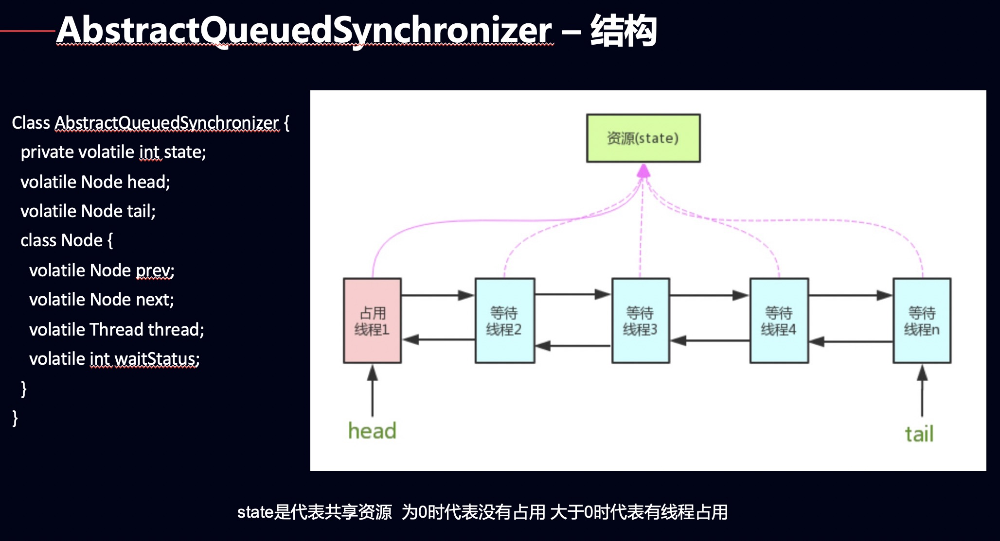

## 背景
> Synchronized 是一种内置锁，容易使用，但是不容易操作。
>
> ReenrantLock 其实也是一种锁， 相比较Synchronized来说，这个锁更加灵活，更容易操作。
>
> 为了保障临界资源的数据安全性，就是通过锁来进行保障的。

## ReentrantLock的使用

```
public class AccountingSyncLock implements Runnable {
    /*
        共享资源(临界资源)
    */
    static int i=0;

    /*
    	该lock属于类，锁定的对象是类实例
    */
    private ReentrantLock lock = new ReentrantLock();

    public void increase(){
        try {
            // 获取锁，如果获取到了，就可以操作临界资源，i++。
            lock.lock();
            i++;
        } catch (Exception e) {
            System.out.println(e.getMessage());
        } finally {
            //必须在finally中进行解锁操作，如果不在 finally解锁，有可能代码出现异常锁没被释放，
            lock.unlock();
        }
    }

    @Override
    public void run() {
        for(int j=0;j<1000000;j++){
            increase();
        }
    }

    public static void main(String[] args) throws InterruptedException {
        AccountingSync instance=new AccountingSync();
        // 两个线程操作同一个实例
        Thread t1=new Thread(instance);
        Thread t2=new Thread(instance);
        t1.start();
        t2.start();
        // 等待t1线程执行完
        t1.join();
        // 等待t2线程执行完
        t2.join();

        // 主线线程输出
        System.out.println(i);
    }
}
```

## 公平锁和非公平锁
> 里面其实是有一个队列的，用来操作临界资源。
>
> 公平锁就是将新的线程插入到队列尾部。
>
> 非公平锁是将新的线程通过CAS插入头部，如果插入头部失败的话，就插入队列尾部就和公平锁一致了。


```
一： 内部（AbstractQueuedSynchronizer）维护了一个队列，维护多个线程获取同个资源。
二： reentrantlock 默认是非公平锁。
public ReentrantLock() {
    sync = new NonfairSync();
}
```


### 公平锁

```
    /**
     * Sync object for fair locks
     */
    static final class FairSync extends Sync {
        private static final long serialVersionUID = -3000897897090466540L;
		// lock 设置锁
        // lock()内部调用acquire(1),为何是”1”呢？
		// 首先我们知道ReentrantLock是独占锁，1表示的是锁的状态state。
		// 对于独占锁而言，如果所处于可获取状态，其状态为0，当锁初次被线程获取时状态变成1。
        final void lock() {
            acquire(1);
        }

        ...
    }
```


### 公平锁
```
    /**
     * Sync object for non-fair locks
     */
    static final class NonfairSync extends Sync {
        private static final long serialVersionUID = 7316153563782823691L;

        /**
         * lock()通过compareAndSetState尝试设置锁状态
         * 若成功直接将锁的拥有者设置为当前线程，否则调用acquire()尝试获取锁
         *
         * Performs lock.  Try immediate barge, backing up to normal
         * acquire on failure.
         */
        final void lock() {
            if (compareAndSetState(0, 1))
                setExclusiveOwnerThread(Thread.currentThread());
            else
                acquire(1);
        }

        ....
    }
```

compareAndSetState(0, 1) 是以原子的方式操作当前线程；若当前线程的状态为expect，则设置它的状态为update。

```
protected final boolean compareAndSetState(int expect, int update) {
    return unsafe.compareAndSwapInt(this, stateOffset, expect, update);
}
```


setExclusiveOwnerThread：设置当前线程为锁的拥有者
```
protected final void setExclusiveOwnerThread(Thread thread) {
    exclusiveOwnerThread = thread;
}
```

### AbstractQueuedSynchronizer 队列




|  | Exclusive (独占) | Share (共享) | 结果 |
| --- | --- | --- | --- |
| tryAcquire | 获取资源 |  | 成功true，失败false |
| tryRelease | 释放资源 |  | 成功true，失败false |
| tryAcquireShared |  | 获取资源 | 负数表示失败； 0表示成功，但没有剩余可用资源； 正数表示成功，且有剩余资源。 |
| tryReleaseShared |  | 释放资源 | 如果释放后允许唤醒后续等待结点，返回true，否则返回false。 |


state初始化为0，表示未锁定状态。A线程lock()时，会调用tryAcquire()独占该锁并将state+1。此后，其他线程再tryAcquire()时就会失败，直到A线程unlock()到state=0（即释放锁）为止，其它线程才有机会获取该锁。当然，释放锁之前，A线程自己是可以重复获取此锁的（state会累加），这就是可重入的概念。但要注意，获取多少次就要释放多么次，这样才能保证state是能回到零态的。

AQS 就是 AbstractQueuedSynchronizer
AQS是JUC中很多同步组件的构建基础，简单来讲，它内部实现主要是状态变量state和一个FIFO队列来完成，同步队列的头结点是当前获取到同步状态的结点，获取同步状态state失败的线程，会被构造成一个结点（或共享式或独占式）加入到同步队列尾部（采用自旋CAS来保证此操作的线程安全），随后线程会阻塞；释放时唤醒头结点的后继结点，使其加入对同步状态的争夺中。

