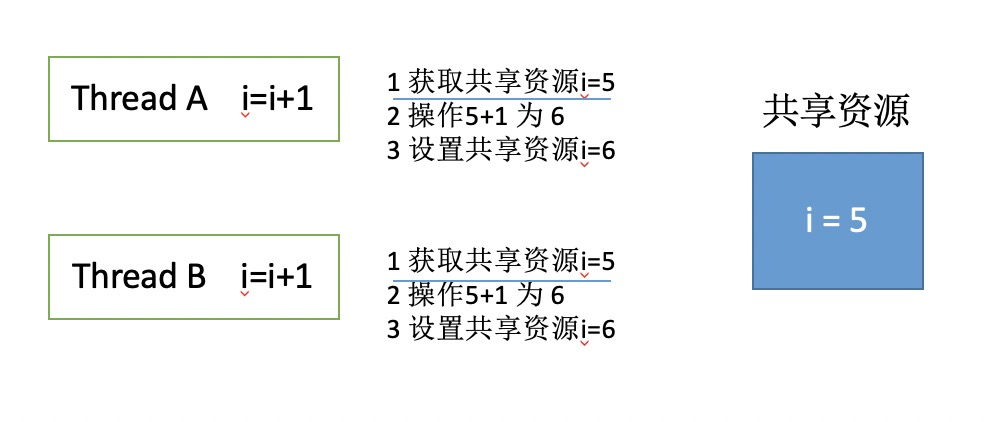
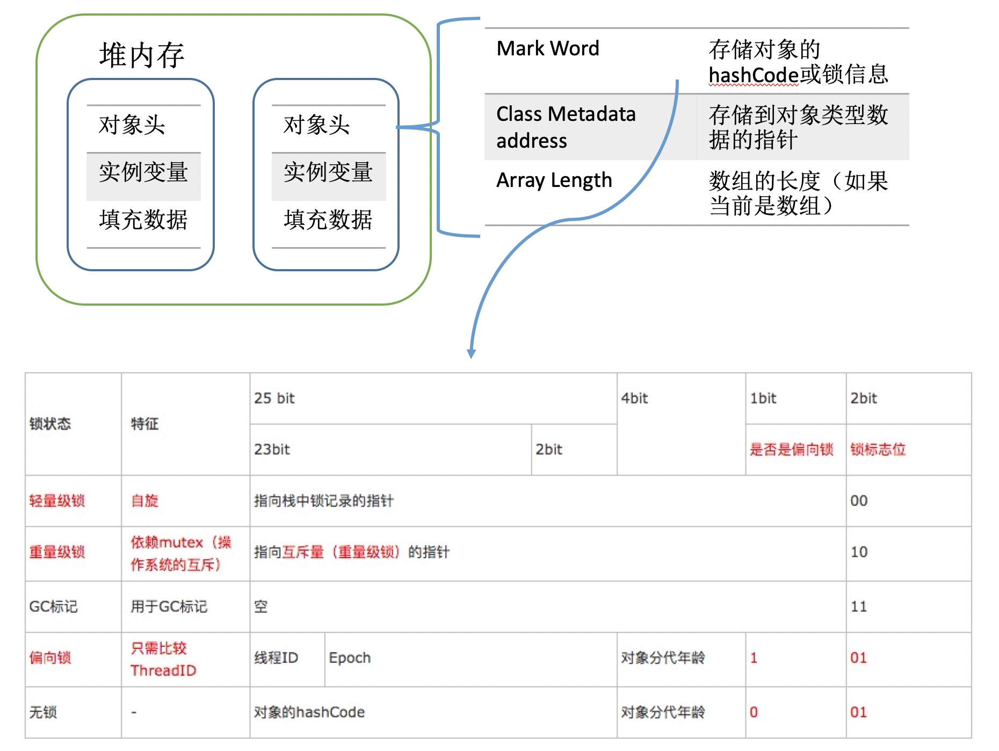
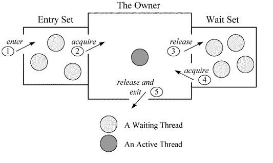
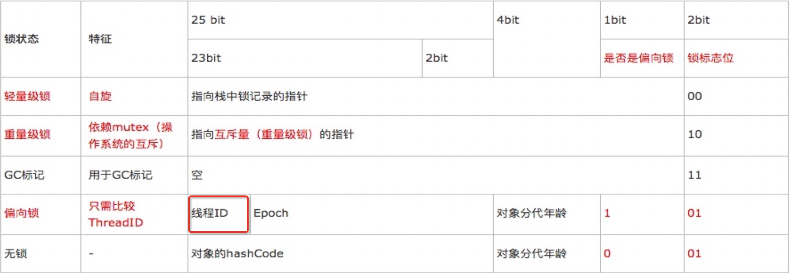

<!-- more -->
> 最近在学习java，因为公司所有的项目都在java化，抛弃世界上最好的语言PHP，来学习在java也还是很不错的。

> 毕竟唯一不变的就是变化，有变化才有成长。


### 背景
JAVA是并发编程，存在多线程，存在共享数据（临界资源）。

多线程操作共享数据（临界资源）就会出现问题。



Thread A 第一步和 Thread B第一步是同时的就会导致数据错乱。 假设i是访问量，则访问量数据就是错的。

### synchronized
> 两个线程同时操作临界资源
#### 使用 修饰方法&修饰代码块
##### 修饰方法 多个线程操作一个实例
```
public class AccountingSync implements Runnable{
    /* 共享资源(临界资源) */
    static int i=0;

    public void increase(){
        i++;
    }

    @Override
    public void run() {
        for(int j=0;j<1000000;j++){
            increase();
        }
    }

    public static void main(String[] args) throws InterruptedException {
        AccountingSync instance=new AccountingSync();
		// 操作同一个实例
        Thread t1=new Thread(instance);
        Thread t2=new Thread(instance);
        t1.start();
        t2.start();
        t1.join();
        t2.join();
        System.out.println(i); //
    }
}
```
多个线程操作一个实例，该实例中static i 是实例共享的，对共享数据进行并发操作会出现数据错乱 原因就是最开始的讲述的。所以最后的数据 i的是小于2000000。

如果对实例方法加synchronized关键字呢？

##### 修饰方法  多个线程操作一个实例  synchronized 修饰实例方法
```
public class AccountingSync implements Runnable{
    /* 共享资源(临界资源) */
    static int i=0;

    public synchronized void increase(){
        i++;
    }

    @Override
    public void run() {
        for(int j=0;j<1000000;j++){
            increase();
        }
    }

    public static void main(String[] args) throws InterruptedException {
        AccountingSync instance=new AccountingSync();
		// 操作同一个实例
        Thread t1=new Thread(instance);
        Thread t2=new Thread(instance);
        t1.start();
        t2.start();
        t1.join();
        t2.join();
        System.out.println(i);
    }
}
```
多个线程操作一个实例，该实例中static i 是实例共享的，synchronized修饰的是实例方法，因为只有一个实例，并且对该实例方法加了锁所以最后的数据 i是2000000。

在这里是多个线程操作的是同一个实例，如果操作不同的实例呢？

##### 修饰方法  多个线程操作不同的实例， synchronized修饰实例方法
```
public class AccountingSync implements Runnable{
    /* 共享资源(临界资源) */
    static int i=0;

    public synchronized void increase(){
        i++;
    }

    @Override
    public void run() {
        for(int j=0;j<1000000;j++){
            increase();
        }
    }

    public static void main(String[] args) throws InterruptedException {
		// 不同线程操作不同的实例
        Thread t1=new Thread(new AccountingSync());
        Thread t2=new Thread(new AccountingSync());
        t1.start();
        t2.start();
        t1.join();
        t2.join();
        System.out.println(i);
    }
}
```
结果小于2000000，原因是一个对象可以有多个实例，不同线程操作不同实例，锁的粒度依然是实例维度，而不是对象维度，但是现在是多个线程操作不同的实例，所以锁根本对临界资源（共享资源）没有发挥作用。

如果是修饰的是静态方法呢？
##### 修饰方法  多个线程操作不同的实例， synchronized修饰静态方法
```
public class AccountingSync implements Runnable{
    /* 共享资源(临界资源) */
    static int i=0;

    public synchronized static void increase(){
        i++;
    }

    @Override
    public void run() {
        for(int j=0;j<1000000;j++){
            increase();
        }
    }

    public static void main(String[] args) throws InterruptedException {
		// 不同线程操作不同的实例
        Thread t1=new Thread(new AccountingSync());
        Thread t2=new Thread(new AccountingSync());
        t1.start();
        t2.start();
        t1.join();
        t2.join();
        System.out.println(i);
    }
}
```
多个线程操作多个实例，大家都知道一个对象可以有很多个实例，但是静态变量静态方法只有一个，所以这里直接synchronized修饰静态方法，是完全生效的，静态方法只有一个，所以对临界资源（共享资源）操作前是加锁的，保证了临界资源正确性。

除了用synchronized修饰方法，还是可以用来修饰代码块的，接下来看如果实现上面类似的功能，用synchronized修饰代码块如何实现呢？

##### 修饰代码块 synchronized修饰代码块  作用于实例
```
public class AccountingSync implements Runnable{
    /* 共享资源(临界资源) */
    static int i=0;

    @Override
    public void run() {
        for(int j=0;j<1000000;j++){
            synchronized(this) {
                i++;
            }
        }
    }

    public static void main(String[] args) throws InterruptedException {
        AccountingSync instance=new AccountingSync();
        // 操作同一个实例
        Thread t1=new Thread(instance);
        Thread t2=new Thread(instance);
        t1.start();
        t2.start();
        t1.join();
        t2.join();
        System.out.println(i);
    }
}
```
多个线程操作的是同一个实例，synchronized修饰的是this，this表示的只是当前实例。由于多个线程操作的是同一个实例，在整个过程中，只有一个实例；this修饰的是实例，所以也保证了临界资源的正确性。

如果是多个线程操作不同实例呢，那这个代码肯定就不行了，接下来看下这种情况如何使用synchronized。

##### 修饰代码块  synchronized修饰代码块  作用于对象
```
public class AccountingSync implements Runnable{
    /* 共享资源(临界资源) */
    static int i=0;

    @Override
    public void run() {
        for(int j=0;j<1000000;j++){
            synchronized(AccountingSync.class) {
                i++;
            }
        }
    }

    public static void main(String[] args) throws InterruptedException {
        AccountingSync instance=new AccountingSync();
        // 操作同一个实例
        Thread t1=new Thread(new AccountingSync());
        Thread t2=new Thread(new AccountingSync());
        t1.start();
        t2.start();
        t1.join();
        t2.join();
        System.out.println(i);
    }
}
```
多个线程操作多个实例，这些实例都属于一个对象。所以直接这样修饰就可以了`synchronized(AccountingSync.class)`


#### 解读字节码
> JVM是基于进入和退出monitor对象来实现的同步，无论是显示同步还是隐式同步。

> 显示同步是指 synchronized修饰的是代码块   是基于monitorenter 和 monitorexit 指令来实现

> 隐式同步是指 synchronized修饰的是方法  是基于ACC_SYNCHRONIZED实现

```
public class Sync {
    public  void test1() {
        synchronized(this) {
            System.out.println("test1 method");
        }
    }

    public synchronized void test2() {
        System.out.println("ok");
    }
}
```
java反编译之后代码 `javap -v Sync.class`
```
  public Sync();
    descriptor: ()V
    flags: ACC_PUBLIC
    Code:
      stack=1, locals=1, args_size=1
         0: aload_0
         1: invokespecial #1                  // Method java/lang/Object."<init>":()V
         4: return
      LineNumberTable:
        line 1: 0

  public void test1();
    descriptor: ()V
    flags: ACC_PUBLIC
    Code:
      stack=2, locals=3, args_size=1
         0: aload_0
         1: dup
         2: astore_1
         3: monitorenter				// 进入
         4: getstatic     #2             // Field java/lang/System.out:Ljava/io/PrintStream;
         7: ldc           #3                // String test1 method
         9: invokevirtual #4          // Method java/io/PrintStream.println:(Ljava/lang/String;)V
        12: aload_1
        13: monitorexit					// 退出  获取锁成功的退出
        14: goto          22
        17: astore_2
        18: aload_1
        19: monitorexit				    // 退出  获取锁失败的退出
        20: aload_2
        21: athrow
        22: return
      Exception table:
         from    to  target type
             4    14    17   any
            17    20    17   any
      LineNumberTable:
        line 3: 0
        line 4: 4
        line 5: 12
        line 6: 22
      StackMapTable: number_of_entries = 2
        frame_type = 255 /* full_frame */
          offset_delta = 17
          locals = [ class Sync, class java/lang/Object ]
          stack = [ class java/lang/Throwable ]
        frame_type = 250 /* chop */
          offset_delta = 4

  public synchronized void test2();
    descriptor: ()V
    flags: ACC_PUBLIC, ACC_SYNCHRONIZED // 标识
    Code:
      stack=2, locals=1, args_size=1
         0: getstatic     #2                  // Field java/lang/System.out:Ljava/io/PrintStream;
         3: ldc           #5                  // String ok
         5: invokevirtual #4                  // Method java/io/PrintStream.println:(Ljava/lang/String;)V
         8: return
      LineNumberTable:
        line 9: 0
        line 10: 8
}
```
#### 对象头和monitor
##### 对象头
> 对象在内存中的布局分为三块区域：对象头、实例数据和对齐填充

> 实例数据：存放类的属性数据信息，包括父类的属性信息

> 填充数据：由于虚拟机要求对象起始地址必须是8字节的整数倍，为了对齐而填充的数据




##### monitor
在JAVA中一切皆对象，任何对象都有一个内部锁或者成为monitor锁

在JVM虚拟机中（HotSpot 大部分都是HotSpot）, monitor是由ObjectMonitor实现的，其主要数据结构如下
```
ObjectMonitor() {
   _header       = NULL;
   _count        = 0; //用来记录该线程获取锁的次数
   _waiters      = 0,
   _recursions   = 0; //锁的重入次数
   _object       = NULL;
   _owner        = NULL; //指向持有ObjectMonitor对象的线程
   _WaitSet      = NULL; //存放处于wait状态的线程队列
   _WaitSetLock  = 0 ;
   _Responsible  = NULL ;
   _succ         = NULL ;
   _cxq          = NULL ;
   FreeNext      = NULL ;
   _EntryList    = NULL ; //存放处于等待锁block状态的线程队列
   _SpinFreq     = 0 ;
   _SpinClock    = 0 ;
   OwnerIsThread = 0 ;
 }
```



如上图所示，一个线程通过1号门进入Entry Set(入口区)，如果在入口区没有线程等待，那么这个线程就会获取监视器成为监视器的Owner，然后执行监视区域的代码。如果在入口区中有其它线程在等待，那么新来的线程也会和这些线程一起等待。线程在持有监视器的过程中，有两个选择，一个是正常执行监视器区域的代码，释放监视器，通过5号门退出监视器；还有可能等待某个条件的出现，于是它会通过3号门到Wait Set（等待区）休息，直到相应的条件满足后再通过4号门进入重新获取监视器再执行。

注意：

当一个线程释放监视器时，在入口区和等待区的等待线程都会去竞争监视器，如果入口区的线程赢了，会从2号门进入；如果等待区的线程赢了会从4号门进入。只有通过3号门才能进入等待区，在等待区中的线程只有通过4号门才能退出等待区，也就是说一个线程只有在持有监视器时才能执行wait操作，处于等待的线程只有再次获得监视器才能退出等待状态。


#### 锁类型
##### 偏向锁
偏向锁是JDK6引进的，通过研究发现，在大多数情况下，锁不仅不存在多线程竞争，而且总是同一个线程获取，为了让线程获取锁的代价更低，引进了偏向锁。


可以看到偏向锁是在对象头中有存储线程ID的，如果与现有的线程ID一致，只需要执行一次CAS（Compare and swap）操作即可，就不会触发轻量级锁，进而降低了锁的代价。 但是如果线程ID不一致，则会升级为轻量级锁。

##### 轻量级锁
- 轻量级锁的目的是 在没有多线程竞争的前提下，减少传统的重量级锁使用操作系统互斥量产生的性能消耗。
- 轻量级锁的触发条件 当关闭偏向锁功能或者多个线程竞争偏向锁导致偏向锁升级为轻量级锁。
- 轻量级锁的依据是 对于绝大部分的锁，在整个生命周期内都是不会存在竞争的。

主要原理是靠下面这种自旋锁来解决的
```
while (true) {
	if (getLock()) {
		// get lock and do something
	}
	// i++ or sleep 来保证退出循环
}
```

##### 重量级锁
Synchronized是通过对象内部的一个叫做监视器（Monitor）来实现的。但是监视器本质又是依赖于底层操作系统的mutex lock来实现的。而操作系统实现线程之间的切换这就需要从用户态转为内核态，这个成本比较高，状态之前的切换需要很长的时间，So， 这种依赖依赖于操作系统Mutex Lock实现的锁称之为重量级锁。

