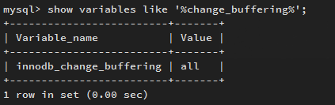
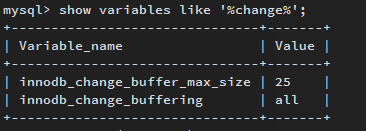
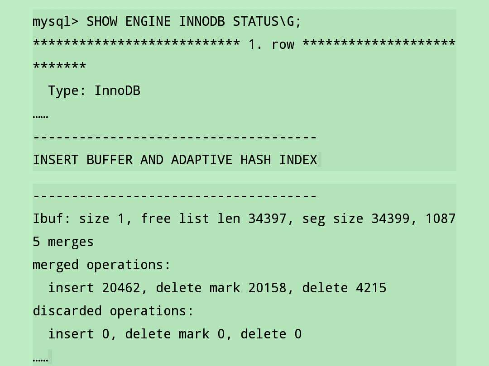

# 插入缓冲 (Insert Buffer)

> InnoDB存储引擎可以大幅度提高数据中非唯一索引的插入性能。
> 
> 插入缓冲简单理解，就是将要插入的非唯一索引，先放到缓冲区中，
> 
> 然后再聚合后写入，这样就把多次操作合并为一次操作，从而提升了效率。

## 为什么必须是非唯一索引
InnoDB中有分为主键索引、非唯一索引、唯一索引。

```
CREATE TABLE `user` (
  `id` int(11) NOT NULL AUTO_INCREMENT,
  `phone` char(11) DEFAULT NULL,
  `name` varchar(30) DEFAULT NULL,
  PRIMARY KEY (`id`), //主键索引
  KEY `name` (`name`), //非唯一索引
  UNIQUE KEY `phone` (`phone`) //唯一索引
) ENGINE=InnoDB DEFAULT CHARSET=utf8
```

- 对于自增主键值的插入是顺序的，顺序IO（非随机IO），因此插入有较高的性能。
- 对于非唯一索引，插入也不是有序，通过insert buffer技术，提升插入新能。
- 对于唯一索引，插入不是有序的；并且还需要查找插入值与已存在的值是否冲突，并不能使用Insert Buffer，因此性能并不好。

## Insert Buffer原理

对于非唯一索引的插入或更新操作，不是每次都直接插入到索引页，而是先判断插入的非唯一索引页是否在缓冲池中，
若在，则插入；若不在，则放入Insert Buffer中。
表象是非唯一索引页插入到叶子结点，本质上存在了另一个位置。
然后再以一定的频率，将多个插入合并到一个操作中。这就很大幅度上提高了非唯一索引插入的性能。
[InnoDB关键特性之Insert Buffer](http://www.cnblogs.com/yuyue2014/p/3802779.html)

## Change Buffer

InnoDB从1.0.x版本开始引入Change Buffer，也可认为是Insert Buffer的升级。

InnoDB可以对DML操作进行缓冲，分别是Insert Buffer、Delete Buffer、Purge Buffer。

对一条记录进行UPDATE操作可分为两个过程。
- 将记录标记为删除
- 真正将记录删除

因此Delete Buffer对应UPDATE的第一个过程，Purge Buffer对应UPDATE操作第二个过程。
同时，InnoDB存储引擎提供了参数innodb_change_buffering，用来开启各种buffer选项。



该参数可选的值为：inserts、deletes、purges、changes、all、none。
其中inserts、deletes、purges就是前面讨论的三种情况。
changes包含inserts和deletes，all表示启用所有，none表示都不启用。
该参数值默认为all。

该参数innodb_change_buffer_max_size，来控制Change Buffer最大使用内存的数量。
innodb_change_buffer_max_size默认为25，表示最多使用1/4的缓冲池内存空间。




merged operations中insert表示Insert Buffer，20462次；delete mark表示Delete Buffer，20158次；delete表示Purge buffer 4215次。
