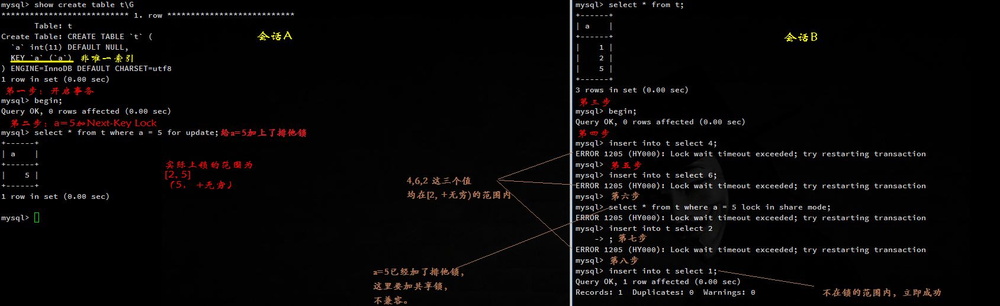

# InnoDB的行锁

行锁的三种算法
===
    - Record Lock  单个记录上的锁
    - Gap Lock  间隙锁，锁定一个范围，但不含记录本身
    - Next-Key Lock  Record+Gap，锁定一个范围，并锁定记录本身

在Next-Key Lock算法下，InnoDB对于行的查询都是采用这种锁定算法。假设一个索引有10,11,13,20这四个值，那么该索引可能被Next-Key Locking的区间为
```
(-∞, 10]
(10, 11]
(11, 13]
(13, 20]
(20, +∞)
```
除了Next-Key 还有一种是Previous-Key 其区间为
```
(-∞, 10)
[10, 11)
[11, 13)
[13, 20)
[20, +∞)
```

非唯一索引 （Next-Key）
===
> Next-Key Lock是一个范围，包含本身的前后范围。

```
drop table if exists t;
create table t ( a int, key(a));
insert into t select 1;
insert into t select 2;
insert into t select 5;
```

| 时间 | 会话A | 会话B |
|:-----|:-----|:-----|
| 1 | Begin |  |
| 2 | select * from t where a = 5 for update |  |
| 3 |  | begin |
| 4 |  | insert into t select 4 |
| 4 |  | insert into t select 6 |
| 4 |  | select * from t where a = 5 lock in share mode |
| 4 |  | insert into t select 2 |
| 4 |  | 这几条命令都会阻塞。 |

## 图解


唯一索引 （Next-Key 降级为 Record-Key）
===
> 查询的索引含有唯一属性时，InnoDB存储引擎会对Next-Key 降级为Record-Key。

主键 `primary key`
---
```
drop table if exists t;
create table t ( a int primary key);
insert into t select 1;
insert into t select 2;
insert into t select 5;
```

| 时间 | 会话A | 会话B |
|:-----|:-----|:-----|
| 1 | Begin |  |
| 2 | select * from t where a = 5 for update |  |
| 3 |  | begin |
| 4 |  | insert into t select 4 |
| 5 |  | commit 立即成功 |
| 6 | commit | - |


表`t`中共有`1、2、5` 三个值。会话A中首先对`a=5`进行锁定，由于`a`是主键，主键都是唯一的。因此就从`Next-Key Lock` 降级为`Record Lock`，仅锁定5这个值。而不是范围(2, 5] (5, +∞)，因此插入4这个值非阻塞。

唯一索引 unique key
---

```
drop table if exists t;
create table t ( a int, unique key (a));
insert into t select 1;
insert into t select 2;
insert into t select 5;
```


| 时间 | 会话A | 会话B |
|:-----|:-----|:-----|
| 1 | Begin |  |
| 2 | select * from t where a = 5 for update |  |
| 3 |  | begin |
| 4 |  | insert into t select 4 |
| 5 |  | commit 立即成功 |
| 6 | commit | - |

## 证明是唯一索引，就会从Next-Key Lock 降级为Record Lock

