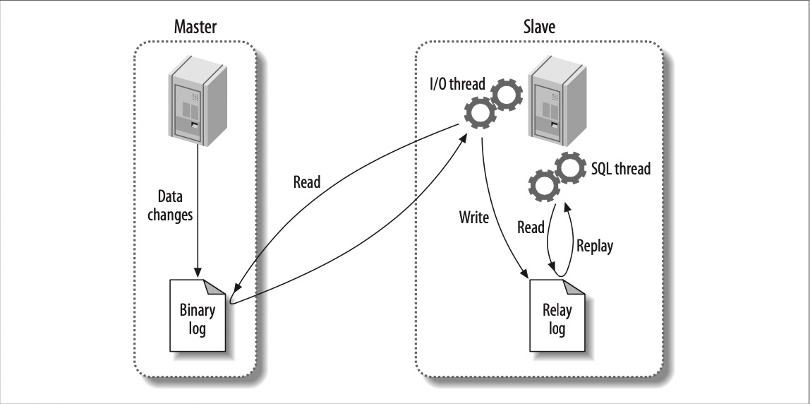

# MySql 主从复制原理
可以先看下[MySQL主从服务搭建](mysql-build-master-slave)

自己动手搭建下，印象比较深刻。

# 直观的展示
## Master processlist
登录`master`MySql服务器，执行命令`show processlist`，展示线程列表。

```
mysql> show processlist;
+----+------+--------------------+------+-------------+-------+-----------------------------------------------------------------------+------------------+
| Id | User | Host               | db   | Command     | Time  | State                                                                 | Info             |
+----+------+--------------------+------+-------------+-------+-----------------------------------------------------------------------+------------------+
|  6 | xp   | master1:52865      | NULL | Binlog Dump | 28604 | Master has sent all binlog to slave; waiting for binlog to be updated | NULL             |
|  8 | root | localhost:61860    | NULL | Query       |     0 | init                                                                  | show processlist |
+----+------+--------------------+------+-------------+-------+-----------------------------------------------------------------------+------------------+
```

这里展示的有两个线程

- `Id`为6的线程，是把二进制日志`dump`出去，所以对应的`Command`是`Binlog Dump`。

- `Id`为8的线程，就是执行当前命令的这个线程，可忽略，`Info`信息可以看出。

咱们再来看看Slave的线程列表
## Slave processlist

登录`slave MySql`服务器，执行命令`show processlist`，展示线程列表。

```
mysql> show processlist;
+----+-------------+-----------------+------+---------+-------+-----------------------------------------------------------------------------+------------------+
| Id | User        | Host            | db   | Command | Time  | State                                                                       | Info             |
+----+-------------+-----------------+------+---------+-------+-----------------------------------------------------------------------------+------------------+
|  7 | system user |                 | NULL | Connect | 28875 | Waiting for master to send event                                            | NULL             |
|  8 | system user |                 | NULL | Connect |  6283 | Slave has read all relay log; waiting for the slave I/O thread to update it | NULL             |
| 11 | root        | localhost:27662 | NULL | Query   |     0 | init                                                                        | show processlist |
+----+-------------+-----------------+------+---------+-------+-----------------------------------------------------------------------------+------------------+
3 rows in set (0.00 sec)
```

这里展示了三个线程，`Id`分别为7，8，11。


- `Id`为`7`的线程，是用来接收master的数据的，其实是存放成`relay log`，`State`信息可以看出来。

- `Id`为`8`的线程，是用来读取`relay log`的，然后将这些重放到数据库表中，这样就完成了复制。

- `Id`为`11`的线程，就是执行当前命令的这个线程，可忽略，`Info`信息可以看出。

## 整体看
`Master` 只有一个关于复制的线程

`Slave`  有两个关于复制的线程

# Master和Slave的线程是如何配合一起工作的

## 图解



1. Master 会将更改的数据写到二进制日志中，也就是binary log。

2. Slave启动IO线程，IO线程跟主库建立一个普通的客户端连接，然后在主库上启动一个`binlog dump`线程，这个`binlog dump`线程在上面也可以看到，这个`binlog dump`线程会读取主库上二进制日志中的事件。他不会对事件进行轮询，如果该线程追赶上了主库，它将进入sleep状态，直到主库发送信号量通知`binlog dump`线程有新的事件产生，这样`binlog dump`线程就会被唤醒，然后将事件记录到`Relay log`中。

3. Slave SQL线程，读取`Relay log`，然后重放到数据库表中，就完成了复制。

# 复制格式

> binlog_format=statement/row/mixed

## 基于语句statement的复制
这个其实就是SQL语句复制，如果主库上执行`update user set age=age+1 where id = 1`，那么到从库上也会执行相同的语句，这就是基于语句的复制。

这个也是MySQL5.0之前复制模式。

优点
- 简单，记录和执行这些语句，就能够让主从保持同步
- 二进制日志里的事件更加紧凑，一条更新几M数据的语句在二进制日志只占几十个字节。
- 向后兼容，旧版本也是可以使用的。

缺点
- 必须是串行的
- 元数据无法正确复制，`CURRENT_USER()`

## 基于行 row的复制
这种方式会将真实的数据记录到二进制日志中。

MySQL5.1之后才开始有的

优点
- 正确地复制每一行

缺点
- `update table set col1 = 0` 会全表更新，行的复制开销很大，但是语句开销很小。


## mixed
就是statement和row的相结合。

