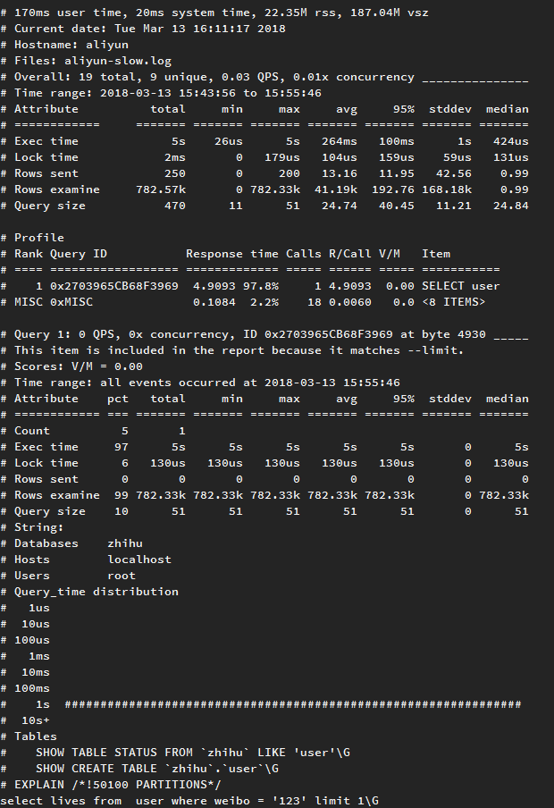
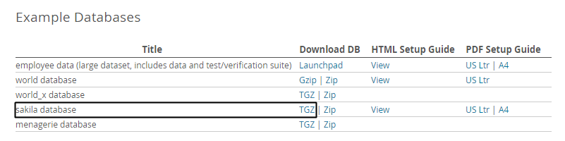
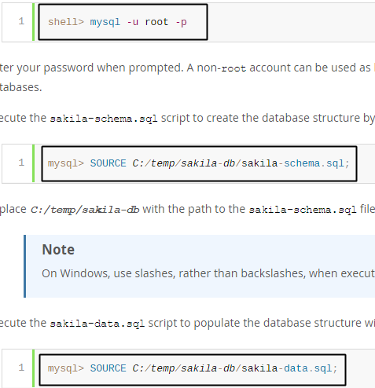

<!-- more -->
> 找出MySQL服务器的慢查询，分析特定SQL语句
>
> 使用的是MySQL5.6

# 慢查询
```
是否开启慢查询日志 (ON开启 OFF关闭)

mysql> show variables like 'slow_query_log';
+----------------+-------+
| Variable_name  | Value |
+----------------+-------+
| slow_query_log | ON    |
+----------------+-------+
1 row in set (0.00 sec)


慢查询日志存放的位置

mysql> show variables like 'slow_query_log_file';
+---------------------+--------------------------------+
| Variable_name       | Value                          |
+---------------------+--------------------------------+
| slow_query_log_file | /var/lib/mysql/aliyun-slow.log |
+---------------------+--------------------------------+
1 row in set (0.00 sec)


耗时大于long_query_time的都会记录到日志中

mysql> show variables like 'long_query_time';
+-----------------+----------+
| Variable_name   | Value    |
+-----------------+----------+
| long_query_time | 10.000000|
+-----------------+----------+
1 row in set (0.00 sec)
```

- long_query_time=0 则会记录所有的查询

## 分析慢查询工具`pt-query-digest`
[pt-query-digest官网](https://www.percona.com/doc/percona-toolkit/LATEST/pt-query-digest.html)

### 安装使用
```
wget percona.com/get/percona-toolkit.tar.gz

tar xzvf percona-toolkit.tar.gz

./percona-toolkit-3.0.7/bin/pt-query-digest /var/lib/mysql/aliyun-slow.log
```

若出现错误
```
Can't locate Digest/MD5.pm in @INC (@INC contains: /usr/local/lib64/perl5 /usr/local/share/perl5 /usr/lib64/perl5/vendor_perl /usr/share/perl5/vendor_perl /usr/lib64/perl5 /usr/share/perl5 .) at ./percona-toolkit-3.0.7/bin/pt-query-digest line 2470.
BEGIN failed--compilation aborted at ./percona-toolkit-3.0.7/bin/pt-query-digest line 2470.
```
则 `yum install perl-Digest-MD5`

### 效果截图


# 分析特定SQL

## 使用 SHOW PROFILE
### 准备数据`sakila`

[sakila数据下载](https://dev.mysql.com/doc/index-other.html)



[sakila数据安装](https://dev.mysql.com/doc/sakila/en/sakila-installation.html)




### 使用PROFILE
```
开始PROFILE
mysql> set profiling = 1;

mysql> select * from sakila.nicer_but_slower_film_list;
997 rows in set (0.25 sec)

mysql> show profiles;
+----------+------------+-------------------------------------------------+
| Query_ID | Duration   | Query                                           |
+----------+------------+-------------------------------------------------+
|        1 | 0.24953300 | select * from sakila.nicer_but_slower_film_list |
+----------+------------+-------------------------------------------------+
1 rows in set (0.00 sec)

mysql> show profile for query 1;
+----------------------+----------+
| Status               | Duration |
+----------------------+----------+
| starting             | 0.000096 |
| checking permissions | 0.000012 |
| Opening tables       | 0.000248 |
| checking permissions | 0.000004 |
| checking permissions | 0.000003 |
| checking permissions | 0.000002 |
| checking permissions | 0.000002 |
| checking permissions | 0.000112 |
| init                 | 0.002236 |
| System lock          | 0.000018 |
| optimizing           | 0.000005 |
| optimizing           | 0.001518 |
| statistics           | 0.097620 |
| preparing            | 0.001815 |
| Creating tmp table   | 0.000087 |
| Sorting result       | 0.000008 |
| statistics           | 0.000013 |
| preparing            | 0.000006 |
| executing            | 0.000286 |
| Sending data         | 0.000016 |
| executing            | 0.000002 |
| Sending data         | 0.127138 |
| Creating sort index  | 0.015985 |
| removing tmp table   | 0.000236 |
| Creating sort index  | 0.001276 |
| end                  | 0.000007 |
| query end            | 0.000006 |
| closing tables       | 0.000002 |
| removing tmp table   | 0.000180 |
| closing tables       | 0.000031 |
| freeing items        | 0.000015 |
| removing tmp table   | 0.000006 |
| freeing items        | 0.000526 |
| cleaning up          | 0.000022 |
+----------------------+----------+
34 rows in set, 1 warning (0.00 sec)
```

### 查询information_schema中的PROFILING
```

mysql> use information_schema;
Database changed

mysql> set @query_id=1;
Query OK, 0 rows affected (0.00 sec)

mysql> select
    ->     state,
    ->     sum(duration) as total_r,
    ->     round(
    ->         100 * sum(duration) /
    ->         (select sum(duration)
    ->         from profiling
    ->         where query_id=@query_id
    ->     ), 2) as pct_r,
    ->     count(1) as calls,
    ->     sum(duration)/count(*) as "R/call"
    -> from
    ->     profiling
    -> where query_id=@query_id
    -> group by state
    -> order by total_r desc;
+----------------------+----------+-------+-------+--------------+
| state                | total_r  | pct_r | calls | R/call       |
+----------------------+----------+-------+-------+--------------+
| Sending data         | 0.127154 | 50.96 |     2 | 0.0635770000 |
| statistics           | 0.097633 | 39.13 |     2 | 0.0488165000 |
| Creating sort index  | 0.017261 |  6.92 |     2 | 0.0086305000 |
| init                 | 0.002236 |  0.90 |     1 | 0.0022360000 |
| preparing            | 0.001821 |  0.73 |     2 | 0.0009105000 |
| optimizing           | 0.001523 |  0.61 |     2 | 0.0007615000 |
| freeing items        | 0.000541 |  0.22 |     2 | 0.0002705000 |
| removing tmp table   | 0.000422 |  0.17 |     3 | 0.0001406667 |
| executing            | 0.000288 |  0.12 |     2 | 0.0001440000 |
| Opening tables       | 0.000248 |  0.10 |     1 | 0.0002480000 |
| checking permissions | 0.000135 |  0.05 |     6 | 0.0000225000 |
| starting             | 0.000096 |  0.04 |     1 | 0.0000960000 |
| Creating tmp table   | 0.000087 |  0.03 |     1 | 0.0000870000 |
| closing tables       | 0.000033 |  0.01 |     2 | 0.0000165000 |
| cleaning up          | 0.000022 |  0.01 |     1 | 0.0000220000 |
| System lock          | 0.000018 |  0.01 |     1 | 0.0000180000 |
| Sorting result       | 0.000008 |  0.00 |     1 | 0.0000080000 |
| end                  | 0.000007 |  0.00 |     1 | 0.0000070000 |
| query end            | 0.000006 |  0.00 |     1 | 0.0000060000 |
+----------------------+----------+-------+-------+--------------+
19 rows in set (0.00 sec)

可以很清楚看到该sql在哪个阶段耗时较长。
上面的例子 Sending data & statistics 耗时较长

```
