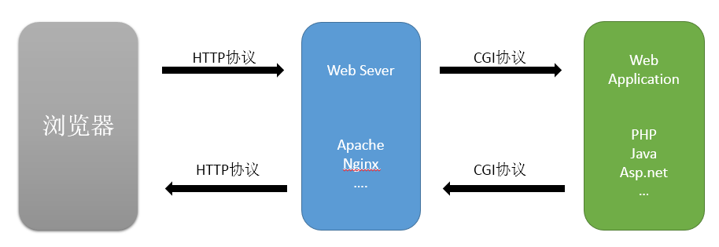
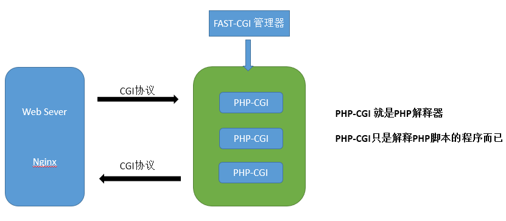

 从CGI到PHP-FPM到底经历了什么？ 
<!-- more -->
# CGI
>Web Server 与 Web Application 之间数据交换的一种协议就是CGI。
>Web Server 一般指Apache、Nginx、IIS、Lighttpd、Tomcat等服务器，
>Web Application 一般指PHP、Java、Asp.net等应用程序。

- CGI程序，指的就是PHP程序、Java程序、Asp.net程序。
- CGI缺点及例子
    + 每次的CGI请求都需要新生成一个程序的副本来运行。fork一个子进程，然后在执行。
    + 以PHP为例，fork一个子进程，需要解析php.ini，初始化执行环境(对应上一篇的MINIT函数)。

CGI程序运行在独立的进程中，并对每个Web请求创建一个进程，这种方法非常容易实现，但效率很差，难以扩展。面对大量请求，进程的大量创建和消亡使操作系统性能大大下降。
** 为了解决CGI这种低效的方式，因此就出现了FASTCGI。 **

# FASTCGI
>FASTCGI生成一些解释器进程，这些解释器进程只是在创建时初始化环境，读取配置文件等等。如果再来CGI请求的，直接交给解释器进程执行即可。FASTCGI只是一个协议。

那么PHP-FPM又是什么呢？ PHP-FPM是实现了FASTCGI协议。

# PHP-FPM
>PHP-FPM的管理对象是php-cgi(PHP解释器)
>因为PHP-CGI只是个CGI程序，他自己本身只能解析请求，返回结果，不会进程管理。所以就出现了一些能够调度 php-cgi 进程的程序，比如说由lighthttpd分离出来的spawn-fcgi。同样，PHP-FPM也是用于调度管理PHP解析器php-cgi的管理程序。

Fastcgi会先启一个master，解析配置文件，初始化执行环境，然后再启动多个worker。当请求过来时，master会传递给一个worker，然后立即可以接受下一个请求。这样就避免了重复的劳动，效率自然是高。而且当worker不够用时，master可以根据配置预先启动几个worker等着；当然空闲worker太多时，也会停掉一些，这样就提高了性能，也节约了资源。这就是fastcgi的对进程的管理。PHP-FPM实现了FASTCGI协议。

- 可以平滑重启，因为master进程可以生成新的work进程，新的work进程就会读取php.ini文件，实现热加载。master进程通知老的work进程该消失了。

参考资料
https://segmentfault.com/q/1010000000256516
https://www.awaimai.com/371.html
https://zh.wikipedia.org/wiki/FastCGI
