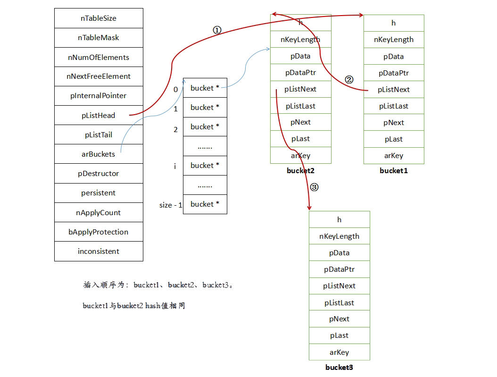

 HashTable 
<!-- more -->
>环境 PHP5.6
>PHP的数组使用哈希表（HashTable）来存储关联数据，PHP内核中的哈希表是十分重要的数据结构，PHP的大部分的语言特性都是基于哈希表实现的。

# 哈希表基本原理


## 哈希函数
```
伪代码

HASH_INDEX(ht, int key) {
    return key % ht->size;
}
```
## 操作接口
### 初始化
```
伪代码

int hash_init(HashTable *ht)
{
    ht->size        = HASH_TABLE_INIT_SIZE;
    ht->elem_num    = 0;
    ht->buckets     = calloc(ht->size, sizeof(Bucket *));
    return SUCCESS;
}
```
### 内容插入到哈希表中
```
伪代码（细节待完善）

int hash_insert(HashTable *ht, char *key, void *value)
{
    // 判断是否需要重哈希
    resize_hash_table_if_needed(ht);

    // 通过哈希函数获取bucket
    int index = HASH_INDEX(ht, key);
    Bucket *tmp_bucket = ht->buckets[index];

    // key已经存在，循环冲突的链表，如果找到key则更新其value
    while(tmp_bucket) {
        if(strcmp(key, tmp_bucket->key) == 0) {
            tmp_bucket->value = value;
            return SUCCESS;
        }
        tmp_bucket = tmp_bucket->next;
    }

    // 生成新的元素
    Bucket *bucket = (Bucket *)malloc(sizeof(Bucket));
    bucket->key   = key;
    bucket->value = value;
    bucket->next  = NULL;

    ht->buckets[index]= bucket;

    // 总的元素+1
    ht->elem_num += 1;
    return SUCCESS;
}
```
### 重哈希
```
伪代码

resize_hash_table_if_needed(HashTable *ht)
{
    // buckets的长度小于等于总的元素
    if(ht->size - ht->elem_num < 1) {
        hash_resize(ht);
    }
}

static int hash_resize(HashTable *ht)
{
    // 原来长度的两倍
    int org_size = ht->size;
    ht->size = ht->size * 2;
    ht->elem_num = 0;

    // 新的buckets
    Bucket **buckets = (Bucket **)calloc(ht->size, sizeof(Bucket *));

    Bucket **org_buckets = ht->buckets;
    ht->buckets = buckets;

    int i = 0;
    for(i=0; i < org_size; ++i) {
        Bucket *cur = org_buckets[i];
        while(cur) {
            // 重哈希，重新插入
            hash_insert(ht, cur->key, cur->value);

            // 链表循环（冲突的hash值）
            cur = cur->next;
        }
    }
    free(org_buckets);
    return SUCCESS;
}
```

# PHP中哈希表的实现
## 存储结构
```
typedef struct bucket {
    ulong h;            // 如果键是数字，那么h指的就是数字；如果键是字符串，那么h指的是字符串经过hash后获得int型值
    uint nKeyLength;    // hash关键字的长度，如果数组索引为数字，此值为0
    void *pData;        // 指向value，一般是用户数据的副本，如果是指针数据，则指向pDataPtr
    void *pDataPtr;     // 如果是指针数据，此值会指向真正的vaule，同时上面pData会指向此值
    struct bucket *pListNext; // 整个hash表的下一个元素
    struct bucket *pListLast; // 整个hash表的上一个元素
    struct bucket *pNext;     // 同一个 Bucket内的下一个元素
    struct bucket *pLast;     // 同一个 Bucket内的上一个元素
    const char *arKey;        // 保存当前值所对于的key字符串，这个字段只能定义在最后，实现变长的结构体
} Bucket;

typedef struct _hashtable {
    uint nTableSize;            // hash Bucket的大小，最小为8， 以2n增长 nTableSize字段用于标示哈希表的容量
    uint nTableMask;            // nTableMask-1   索引取值的优化
    uint nNumOfElements;        // 整个hash table 中当前存在的元素个数，count() 函数会直接返回比值
    ulong nNextFreeElement;     // 下一个数字索引的位置
    Bucket *pInternalPointer;   /* Used for element traversal 当前遍历的指针 （foreach比for快的原因之一 ）*/
    Bucket *pListHead;          // 存储数组头元素指针
    Bucket *pListTail;          // 存储数组尾元素指针
    Bucket **arBuckets;         // 存储hash数组
    dtor_func_t pDestructor;    // 在删除元素时执行的回调函数，用于资源的释放
    zend_bool persistent;       // 指出了Bucket内存的分配方式，如果persistent为true，则使用操作系统本身的内存分配函数为Bucket分配内存，否则使用PHP的内存分配函数
    unsigned char nApplyCount;  // 标记当前 hash Bucket被递归访问的次数（防止多次递归）
    zend_bool bApplyProtection; // 标记当前hash桶运行不允许多次访问，不允许访问时，最多只能递归3次
#if ZEND_DEBUG
    int inconsistent;
#endif
} HashTable;
```
- hashtable的pListHead存储数组头元素指针，bucket的pListNext 整个hash表的下一个元素

- hashtable的pListTail存储数组尾元素指针，bucket的pListLast 整个hash表的上一个元素

- bucket的pNext同一个hash Bucket内的下一个元素(红色) bucket的pLast同一个hash bucket的下一个元素


## 哈希表的初始化 hash_init
```
Zend/zend_hash.c

ZEND_API int _zend_hash_init(HashTable *ht, uint nSize, dtor_func_t pDestructor, zend_bool persistent ZEND_FILE_LINE_DC)
{
    uint i = 3;

    SET_INCONSISTENT(HT_OK);

    if (nSize >= 0x80000000) {
        /* prevent overflow  防止溢出 */
        ht->nTableSize = 0x80000000;
    } else {
        while ((1U << i) < nSize) {
            i++;
        }
        ht->nTableSize = 1 << i;
    }

    ht->nTableMask = 0; /* 0意味着ht->arBuckets未初始化 */
    ht->pDestructor = pDestructor;
    ht->arBuckets = (Bucket**)&uninitialized_bucket;
    ht->pListHead = NULL;
    ht->pListTail = NULL;
    ht->nNumOfElements = 0;
    ht->nNextFreeElement = 0;
    ht->pInternalPointer = NULL;
    ht->persistent = persistent;
    ht->nApplyCount = 0;
    ht->bApplyProtection = 1;
    return SUCCESS;
}
```

## 计算哈希值
```
h = zend_inline_hash_func(arKey, nKeyLength);
nIndex = h & ht->nTableMask;

ht->nTableMask的大小为ht->nTableSize -1。 这里使用&操作
mask的作用就是将哈希值映射到槽位所能存储的索引范围内。
例如：某个key的索引值是21， 哈希表的大小为8，则mask为7，
    则求与时的二进制表示为： 10101 & 111 = 101 也就是十进制的5。
```


## 插入内容到哈希表
建议看源码 `Zend/zend_hash.c 文件中 _zend_hash_add_or_update`函数
- 如果Bucket中已经存在该元素，则遍历整个Bucket，查找是否存在相同的key值元素，如果有并且是update调用，则执行update数据操作。
- 创建新的Bucket元素，初始化数据，并将新元素添加到当前hash值对应的Bucket链表的最前面（CONNECT_TO_BUCKET_DLLIST）。 这也是为什么上面图中 插入顺序为bucket1，bucket2，bucket3。bucket1与bucket2冲突，bucket2在前面的原因

# 总结
- HashTable 是采用拉链法解决hash冲突的，了解到计算哈希值的计算规则，一些黑客利用这个特性，插入许多hash冲突的元素，则会将时间复杂度O(1)退化到O(N)。
- HashTable 是使用两个结构进行存储的 hashtable和bucket，hashtable中存在一些必要的元素，例如：元素的总数，头指针、尾指针等，bucket中存在哈希冲突的指针和整个HashTable的指针。因此HashTable是双向链表，其中的bucket也是双向链表。
- HashTable是双向链表，因此实现 (array_pop 删除尾部元素 array_push 向尾部加入元素 array_shift 删除头部元素 array_unshift 向头增加元素) 轻而易举。


参考文献
哈希冲突： https://blog.csdn.net/qq_27093465/article/details/52269862
PHP中的hash算法： http://www.laruence.com/2009/07/23/994.html
PHP数组的Hash冲突实例：http://www.laruence.com/2011/12/30/2435.html
哈希表(HashTable)：http://www.php-internals.com/book/?p=chapt03/03-01-01-hashtable
PHP的哈希表实现： http://www.php-internals.com/book/?p=chapt03/03-01-02-hashtable-in-php
