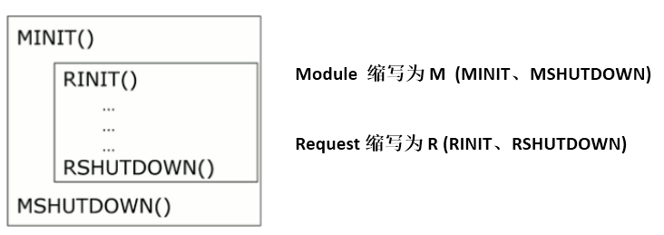
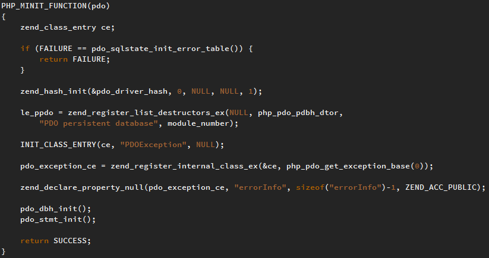
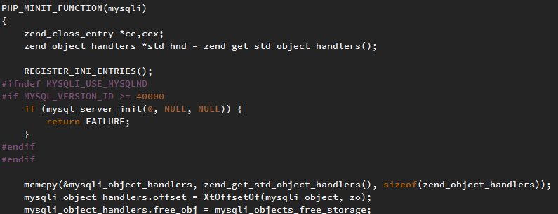
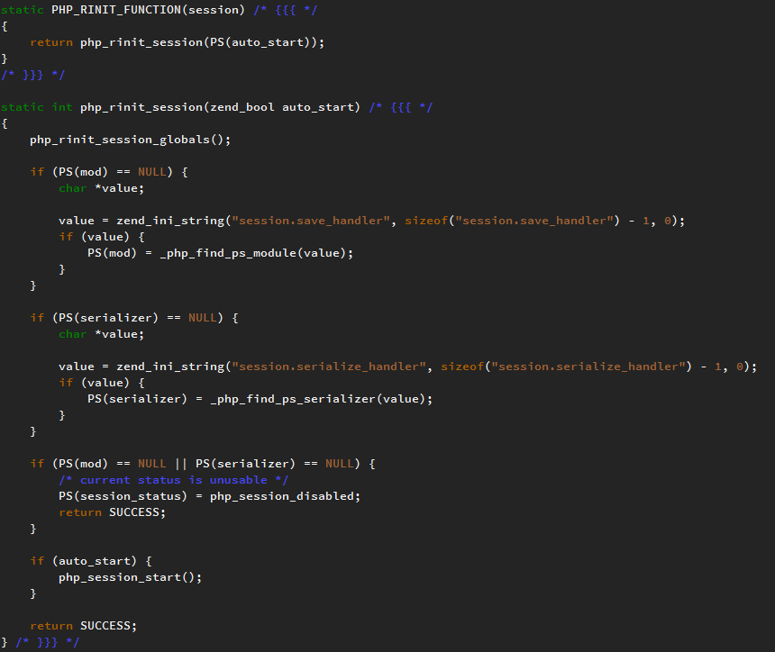
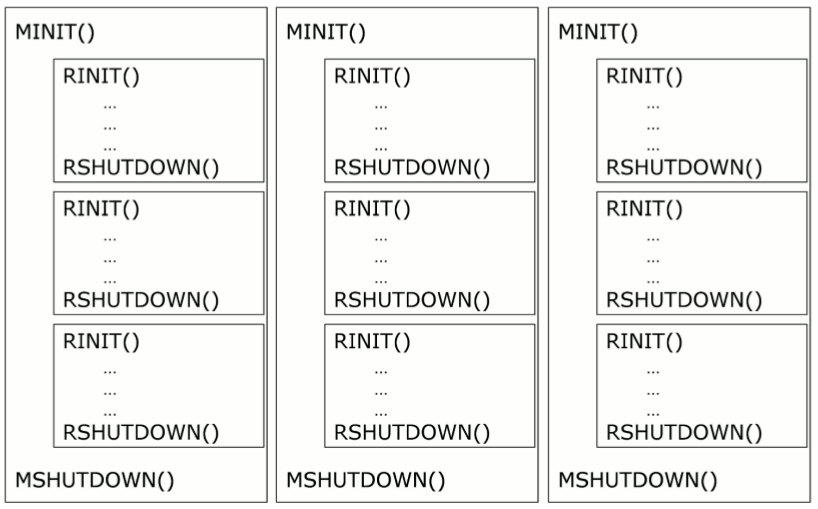
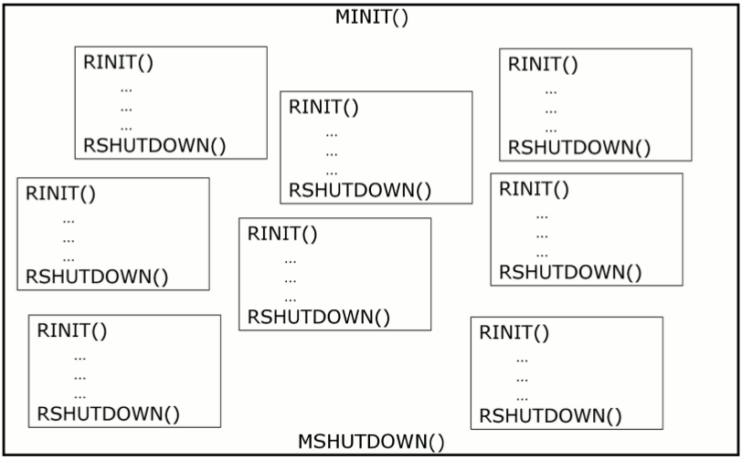
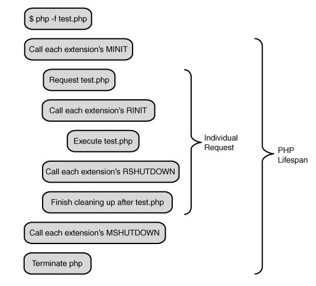

<!-- more -->
>PHP启动 会执行MINIT
>请求开始 会执行RINIT
>请求结束 会执行RSHUTDOWN
>PHP结束 会执行MSHUTDOWN
>

## PHP启动 模块初始化阶段（MINIT）
启动CLI或者FPM时；apache中php模块，apache启动时，php的模块也会启动。新开启一个php进程时，此时就会执行MINIT。

例如PHP注册了一些扩展模块，则在MINIT阶段会回调所有模块的MINIT函数。例如调用MySQLI扩展模块的MINIT函数、PDO扩展模块的MINIT函数等等。看看php.ini文件里打开了哪些扩展。
模块在这个阶段可以进行一些初始化工作，例如注册常量，定义模块使用的类等等。
```
PHP_MINIT_FUNCTION(myphpextension)
{
    // 注册常量或者类等初始化操作
    return SUCCESS; 
}
```
- ** PDO的MINIT函数 **

- ** MySQLI的MINIT部分函数 **


## 请求开始（RINIT）
一旦PHP启动完成，PHP就会等着处理一个或多个请求。PHP在CLI模式下，一个脚本只能处理一个请求。在web server下， PHP-FPM或apache下，可以处理多个请求。在处理请求时，就会运行RINIT。

PHP会调用所有模块的RINIT函数， 在这个阶段各个模块也可以执行一些相关的操作
```
PHP_RINIT_FUNCTION(myphpextension)
{
    // 例如记录请求开始时间
    // 随后在请求结束的时候记录结束时间。这样我们就能够记录下处理请求所花费的时间了
    return SUCCESS; 
}
```
一个经典的例子是Session模块的RINIT，如果在php.ini中启用了Session模块，那在调用该模块的RINIT时就会初始化$_SESSION变量，并将相关内容读入
- Session 的 RINIT函数


## 请求结束 (RSHUTDOWN，对应RINIT)
执行到了文件结尾或exit、die函数终止，PHP就会启动清理程序，它会按顺序调用各个模块的RSHUTDOWN方法。清除程序运行时产生的符号表，也就是对每个变量调用unset函数。
停止对这个请求的处理，准备处理下个请求。
## PHP结束 释放各个模块内存 (MSHUTDOWN，对应MINIT)
PHP最终会关闭自身，关闭php的进程就是MSHUTDOWN。
PHP调用每个扩展的MSHUTDOWN方法，这是各个模块释放内存。

## 并行模型
在CLI模式下，所有的东西都很简单，一个PHP进程处理一个请求，运行模式是单独的脚本执行，然后结束。
但是在web server模式下比CLI模式下复杂的多。

在同一时间处理多个请求，在PHP中有两种存在模式。
- ** 多进程模式 **
在多进程模式下，每个PHP解释器都被操作系统隔离到自己的进程中。这种模式通常会运行在UNIX系统下。这种模式通常应用在PHP-CLI, PHP-FPM 和 PHP-CGI中。


- ** 多线程模式 **
在多线程模式下，每个PHP解释器都被隔离到一个线程中。这种模式通常会运行在Windows操作系统，但也能运行在UNIX系统下。PHP及它的扩展必须在线程安全的模式下。


## 从PHP扩展解析
PHP扩展在一些阶段可以被PHP触发，这些阶段其实就是几个函数，这种又叫做钩子。我们来看下PHP扩展的结构`zend_module_entry `
```
struct _zend_module_entry {
    unsigned short size;
    unsigned int zend_api;
    unsigned char zend_debug;
    unsigned char zts;
    const struct _zend_ini_entry *ini_entry;
    const struct _zend_module_dep *deps;
    const char *name;
    const struct _zend_function_entry *functions;
    int (*module_startup_func)(INIT_FUNC_ARGS);         // MINIT
    int (*module_shutdown_func)(SHUTDOWN_FUNC_ARGS);    // MSHUTDOWN
    int (*request_startup_func)(INIT_FUNC_ARGS);        // RINIT
    int (*request_shutdown_func)(SHUTDOWN_FUNC_ARGS);   // RSHUTDOWN
    void (*info_func)(ZEND_MODULE_INFO_FUNC_ARGS);      // PHPINFO
    const char *version;
    size_t globals_size;
#ifdef ZTS
    ts_rsrc_id* globals_id_ptr;
#else
    void* globals_ptr;
#endif
    void (*globals_ctor)(void *global);      // GINIT
    void (*globals_dtor)(void *global);      // GSHUTDOWN
    int (*post_deactivate_func)(void);       // RPSHUTDOWN
    int module_started;
    unsigned char type;
    void *handle;
    int module_number;
    const char *build_id;
};
```


## 总结



参考文献
http://www.php-internals.com/book/?p=chapt02/02-01-php-life-cycle-and-zend-engine
http://www.laruence.com/2008/08/12/180.html
http://www.phpinternalsbook.com/php7/extensions_design/php_lifecycle.html

