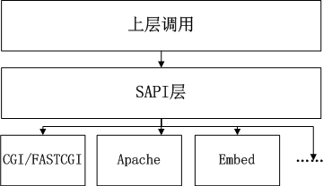
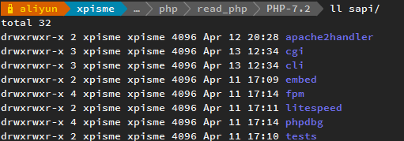
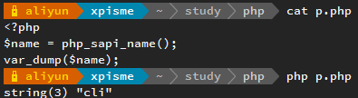
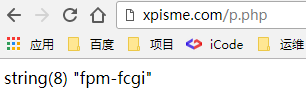

> SAPI是重要PHP中重要的组成部分。

### SAPI的示意图



### SAPI的作用

SAPI提供了一个和外部通信的接口。与外部通信一般表现为命令行下、web服务器下调用等。

SAPI可以理解为用于与外部通信的一套接口（协议）。实现这套接口应用于命令行，则在命令行下与PHP内核交互时使用命令行下的这套接口。实现这套接口应用于web服务器，则在web服务器下与PHP内核交互时使用web服务器下的这套接口。

### 每个SAPI源码的目录



### 利用`php_sapi_name`函数确定使用的那种`sapi`

在命令行下运行，则使用cli实现的sapi



在web服务器（Nginx）下运行，则使用fpm实现的sapi



### SAPI的结构体`sapi_module_struct`

```

main/SAPI.h

struct _sapi_module_struct {

    char *name;                                                 // 名字 标识用

    char *pretty_name;                                          // 更好理解的名字

    int (*startup)(struct _sapi_module_struct *sapi_module);    // 启动函数 当SAPI初始化时，首先会调用该函数。如果服务器处理多个请求时，该函数只会调用一次。

    int (*shutdown)(struct _sapi_module_struct *sapi_module);   // 关闭方法 它用来释放所有SAPI的数据结构，内存等。

    int (*activate)(void);                                      // 激活 此函数会在每个请求开始时调用，它会再次初始化每个请求前的数据结构。

    int (*deactivate)(void);                                    // 停用 此函数会在每个请求结束时调用，它用来确保释放activate中初始化的数据结构

    size_t (*ub_write)(const char *str, size_t str_length);     // 不缓存的写操作 unbuffered write 用来将PHP的数据输出给客户端

    void (*flush)(void *server_context);                        // flush  刷新输出，在CLI模式下通过使用C语言的库函数fflush实现，在php_mode5模式下，使用Apache的提供的函数rflush实现。

    zend_stat_t *(*get_stat)(void);                             // get uid

    char *(*getenv)(char *name, size_t name_len);               // getenv

    void (*sapi_error)(int type, const char *error_msg, ...) ZEND_ATTRIBUTE_FORMAT(printf, 2, 3);                       //error handler 报告错误用，大多数的SAPI都是使用的PHP的默认实现php_error

    int (*header_handler)(sapi_header_struct *sapi_header, sapi_header_op_enum op, sapi_headers_struct *sapi_headers);  //header handler

    int (*send_headers)(sapi_headers_struct *sapi_headers);                     // send headers handler

    void (*send_header)(sapi_header_struct *sapi_header, void *server_context); // send header handler  发送头部信息，此方法一般的SAPI都会定制，其所不同的是，有些的会调服务器自带的（如apache），有些需要自己实现（FastCGI）

    size_t (*read_post)(char *buffer, size_t count_bytes);      // read POST data  此函数和read_cookie一样也是在SAPI激活是调用，他与请求的方法相关，当请求的方式是POST时，程序会操作$_POST/$HTTP_RAS_POST_DATA等变量

    char *(*read_cookies)(void);                                // read Cookies 在SAPI激活时，程序会调用次函数，并且将此函数获取的值赋给SG request_info.cookie_data 在CLI模式下，函数会返回NULL

    void (*register_server_variables)(zval *track_vars_array);  // register server variables

    void (*log_message)(char *message, int syslog_type_int);    // Log message

    double (*get_request_time)(void);                           // Request Time

    void (*terminate_process)(void);                            // Child Terminate

    char *php_ini_path_override;                                // 覆盖的ini路径

    void (*default_post_reader)(void);

    void (*treat_data)(int arg, char *str, zval *destArray);

    char *executable_location;

    int php_ini_ignore;

    int php_ini_ignore_cwd; /* don't look for php.ini in the current directory */

    int (*get_fd)(int *fd);

    int (*force_http_10)(void);

    int (*get_target_uid)(uid_t *);

    int (*get_target_gid)(gid_t *);

    unsigned int (*input_filter)(int arg, char *var, char **val, size_t val_len, size_t *new_val_len);

    void (*ini_defaults)(HashTable *configuration_hash);

    int phpinfo_as_text;

    char *ini_entries;

    const zend_function_entry *additional_functions;

    unsigned int (*input_filter_init)(void);

};

```

#### `cli`模式的`_sapi_module_struct`

```

sapi/cli/php_cli.c

static sapi_module_struct cli_sapi_module = {

    "cli",                          /* name */

    "Command Line Interface",       /* pretty name */

    php_cli_startup,                /* startup */

    php_module_shutdown_wrapper,    /* shutdown */

    NULL,                           /* activate */

    sapi_cli_deactivate,            /* deactivate */

    sapi_cli_ub_write,              /* unbuffered write */

    sapi_cli_flush,                 /* flush */

    NULL,                           /* get uid */

    NULL,                           /* getenv */

    php_error,                      /* error handler */

    sapi_cli_header_handler,        /* header handler */

    sapi_cli_send_headers,          /* send headers handler */

    sapi_cli_send_header,           /* send header handler */

    NULL,                           /* read POST data 命令行模式下 没有post数据 */

    sapi_cli_read_cookies,          /* read Cookies */

    sapi_cli_register_variables,    /* register server variables */

    sapi_cli_log_message,           /* Log message */

    NULL,                           /* Get request time */

    NULL,                           /* Child terminate */

    STANDARD_SAPI_MODULE_PROPERTIES

};

```

####  `fpm`模式下的`_sapi_module_struct`

```

sapi/fpm/fpm/fpm_main.c

static sapi_module_struct cgi_sapi_module = {

    "fpm-fcgi",                     /* name */

    "FPM/FastCGI",                  /* pretty name */

    php_cgi_startup,                /* startup */

    php_module_shutdown_wrapper,    /* shutdown */

    sapi_cgi_activate,              /* activate */

    sapi_cgi_deactivate,            /* deactivate */

    sapi_cgibin_ub_write,           /* unbuffered write */

    sapi_cgibin_flush,              /* flush */

    NULL,                           /* get uid */

    sapi_cgibin_getenv,             /* getenv */

    php_error,                      /* error handler */

    NULL,                           /* header handler */

    sapi_cgi_send_headers,          /* send headers handler */

    NULL,                           /* send header handler */

    sapi_cgi_read_post,             /* read POST data */

    sapi_cgi_read_cookies,          /* read Cookies */

    sapi_cgi_register_variables,    /* register server variables */

    sapi_cgi_log_message,           /* Log message */

    NULL,                           /* Get request time */

    NULL,                           /* Child terminate */

    STANDARD_SAPI_MODULE_PROPERTIES

};

```

#### `php_sapi_name`取的值就是`sapi_module`的`name`

```

PHP_FUNCTION(php_sapi_name)

{

    if (zend_parse_parameters_none() == FAILURE) {

        return;

    }

    if (sapi_module.name) {

        RETURN_STRING(sapi_module.name);

    } else {

        RETURN_FALSE;

    }

}

```

### TIPS

大家可以观察下sapi/fpm/fpm/fpm_main.c下cgi_sapi_module的sapi_cgi_read_post函数。

然后再观察下sapi/cli/php_cli.c下cli_sapi_module的获取post数据。

发现cli（命令行模式）下获取post数据是NULL，因为命令行下没有POST数据。

你也可以看下获取cookie函数。

参考资料

http://www.laruence.com/2008/08/12/180.html

http://www.php-internals.com/book/?p=chapt02/02-02-00-overview

http://php.net/manual/zh/function.php-sapi-name.php

