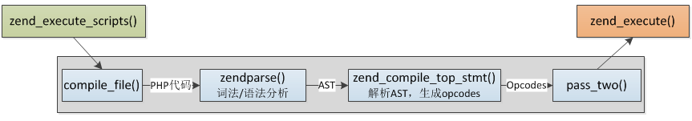
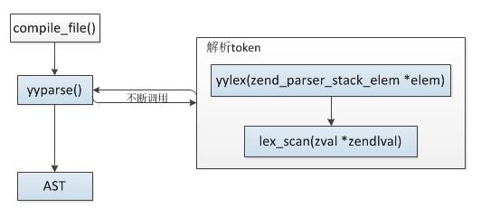
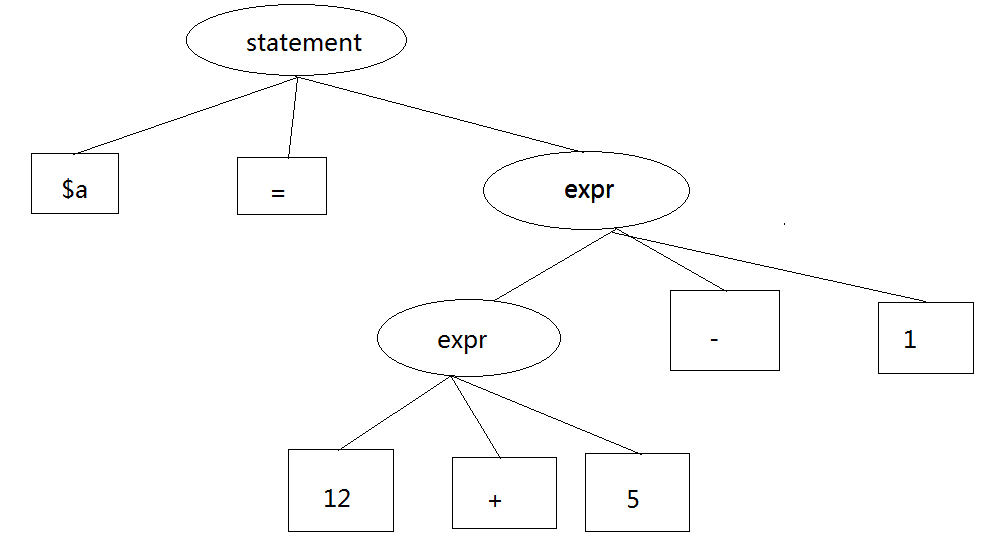

 PHP代码 编译过程 
<!-- more -->
>PHP的SAPI，SAPI处于PHP整个架构较上层，而真正脚本的执行主要由Zend引擎来完成。

## 编程语言
- 编程语言分类
    + 编译型语言 运行前必须对源代码进行编译，然后运行编译后的目标文件。例如：C++、java
    + 解释型语言 无需经过编译即可"运行"，可以理解为直接运行。例如：PHP、Python、Javascript
        * 这些语言并不是真的直接就被能被机器理解，这些语言都需要一个解释器， 由解释器来执行这些源码， 实际上这些语言还是会经过编译环节， 只不过它们一般会在运行的时候实时进行编译。
        * 为了效率，并不是所有语言在每次执行的时候都会重新编译一遍， 比如PHP的各种opcode缓存扩展、Python会将编译的中间文件保存成pyc/pyo文件。

## PHP代码的编译过程
>PHP代码先进行词法、语法分析生成抽象语法树(AST)
>然后再将抽象语法树编译为opcode

图解如下


## 将PHP转为token
PHP中提供了一个函数`token_get_all`， 该函数接收一个字符串参数， 返回一个按照词法规则切分好的数组。函数`token_name`，该函数将数字转化为解析器代号。
```
<?php
$code = <<<PHP_CODE
<?php
$str = 'hi';
echo $str;
?>
PHP_CODE;
$tokens = token_get_all($code);
foreach ($tokens as $k => $v) {
    $tokens[$k][0] = empty(token_name($v[0])) ? $v[0] : token_name($v[0]);
}
print_r($tokens);
```

就是将这一小段代码转化为词法规则。
```
<?php
$str = 'hi';
echo $str;
?>
```
[解析器代码列表](http://php.net/manual/zh/tokens.php) 输出结果如下
```
Array
(
    [0] => Array
        (
            [0] => T_OPEN_TAG
            [1] => <?php

            [2] => 1
        )

    [1] => Array
        (
            [0] => T_WHITESPACE
            [1] =>
            [2] => 2
        )

    [2] => =
    [3] => Array
        (
            [0] => T_WHITESPACE
            [1] =>
            [2] => 2
        )

    [4] => Array
        (
            [0] => T_CONSTANT_ENCAPSED_STRING
            [1] => 'hi'
            [2] => 2
        )

    [5] => ;
    [6] => Array
        (
            [0] => T_WHITESPACE
            [1] =>

            [2] => 2
        )

    [7] => Array
        (
            [0] => T_ECHO
            [1] => echo
            [2] => 3
        )

    [8] => Array
        (
            [0] => T_WHITESPACE
            [1] =>
            [2] => 3
        )

    [9] => ;
    [10] => Array
        (
            [0] => T_WHITESPACE
            [1] =>

            [2] => 3
        )

    [11] => Array
        (
            [0] => T_CLOSE_TAG
            [1] => ?>
            [2] => 4
        )

)
```

PHP使用re2c完成这个阶段的工作，re2c是词法分析器，将输入分割为一个个有意义的词块，称为token。


## 词法、语法解析
>词法分析读入PHP源代码，将PHP代码切割为可识别的token。
>语法分析根据token，生成抽象语法树（AST）



`$a = 12 + 5 - 1`，经过词法、语法解析后生成AST树




参考资料
http://www.php-internals.com/book/?p=chapt02/02-03-00-how-php-script-get-executed
https://github.com/pangudashu/php7-internal/blob/master/3/zend_compile_parse.md
http://www.laruence.com/2008/06/18/221.html
