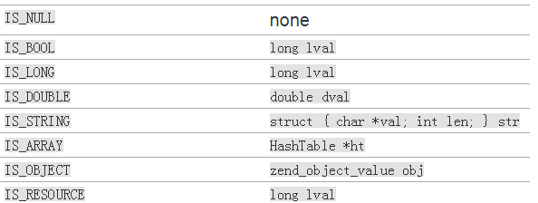
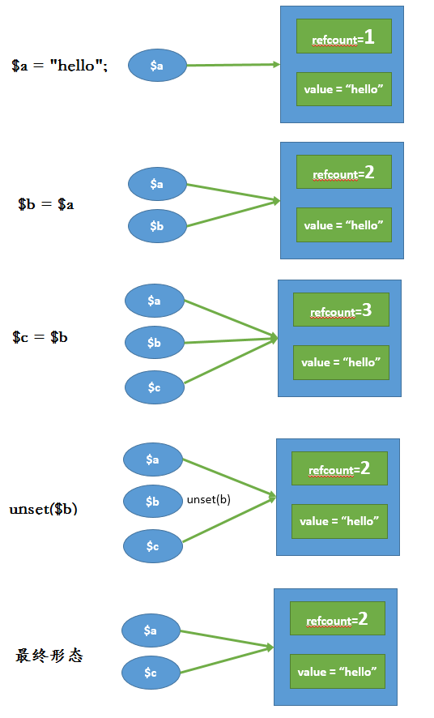
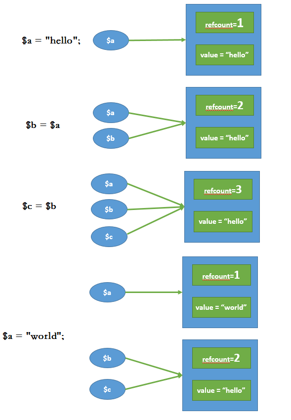

<!-- more -->
>环境 PHP5.6
>众所周知，PHP是弱类型语言，而C是强类型语言。那强类型语言C是怎么实现弱类型PHP语言的呢，变量在C中是如何定义的呢？

### _zval_struct 结构
```
typedef struct _zval_struct zval;

// PHP使用这个结构来存储变量的所有数据
struct _zval_struct {
    /* Variable information */
    zvalue_value value;     /* value 存储变量的值 */
    zend_uint refcount__gc; /* 表示引用计数 */
    zend_uchar type;    /* active type 存储变量的类型 type字段就是实现弱类型最关键的字段*/
    zend_uchar is_ref__gc;  /* 表示是否引用 */
};
```
- value 存储变量的值
- type 存储变量的类型 (8种数据类型)
    + IS_NULL
    + IS_BOOL
    + IS_LONG
    + IS_DOUBLE
    + IS_STRING
    + IS_ARRAY
    + IS_OBJECT
    + IS_RESOURCE
- refcount__gc 引用计数 默认为1
- is_ref__gc   是否引用 默认为0

### zvalue_value_zval_struct 结构
```
变量的值存储在zvalue_value联合体中，结构体定义如下

typedef union _zvalue_value {
    long lval;                  /* long value */
    double dval;                /* double value */
    struct {                    
        char *val;              
        int len;                
    } str;                      
    HashTable *ht;              /* hash table value */
    zend_object_value obj;      
    zend_ast *ast;
} zvalue_value;
```
- ** IS_NULL ** `_zval_struct`结构中`type`标记为`NULL`类型，`_zvalue_value`不存储。
- ** IS_BOOL ** `_zval_struct`结构中`type`标记为`BOOL`类型，`_zvalue_value`中`lval`存储，0(false) 和1(true)
- ** IS_LONG ** `_zval_struct`结构中`type`标记为`INT`类型，`_zvalue_value`中`lval`存储，
    + 这是一个有符号整数类型，即它可以存储正整数和负整数。但是不适合位(&,|,^)操作
    + 64位UNIX操作系统占8个字节，64位windows操作系统占4个字节。所以在不同的操作系统中，存储的整型范围不同。
- ** IS_DOUBLE ** `_zval_struct`结构中`type`标记为`DOUBLE`类型，`_zvalue_value`中`dval`存储
    + 根据`IEEE-754`指定的，采用8字节存储。
- ** IS_STRING ** `_zval_struct`结构中`type`标记为`STRING`类型，`_zvalue_value`中`struct {char *val; int len; } str; `存储
    + C中字符串是以\0结尾的字符数组，这里多存储了字符串的长度。空间换时间，strlen时间负责度O(1)
    + 字符串`foo`长度为3，实际上存储是4。`strlen("foo") == sizeof("foo") - 1`
- ** IS_ARRAY ** `_zval_struct`结构中`type`标记为`ARRAY`类型，`_zvalue_value`中`HashTable *ht`存储
    + PHP5.6 HashTable http://blog.xpisme.com/posts/PHP/2018/04/09/php-hashtable/
- ** IS_OBJECT ** `_zval_struct`结构中`type`标记为`OBJECT`类型，`_zvalue_value`中`zend_object_value obj`存储
```
// 对象Object结构体，php对象只有在运行时才会被创建。
typedef struct _zend_object_value {
    zend_object_handle handle; // unsigned int类型，EG(objects_store).object_buckets的索引 object对象值内容的zend_object_handle域就是当前对象在对象池中所在的索引
    const zend_object_handlers *handlers; // handlers字段则是将对象进行操作时的处理函数保存起来
} zend_object_value;

```
- ** IS_RESOURCE ** `_zval_struct`结构中`type`标记为`RESOURCE`类型，`_zvalue_value`中`lval`存储
    + 资源(IS_RESOURCE)与对象相似，它们也存储一个惟一的ID，可以用来查找实际值。这个ID存储在long lval成员中

### 类型存储对应关系



### 有意思的宏
```
zval *zv_ptr = /* 假设有zval结构的值 */;

if (zv_ptr->type == IS_LONG) {
    php_printf("Zval 是一个长整型，其值为 %ld\n", zv_ptr->value.lval);
} else /* ... 处理其他类型 */
```

在定义了宏后，操作变得更简单了
```
zval *zv_ptr = /* ... */;

if (Z_TYPE_P(zv_ptr) == IS_LONG) {
    php_printf("Zval 是一个长整型，其值为 %ld\n", Z_LVAL_P(zv_ptr));
} else /* ... */
```
`Z_TYPE_P`宏取的是zval的type值，`Z_LVAL_P`宏取的是zval的lval字段值。

```
#define Z_TYPE(zval)        (zval).type
#define Z_TYPE_P(zval_p)    Z_TYPE(*zval_p)

#define Z_LVAL_P(zval_p)        Z_LVAL(*zval_p)
#define Z_LVAL(zval)            (zval).value.lval
```

### 有意思的打印函数
```
switch (Z_TYPE_P(zv_ptr)) {
    case IS_NULL:
        php_printf("NULL: null\n");
        break;
    case IS_BOOL:
        if (Z_BVAL_P(zv_ptr)) {
            php_printf("BOOL: true\n");
        } else {
            php_printf("BOOL: false\n");
        }
        break;
    case IS_LONG:
        php_printf("LONG: %ld\n", Z_LVAL_P(zv_ptr));
        break;
    case IS_DOUBLE:
        php_printf("DOUBLE: %g\n", Z_DVAL_P(zv_ptr));
        break;
    case IS_STRING:
        php_printf("STRING: value=\"");
        PHPWRITE(Z_STRVAL_P(zv_ptr), Z_STRLEN_P(zv_ptr));
        php_printf("\", length=%d\n", Z_STRLEN_P(zv_ptr));
        break;
    case IS_RESOURCE:
        php_printf("RESOURCE: id=%ld\n", Z_RESVAL_P(zv_ptr));
        break;
    case IS_ARRAY:
        php_printf("ARRAY: hashtable=%p\n", Z_ARRVAL_P(zv_ptr));
        break;
    case IS_OBJECT:
        php_printf("OBJECT: ???\n");
        break;
}
```

### 变量的引用计数和写时复制
>假如我们定义了一个变量然后赋值给另外一个变量，可能后面都只是只读操作，硬拷贝就会有多余的一份数据。解决方案是： 引用计数+写时复制
>xdebug扩展安装：http://blog.xpisme.com/posts/PHP/2018/04/08/build-enviorment-for-php/

#### 引用计数

```
$a = 'hello';
xdebug_debug_zval('a'); //refcount只有变量a在引用 所以为1
$b = $a;
xdebug_debug_zval('a'); //refcount有变量a和变量b在引用 所以为2
$c = $b;
xdebug_debug_zval('a'); //refcount有变量a、b、c在引用 所以为3
unset($b);
xdebug_debug_zval('a'); //refcount有变量a、c在引用，所以为2

输出
a: (refcount=1, is_ref=0)=1
a: (refcount=2, is_ref=0)=1
a: (refcount=3, is_ref=0)=1
a: (refcount=2, is_ref=0)=1
```

图解


#### 写时复制
```
$a = 'hello';
xdebug_debug_zval('a'); //refcount只有变量a在引用 所以为1
$b = $a;
xdebug_debug_zval('a'); //refcount有变量a和变量b在引用 所以为2
$c = $b;
xdebug_debug_zval('a'); //refcount有变量a、b、c在引用 所以为3
$a = 'world';  // $a 与 $b,$c 存储分离
xdebug_debug_zval('a'); //refcount只有变量a在引用 所以为1
xdebug_debug_zval('b'); //refcount有变量b和变量c在引用 所以为2

输出
a: (refcount=1, is_ref=0)=1
a: (refcount=2, is_ref=0)=1
a: (refcount=3, is_ref=0)=1
a: (refcount=1, is_ref=0)=2
b: (refcount=2, is_ref=0)=1
```

图解


参考资料
http://www.phpinternalsbook.com/zvals/basic_structure.html
http://www.php-internals.com/book/?p=chapt03/03-01-00-variables-structure
