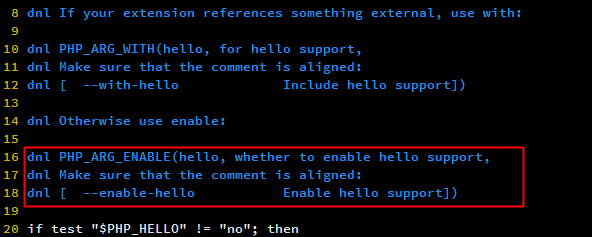
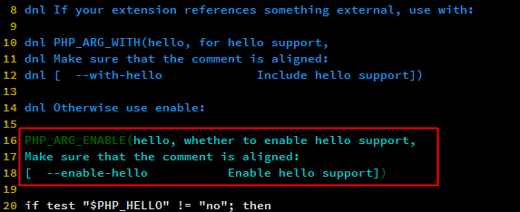
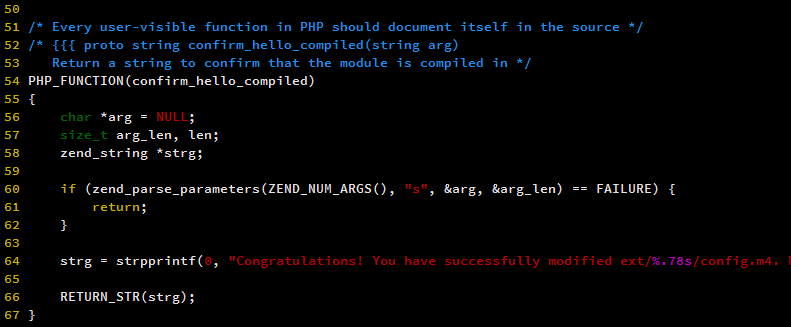
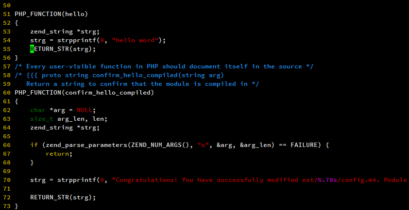
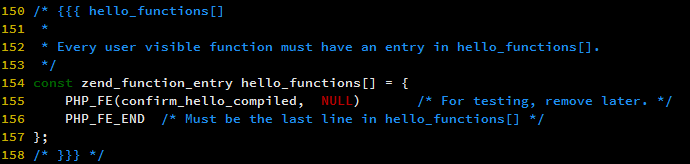
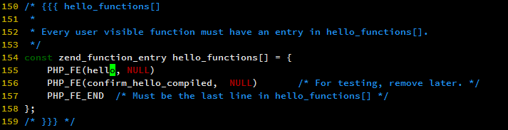

---

title: PHP7 扩展开发 (hello world)

date: 2018-06-11 15:04:15

tags:

    - PHP

categories: PHP

---

<!-- more -->

>学习概念是比较枯燥的事情，只有动手操作才能吸收的更多。从扩展开发开始

示例：

```

<?php

echo hello();

?>

```

执行

```

php ./test.php

hello world

```

## 第零步 搭建基础环境

下载php7的源码 https://github.com/php/php-src/releases 在这里我们用php-7.2.6

```

[xpisme@aliyun ~]$ cd /home/xpisme/usr/local

下载

[xpisme@aliyun local]$ wget https://github.com/php/php-src/archive/php-7.2.6.tar.gz

解压

[xpisme@aliyun local]$ tar xzvf php-7.2.6.tar.gz

创建配置

[xpisme@aliyun local]$ cd php-src-php-7.2.6/

[xpisme@aliyun php-src-php-7.2.6]$ ./buildconf --force

编译三部曲

[xpisme@aliyun php-src-php-7.2.6]$ ./configure --disable-all --prefix=/home/xpisme/usr/php72

[xpisme@aliyun php-src-php-7.2.6]$ make 

[xpisme@aliyun php-src-php-7.2.6]$ make  install

```

## 第一步 生成骨干代码

使用php提供的代码生成工具ext_skel

```

[xpisme@aliyun ~]$ cd /home/xpisme/usr/local/php-src-php-7.2.6/ext

[xpisme@aliyun ext]$ ./ext_skel --extname=hello

```

会发现ext下多个hello目录。

## 第二步 移除注释

编辑`hello/config.m4`文件 移除注释`--enable-hello`


将





改为




## 第三步 实现代码

```

[xpisme@aliyun ~]$ cd /home/xpisme/usr/local/php-src-php-7.2.6/ext/hello

[xpisme@aliyun hello]$ vim hello.c

```

找到PHP_FUNCTION(confirm_hello_compiled)，在其上面增加如下代码：

```

PHP_FUNCTION(hello)

{

        zend_string *strg;

        strg = strpprintf(0, "hello world");

        RETURN_STR(strg);

}

```

即将



改为



找到 PHP_FE(confirm_hello_compiled, 在上面增加如下代码

```

PHP_FE(say, NULL)

```

即将



改为



## 第四步 编译安装

```

[xpisme@aliyun ~]$ cd /home/xpisme/usr/local/php-src-php-7.2.6/ext/hello

[xpisme@aliyun hello]$ /home/xpisme/usr/php72/bin/phpize

[xpisme@aliyun hello]$ ./configure --with-php-config=/home/xpisme/usr/php72/bin/php-config

[xpisme@aliyun hello]$ make && make install

```

## 第五步 测试

```

[xpisme@aliyun hello]$ /home/xpisme/usr/php72/bin/php -d "extension=hello.so" -r "echo hello();"

hello world

```

参考资料

http://www.php-internals.com/book/?p=chapt11/11-02-00-extension-hello-world

https://www.bo56.com/php7%E6%89%A9%E5%B1%95%E5%BC%80%E5%8F%91%E4%B9%8Bhello-word/

https://www.bo56.com/php7%E6%89%A9%E5%B1%95/

