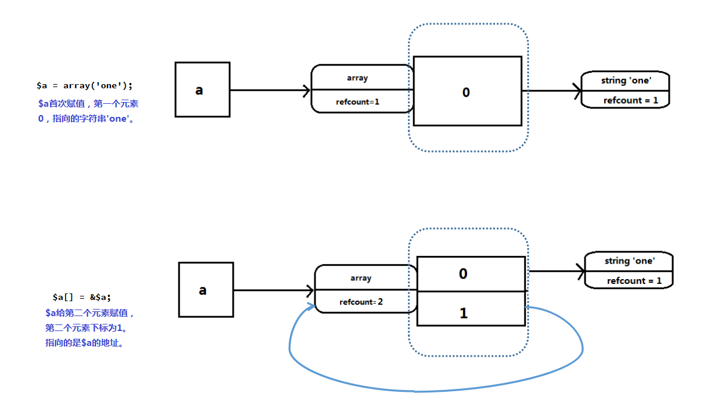
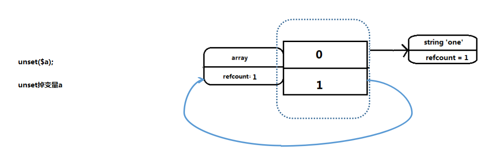
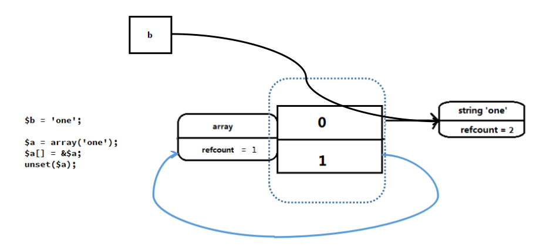
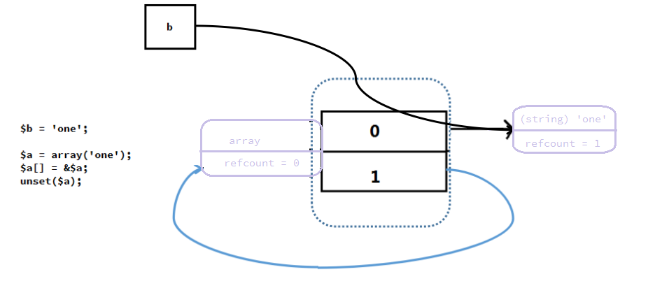
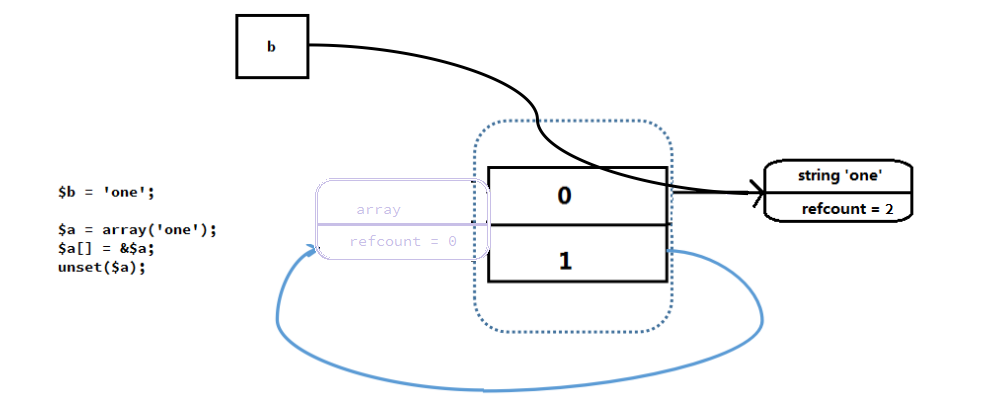
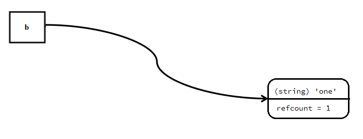
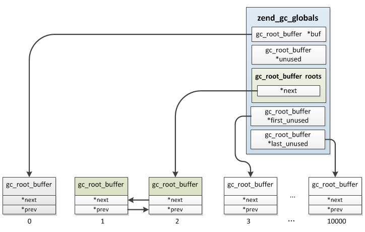

---

title: php7 垃圾回收

date: 2018-05-08 11:09:10

tags:

 - PHP

categories: PHP

---

<!-- more -->

# PHP7 垃圾回收

## `unset`后的`zval`是不是垃圾

```

$a = "hello world!";

unset($a);

```

`$a`现在是不是一个垃圾呢？GC认为这不是一个垃圾。因为`$a`在`unset`之后，refcount减少1变成了0，这个时候GC会直接将`$a`将对应的空间释放掉，则`$a`及对应的`zval`结构就不存在了。

## 垃圾的产生

将数组的引用赋值给数组中的一个元素

```

$a = array('one');

$a[] = &$a;

```



此时若执行`unset`操作

```

unset($a);

```



`unset`操作后，`$a`不在符号表中，用户无法再访问此变量，`$a`之前指向的`zval`的`refcount`变为1，因为`$a`的第二个元素指向`$a`的地址。因此不能被回收，这就是垃圾。

## 回收垃圾的规则

0. 垃圾回收只适用于`array`、`object`这两种类型。

1. 变量的refcount减少到0，那么此变量可以被释放掉，所占用的内存直接被释放掉，不属于垃圾。

2. 变量的refcount减少之后大于0，那么此变量还不能释放，此变量可能成为一个垃圾。

- 第一种情况就是可以理解为正常的`unset`操作，不会产生垃圾。

- 第二种情况垃圾回收器才会将变量收集起来。

## 回收算法

第一步： 遍历垃圾收集器的buffer缓存区，并把所有的value成员refcount减1，把当前value设置为灰色，并把当前value的成员遍历也设置为灰色。

第二步： 再次遍历buffer，检查当前value的refcount是否为0，为0表示是垃圾，标记为白色；不为0，则证明还有用，需要对refcount在加回去，设置颜色为黑色。

第三步： 最后再次遍历buffer，把非白色的从buffer中移除，剩下的buffer中就是垃圾了。

图解：



经过第一步后



经过第二步后



经过第三步后



**所以总结来看，就是对循环引用的对象，将refcount减1后，判断refcount是否为0，若为0则是垃圾，若不为0，则把refcount加回去**

## 数据结构

```

// 该struct对垃圾进行管理

// 收集到的可能成为垃圾的value就保存在这个结构的buf中，即垃圾缓存区 buf是一个双向链表

typedef struct _zend_gc_globals {

    zend_bool         gc_enabled;       // 是否启用gc

    zend_bool         gc_active;        // 是否在垃圾检查过程中

    zend_bool         gc_full;          // 缓存区是否已满

    gc_root_buffer   *buf;              /* preallocated arrays of buffers   启动时分配的用于保存可能垃圾的缓存区 */

    gc_root_buffer    roots;            /* list of possible roots of cycles 指向buf中最新加入的一个可能垃圾*/

    gc_root_buffer   *unused;           /* list of unused buffers           指向buf中没有使用的buffer*/

    gc_root_buffer   *first_unused;     /* pointer to first unused buffer   指向buf中第一个没有使用的buffer*/

    gc_root_buffer   *last_unused;      /* pointer to last unused buffer    指向buf尾部*/

    gc_root_buffer    to_free;          /* list to free                     待释放的垃圾*/

    gc_root_buffer   *next_to_free;

    uint32_t gc_runs;                   // 统计gc运行的次数

    uint32_t collected;                 // 统计已回收的垃圾数

    .....

    gc_additional_buffer *additional_buffer;

} zend_gc_globals;

//双向链表

typedef struct _gc_root_buffer {

    zend_refcounted          *ref;

    struct _gc_root_buffer   *next;     /* double-linked list               */

    struct _gc_root_buffer   *prev;

    uint32_t                 refcount;

} gc_root_buffer;

```

### buf是个双向链表

`buf`用于保存收集到的value，它是一个双向链表，初始化时一次性分配10001个`gc_root_buffer`，第一个buffer被保留。

既然是个双向链表，`gc_root_buffer`中肯定有两个指针`next、prev`。

`zend_gc_globals`结构中有两个指针指向缓冲区`buf`的可用空间的起点和终点`first_unused`和`last_unused`。

### zend_gc_globals中的unused

unused用来管理buf中开始加入，后面又删除的节点，这是一个单链表。

### 添加垃圾变量

1. 优先使用unused的这些节点。

2. 其次才是first_unused节点，first_unused++，直到last_unused。

### 结构中有2个可能的垃圾变量，结构如图



```
gc_root_buffer 1 与 gc_root_buffer 2 互相引用
```

## 代码解析

### 初始化

```

// 初始化垃圾回收器

ZEND_API void gc_init(void)

{

    if (GC_G(buf) == NULL && GC_G(gc_enabled)) {

        // 分配buf缓存区内存，大小为GC_ROOT_BUFFER_MAX_ENTRIES 10001，其中第1个保留不被使用  buf是一个双向链表

        GC_G(buf) = (gc_root_buffer*) malloc(sizeof(gc_root_buffer) * GC_ROOT_BUFFER_MAX_ENTRIES);

        // last_unused 指向尾部

        GC_G(last_unused) = &GC_G(buf)[GC_ROOT_BUFFER_MAX_ENTRIES];

        gc_reset();

    }

}

```

此垃圾回收机制可以通过php.ini中的zend.enable_gc设置是否开启。

### 垃圾收集

#### 销毁变量

销毁变量判断是否需要加入垃圾收集器

```

Zend/zend_variables.h

// 销毁一个zval 会调用i_zval_ptr_dtor进行处理

static zend_always_inline void i_zval_ptr_dtor(zval *zval_ptr ZEND_FILE_LINE_DC)

{

    // 不使用引用计数的类型不需要进行回收

    if (Z_REFCOUNTED_P(zval_ptr)) {

        zend_refcounted *ref = Z_COUNTED_P(zval_ptr);

        if (!--GC_REFCOUNT(ref)) {

            //refcount 减一后变为0 不是垃圾 正常回收

            _zval_dtor_func(ref ZEND_FILE_LINE_RELAY_CC);

        } else {

            // refcount减一后仍然大于0

            gc_check_possible_root(ref);

        }

    }

}

```

#### gc_check_possible_root

```

Zend/zend_gc.h

// 垃圾收集器收集

static zend_always_inline void gc_check_possible_root(zend_refcounted *ref)

{

    if (GC_TYPE(ref) == IS_REFERENCE) {

        zval *zv = &((zend_reference*)ref)->val;

        if (!Z_REFCOUNTED_P(zv)) {

            return;

        }

        ref = Z_COUNTED_P(zv);

    }

    //判断是否已经收集过

    if (UNEXPECTED(GC_MAY_LEAK(ref))) {

        gc_possible_root(ref);

    }

}

```

#### gc_possible_root

```

// 收集时首先会从buf中选择一个空闲节点，然后将value的gc保存到这个节点中，

// 如果没有空闲节点则表明回收器已经满了，这个时候会触发垃圾鉴定、回收的程序

ZEND_API void ZEND_FASTCALL gc_possible_root(zend_refcounted *ref)

{

    ...

    //插入的节点必须是数组或者对象

    ZEND_ASSERT(GC_TYPE(ref) == IS_ARRAY || GC_TYPE(ref) == IS_OBJECT);

    //插入的节点必须是黑色 防止重复插入

    ZEND_ASSERT(EXPECTED(GC_REF_GET_COLOR(ref) == GC_BLACK));

    ZEND_ASSERT(!GC_ADDRESS(GC_INFO(ref)));

    GC_BENCH_INC(zval_possible_root);

    //unused中有可用的节点

    newRoot = GC_G(unused);

    if (newRoot) {

        //有的话先用unused 然后将GC_G(unused)指向单链表的下一个

        GC_G(unused) = newRoot->prev;

    } else if (GC_G(first_unused) != GC_G(last_unused)) {

        //unused没有可用的，但buf中有

        newRoot = GC_G(first_unused);

        GC_G(first_unused)++;

    } else {

        // buf 缓存区已满，这时需要启动垃圾鉴定、回收程序。

        ....

    }

    //将插入的ref标记为紫色，防止重复插入

    GC_TRACE_SET_COLOR(ref, GC_PURPLE);

    GC_INFO(ref) = (newRoot - GC_G(buf)) | GC_PURPLE;

    newRoot->ref = ref;

    //插入roots链表头部

    newRoot->next = GC_G(roots).next;

    newRoot->prev = &GC_G(roots);

    GC_G(roots).next->prev = newRoot;

    GC_G(roots).next = newRoot;

    GC_BENCH_INC(zval_buffered);

    GC_BENCH_INC(root_buf_length);

    GC_BENCH_PEAK(root_buf_peak, root_buf_length);

}

```

#### 删除GC_REMOVE_FROM_BUFFER

```

Zend/zend_gc.h

#define GC_REMOVE_FROM_BUFFER(p) do { \

        zend_refcounted *_p = (zend_refcounted*)(p); \

        if (GC_ADDRESS(GC_INFO(_p))) { \

            gc_remove_from_buffer(_p); \

        } \

    } while (0)

#define GC_ADDRESS(v) \

    ((v) & ~GC_COLOR)

```

删除时首先根据gc_info取到gc_root_buffer，然后再从buf中移除，删除后把空出来的gc_root_buffer插入unused单链表尾部。

```

ZEND_API void ZEND_FASTCALL gc_remove_from_buffer(zend_refcounted *ref)

{

    gc_root_buffer *root;

    ZEND_ASSERT(GC_ADDRESS(GC_INFO(ref)));

    GC_BENCH_INC(zval_remove_from_buffer);

    if (EXPECTED(GC_ADDRESS(GC_INFO(ref)) < GC_ROOT_BUFFER_MAX_ENTRIES)) {

        // GC_ADDRESS就是获取节点在缓存区中的位置，因为删除是根据zend_refcounted而缓存链表的节点类型是gc_root_buffer。

        root = GC_G(buf) + GC_ADDRESS(GC_INFO(ref));

        //双向链表的移除操作。

        gc_remove_from_roots(root);

    } else {

        root = gc_find_additional_buffer(ref);

        gc_remove_from_additional_roots(root);

    }

    if (GC_REF_GET_COLOR(ref) != GC_BLACK) {

        GC_TRACE_SET_COLOR(ref, GC_PURPLE);

    }

    GC_INFO(ref) = 0;

    /* updete next root that is going to be freed */

    if (GC_G(next_to_free) == root) {

        GC_G(next_to_free) = root->next;

    }

}

```

### 释放垃圾 zend_gc_collect_cycles

```

ZEND_API int zend_gc_collect_cycles(void)

{

    ...

    //遍历roots链表，对当前结点value的所有成员进行遍历，refcount减1

    gc_mark_roots();

    //再次遍历roots链表 检查各节点当前refcount是否为0 是则标记为白色 表示为垃圾，否则需要还原，把refcount再加回去

    gc_scan_roots();

    //将roots链表中的非白色节点删除，之后roots链表中全部是真正的垃圾，将垃圾链表转到to_free等待释放

    count = gc_collect_roots(&gc_flags);


    //释放垃圾

    current = to_free.next;

    while (current != &to_free) {

        p = current->ref;

        GC_G(next_to_free) = current->next;

        GC_TRACE_REF(p, "destroying");

        if (GC_TYPE(p) == IS_OBJECT) {

            ...

            // 调用free_obj释放对象

            obj->handlers->free_obj(obj);

            ...

        } else if (GC_TYPE(p) == IS_ARRAY) {

            ...

            //释放数组

            zend_array *arr = (zend_array*)p;

            GC_TYPE(arr) = IS_NULL;

            zend_hash_destroy(arr);

        }

        current = GC_G(next_to_free);

    }

}

```

参考资料    ：

http://php.net/manual/zh/features.gc.collecting-cycles.php

https://github.com/pangudashu/php7-internal/blob/master/5/gc.md

