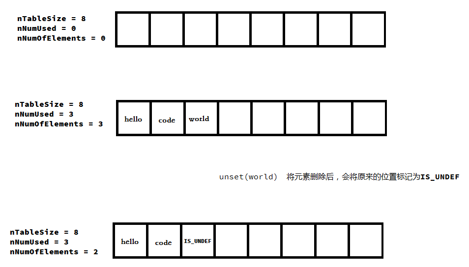
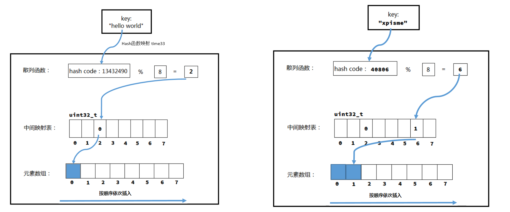
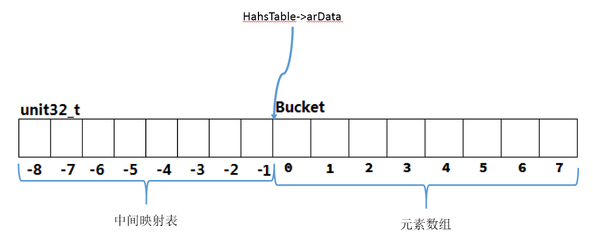
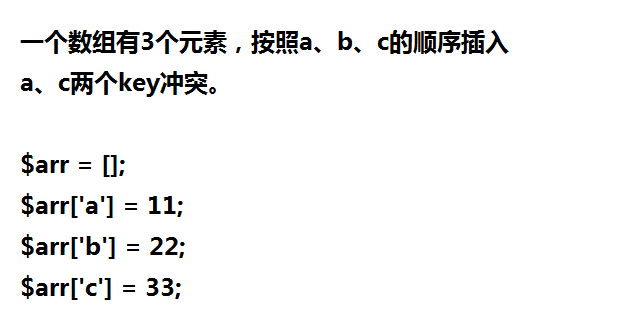
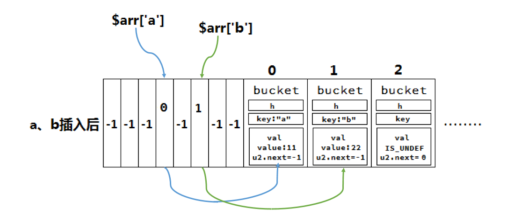
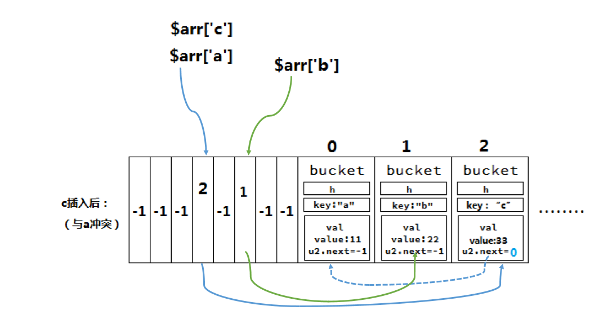
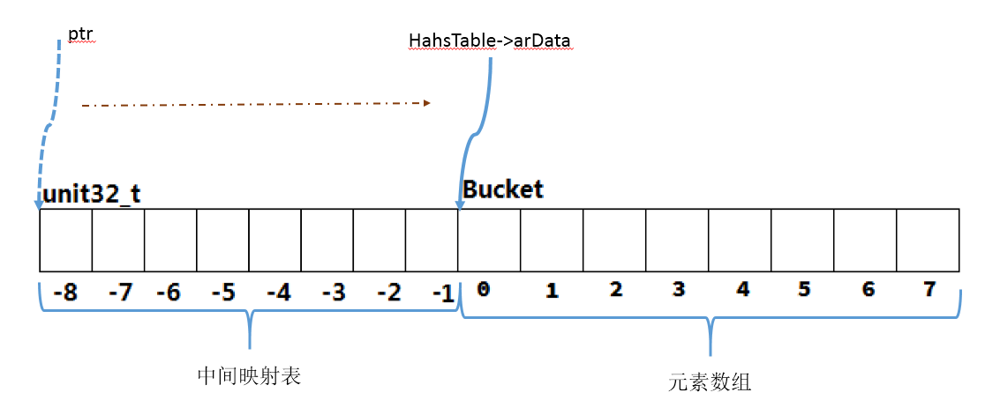

 PHP7之HashTable 
<!-- more -->
- **hashtable的基本原理** http://blog.xpisme.com/posts/PHP/2018/04/09/php-hashtable/
### HashTable的数据结构
数据结构定义在`Zend/zend_types.h`
```
// Bucket：散列表中存储的元素
typedef struct _Bucket {
    zval              val;              // 存储的具体value，这里嵌入一个zval结构
    zend_ulong        h;                /* key根据哈希算法计算得到的哈希值 或者是数字索引编号  hash value (or numeric index)   */
    zend_string      *key;              /* 存储元素的key  string key or NULL for numerics */
} Bucket;

typedef struct _zend_array HashTable;

// array是PHP中非常强大的一个数据结构，它的底层实现就是普通有序HashTable
struct _zend_array {
    zend_refcounted_h gc;   // 引用计数，与字符串相同
    union {
        struct {
            ZEND_ENDIAN_LOHI_4(
                zend_uchar    flags,
                zend_uchar    nApplyCount,
                zend_uchar    nIteratorsCount,
                zend_uchar    consistency)
        } v; 
        uint32_t flags;
    } u; 
    uint32_t          nTableMask;   // 计算bucket索引时的掩码
    Bucket           *arData;       // bucket 数组
    uint32_t          nNumUsed;     // 已用bucket数
    uint32_t          nNumOfElements; // 已有元素数，nNumOfElements <= nNumUsed，因为删除的并不是直接从arData中移除
    uint32_t          nTableSize;     // 数组的大小 为2^n
    uint32_t          nInternalPointer; // 数值索引
    zend_long         nNextFreeElement;
    dtor_func_t       pDestructor;
};
```
#### `_zend_array`中的 nNumUsed、nNumOfElements、nTableSize
- 先来说nTableSize，在初始化的时候，会先定义数组的大小，初始化一般会定义8个空间，此时nTableSize就是8，但是它还是个空数组，因为只是定义了空间，并没有向空间中存值。
- 再来说nNumUsed、nNumOfElements，如果向该数组中添加了3个元素，则nNumUsed=nNumOfElements=3。
- 如果你unset其中一个元素，此时nNumOfElements=2，nNumUsed=3。
- 图解如下：


#### `_zend_array`中的 *arData bucket数组
- 这个值指向存储元素数组的第一个Bucket
- 插入元素时按顺序**依次插入**数组，比如第一个元素在arData[0]、第二个在arData[1]...arData[nNumUsed] (这里为什么是顺序递增的呢，将字符串哈希后，也不可能是顺序递增的呀？)

#### `_zend_array`中的nTableMask 
`_zend_array`中的nTableMask值为nTableSize的负数。用于计算散列值，计算方式如下
```
nIndex = key->h | nTableMask;
```
因为nTableSize大小为2的幂次方，则nTableMask为（-8，-16，-32，-64，-128 ...）
key->h值为正整数，与nTableMask做或操作，可以得到[nTableMask, -1]之间的散列值。
>说明：
>5用二进制表示 0000 0101 。 -5用5的反码加1（即补码表示）
>5的原码为0000 0101  原码：自己本身的二进制编码
>5的反码为1111 1010  反码：0变1, 1变0
>5的补码为1111 1011
>-5用二进制表示为：1111 1011
>
>3用二进制表示 0000 0011 。-3用3的反码加1（即补码表示）
>3的原码为0000 0011  原码：自己本身的二进制编码
>3的反码为1111 1100  反码：0变1, 1变0
>3的补码为1111 1101
>-3用二进制表示为：1111 1101
>
>8用二进制表示 0000 1000
>-8用二进制表示 1111 1000
>
>5 | -8 = 0000 0101 | 1111 1000 = 1111 1101 = -3
>3 | -8 = 0000 0011 | 1111 1000 = 1111 1011 = -5

#### 神奇的arData 借助映射表(图解)
##### 映射表原理

##### arData中映射表的存储



### 初始化
```
// hash Table 初始化
ZEND_API void ZEND_FASTCALL _zend_hash_init(HashTable *ht, uint32_t nSize, dtor_func_t pDestructor, zend_bool persistent ZEND_FILE_LINE_DC)
{
    // 初始化gc信息
    GC_REFCOUNT(ht) = 1; 
    GC_TYPE_INFO(ht) = IS_ARRAY | (persistent ? 0 : (GC_COLLECTABLE << GC_FLAGS_SHIFT));
    // 设置flags
    ht->u.flags = (persistent ? HASH_FLAG_PERSISTENT : 0) | HASH_FLAG_APPLY_PROTECTION | HASH_FLAG_STATIC_KEYS;
    //nTableMask的值是临时的
    ht->nTableMask = HT_MIN_MASK;
    //临时设置ht->arData
    HT_SET_DATA_ADDR(ht, &uninitialized_bucket);
    ht->nNumUsed = 0; 
    ht->nNumOfElements = 0; 
    ht->nInternalPointer = HT_INVALID_IDX;
    ht->nNextFreeElement = 0; 
    ht->pDestructor = pDestructor;
    //这里会把数组大小设置为2的幂次方
    ht->nTableSize = zend_hash_check_size(nSize);
}
```

- 此时的HashTable只是设置了散列表的大小及其他一些成员的初值，还无法用来存储元素。

### 插入元素
#### 真正初始化
>因为初始化_zend_hash_init并没有实际分配arData的内存，在第一次插入时才会根据nTableSize的大小分配，分配完后把HashTable->u.flags打上HASH_FLAG_INITIALIZED掩码，这样就标识已分配。

```
//_zend_hash_add_or_update_i 函数中的前几行
if (UNEXPECTED(!(ht->u.flags & HASH_FLAG_INITIALIZED))) {
    CHECK_INIT(ht, 0);
    goto add_to_hash
}

```

```
#define CHECK_INIT(ht, packed) \
    zend_hash_check_init(ht, packed)

```

```
static zend_always_inline void zend_hash_check_init(HashTable *ht, int packed)
{
    HT_ASSERT_RC1(ht);
    //分配完后(ht)->u.flags 打上HASH_FLAG_INITIALIZED掩码
    if (UNEXPECTED(!((ht)->u.flags & HASH_FLAG_INITIALIZED))) {
        zend_hash_real_init_ex(ht, packed);
    }
}

```
真正完成内存的分配用zend_hash_real_init_ex函数
```
static zend_always_inline void zend_hash_real_init_ex(HashTable *ht, int packed)
{
    .....

    //设置nTableMask
    (ht)->nTableMask = -(ht)->nTableSize;
    //分配Bucket数组及映射数组
    HT_SET_DATA_ADDR(ht, pemalloc(HT_SIZE(ht), (ht)->u.flags & HASH_FLAG_PERSISTENT));
    //(ht)->u.flags 打上HASH_FLAG_INITIALIZED掩码
    (ht)->u.flags |= HASH_FLAG_INITIALIZED;
    //初始化映射数组的value为-1
    if (EXPECTED(ht->nTableMask == (uint32_t)-8)) {
        //若只有8个值
        Bucket *arData = ht->arData;

        HT_HASH_EX(arData, -8) = -1;
        HT_HASH_EX(arData, -7) = -1;
        HT_HASH_EX(arData, -6) = -1;
        HT_HASH_EX(arData, -5) = -1;
        HT_HASH_EX(arData, -4) = -1;
        HT_HASH_EX(arData, -3) = -1;
        HT_HASH_EX(arData, -2) = -1;
        HT_HASH_EX(arData, -1) = -1;
    } else {
        HT_HASH_RESET(ht);
    }

    .....
}
```
#### 添加元素
```
//_zend_hash_add_or_update_i 中的add_to_hash

    //使用空间++，idx是bucket在arData中的存储位置
    idx = ht->nNumUsed++;
    ht->nNumOfElements++;
    ....
    //找到存储bucket，设置key、value
    p = ht->arData + idx;
    p->h = h;
    p->key = NULL;
    //计算中间映射表的散列值，idx将保存在映射数组的nIndex位置
    nIndex = h | ht->nTableMask;
    ZVAL_COPY_VALUE(&p->val, pData);

    // 将映射表中原来的值保存到新bucket中，哈希冲突会用到 nIndex的范围在[nTableMask, -1]
    // 这里的p就是bucket  Z_NEXT就是zval结构中指向下一个元素
    Z_NEXT(p->val) = HT_HASH(ht, nIndex);
    // 保存idx ((uint32_t*)(ht->arData))[nIndex] = idx
    HT_HASH(ht, nIndex) = HT_IDX_TO_HASH(idx);
```

### 哈希冲突
>不同元素的key可能计算得到相同的哈希值，这些具有相同哈希值的元素。散列表时就会发生冲突，应为映射表中只能存储一个元素。解决方法是把冲突的bucket串成链表，这样一来中间映射表映射出的就不再是一个Bucket，而是一个Bucket链表。

核心代码如下
```
//先把旧的值保存到新插入元素中，新插入的元素为链表的头部
Z_NEXT(p->val) = HT_HASH(ht, nIndex);
// 再把新元素数组存储位置更新到映射表中
HT_HASH(ht, nIndex) = HT_IDX_TO_HASH(idx);
```

```
//zval结构中u2有个next指针
struct _zval_struct {
    zend_value        value;
    union {
        .....
    } u1;
    union {
        uint32_t     next; //用于解决哈希冲突
        ....
    } u2;
};
```




### 查找元素
#### 具体过程
1. 首先根据key计算出hash code，hash code存放在zend_string->h
2. 计算散列值nIndex，zend_string->h | nTableMask
3. 然后根据散列值nIndex从散列表得到idx，idx为有序数组中的位置
4. 接着根据idx从有序数组HashTable->arData中获取Bucket。
5. 判断Bucket的key是否是要查找的key，如果是则终止遍历，否则继续根据zval.u2.next遍历比较

#### 详细代码
```
// Hash Table 查找
static zend_always_inline Bucket *zend_hash_find_bucket(const HashTable *ht, zend_string *key)
{
    zend_ulong h;
    uint32_t nIndex;
    uint32_t idx; 
    Bucket *p, *arData;

    // 将字符串获得数字
    h = zend_string_hash_val(key);
    arData = ht->arData;
    //计算散列值
    nIndex = h | ht->nTableMask;
    //获取Bucket存储位置
    idx = HT_HASH_EX(arData, nIndex);
    //遍历
    while (EXPECTED(idx != HT_INVALID_IDX)) {
        //通过idx获取值
        p = HT_HASH_TO_BUCKET_EX(arData, idx);
        // key是string string与需要查找的相等
        if (EXPECTED(p->key == key)) { /* check for the same interned string */
            return p;
        } else if (EXPECTED(p->h == h) && // 比较hash code
             EXPECTED(p->key) &&
             EXPECTED(ZSTR_LEN(p->key) == ZSTR_LEN(key)) && // 比较key的长度
             EXPECTED(memcmp(ZSTR_VAL(p->key), ZSTR_VAL(key), ZSTR_LEN(key)) == 0)) { // 比较查找的key与Bucket的key是否匹配
            return p;
        }    
        // 哈希冲突 循环链表
        idx = Z_NEXT(p->val);
    }    
    return NULL;
}
```

### 扩容
#### 扩容时机
>数组的容量时有限的，最多可容纳nTableSize个元素。当在已经有NnTableSize个元素，再向里面插入时，则会触发扩容。

```
static zend_always_inline zval *_zend_hash_add_or_update_i(HashTable *ht, zend_string *key, zval *pData, uint32_t flag ZEND_FILE_LINE_DC)
{
    ...
    // 检查是否需要扩容
    ZEND_HASH_IF_FULL_DO_RESIZE(ht);

add_to_hash:
    //插入元素
    ...
}
```

```
// HashTable 判断是否需要扩容并扩容 HashTable 最多可存储nTableSize个元素
#define ZEND_HASH_IF_FULL_DO_RESIZE(ht)             \
    if ((ht)->nNumUsed >= (ht)->nTableSize) {       \
        zend_hash_do_resize(ht);                    \
    }
```

#### 扩容过程
##### 大致扩容描述
1. 检查数组中已经删除的元素所占的比例（也就是那些已经删除但未从存储数组中移除的元素）
2. 如果比例达到阈值则触发重建索引的操作，会把删除的Bucket移除。
3. 如果比例未达到阈值，则会分配一个原数组大小2倍的新数组，然后把原数组的元素复制到新数组中，最后重建索引。

##### 阈值判断
```
ht->nNumUsed > ht->nNumOfElements + (ht->nNumOfElements >> 5)
```

##### 具体处理过程的代码
```
static void ZEND_FASTCALL zend_hash_do_resize(HashTable *ht)
{

    IS_CONSISTENT(ht);
    HT_ASSERT_RC1(ht);

    if (ht->nNumUsed > ht->nNumOfElements + (ht->nNumOfElements >> 5)) { /* additional term is there to amortize the cost of compaction */
        // 只有到一定阈值才进行rehash
        zend_hash_rehash(ht); // 重建索引数组
    } else if (ht->nTableSize < HT_MAX_SIZE) {  /* Let's double the table size */
        void *new_data, *old_data = HT_GET_DATA_ADDR(ht);
        // 扩大为2倍，加法要比乘法快
        uint32_t nSize = ht->nTableSize + ht->nTableSize;
        Bucket *old_buckets = ht->arData;

        //新分配arData空间 大小为(sizeof(Bucket)+sizeof(uint32_t)) * nSize
        new_data = pemalloc(HT_SIZE_EX(nSize, -nSize), ht->u.flags & HASH_FLAG_PERSISTENT);
        ht->nTableSize = nSize;
        ht->nTableMask = -ht->nTableSize;
        //将arData指针偏移到Bucket数组起始位置
        HT_SET_DATA_ADDR(ht, new_data);
        //将旧的bucket数组赋值到新的空间
        memcpy(ht->arData, old_buckets, sizeof(Bucket) * ht->nNumUsed);
        //释放旧的空间
        pefree(old_data, ht->u.flags & HASH_FLAG_PERSISTENT);
        //重建索引
        zend_hash_rehash(ht);
    } else {
        zend_error_noreturn(E_ERROR, "Possible integer overflow in memory allocation (%u * %zu + %zu)", ht->nTableSize * 2, sizeof(Bucket) + sizeof(uint32_t), sizeof(Bucket));
    }
}

```

##### 重建索引 zend_hash_rehash
```
ZEND_API int ZEND_FASTCALL zend_hash_rehash(HashTable *ht)
{
    ...
    do {
        nIndex = p->h | ht->nTableMask;
        //将映射表中原来的值保存到新Bucket中，HT_HASH(ht, nIndex)这个函数得到的值映射表中存储的idx值,将idx值放到新的bucket(新bucket就是 刚刚生成的)的next字段中  哈希冲突时会用到
        Z_NEXT(p->val) = HT_HASH(ht, nIndex);
        //在映射表中保存idx的值
        HT_HASH(ht, nIndex) = HT_IDX_TO_HASH(i);
        p++;
    } while (++i < ht->nNumUsed);

    ...
}
```

- 重建索引的过程还会将已删除的Bucket删除，移除后会把这个Bucket之后的元素全部向前移动一个位置，所以在重建索引后存储数组中元素全部紧密排列。

### 附加 宏的定义
#### HT_SET_DATA_ADDR

```
设置HashTable arData的位置
#define HT_SET_DATA_ADDR(ht, ptr) do { \
        (ht)->arData = (Bucket*)(((char*)(ptr)) + HT_HASH_SIZE((ht)->nTableMask)); \
    } while (0)
```


#### HT_HASH_EX、HT_HASH、HT_HASH_RESET
```
// data[idx]
#define HT_HASH_EX(data, idx) \
    ((uint32_t*)(data))[(int32_t)(idx)]

```

```
// HashTable->arrData[idx]
#define HT_HASH(ht, idx) \
    HT_HASH_EX((ht)->arData, idx)
```

```
//将HashTable->arrData[-1]到[nTableMask]均设置为HT_INVALID_IDX（-1）
#define HT_HASH_RESET(ht) \
    memset(&HT_HASH(ht, (ht)->nTableMask), HT_INVALID_IDX, HT_HASH_SIZE((ht)->nTableMask))
```

#### HT_IDX_TO_HASH
```
//idx*bucket的大小
define HT_IDX_TO_HASH(idx) \
    ((idx) * sizeof(Bucket))
```

#### Z_NEXT
```
#define Z_NEXT(zval)                (zval).u2.next
```

参考资料
https://www.dayexie.com/detail282389.html
http://gywbd.github.io/posts/2014/12/php7-new-hashtable-implementation.html
PHP7内核剖析
