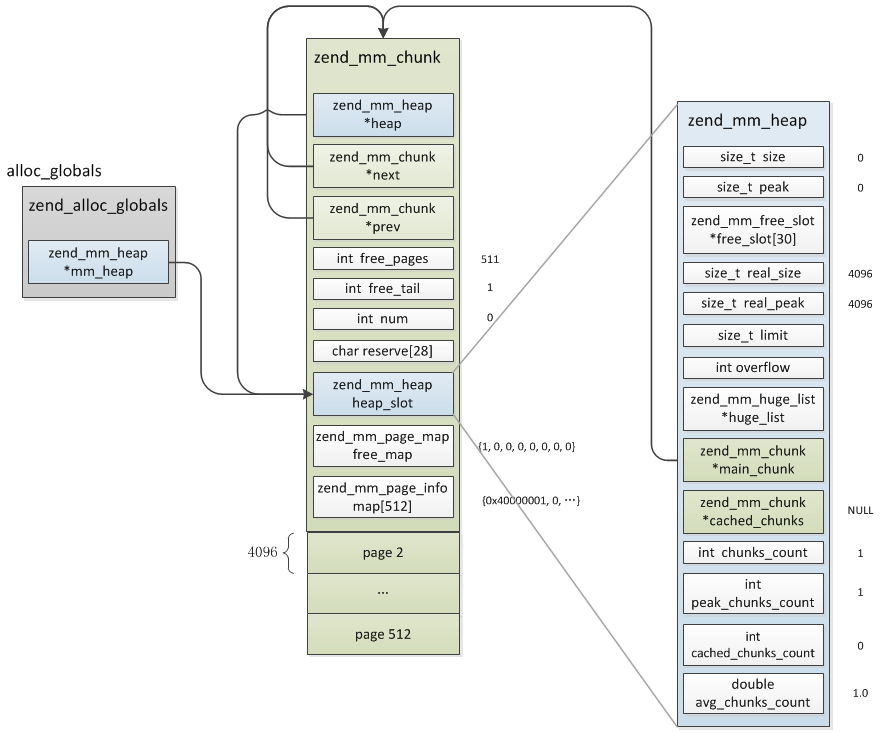
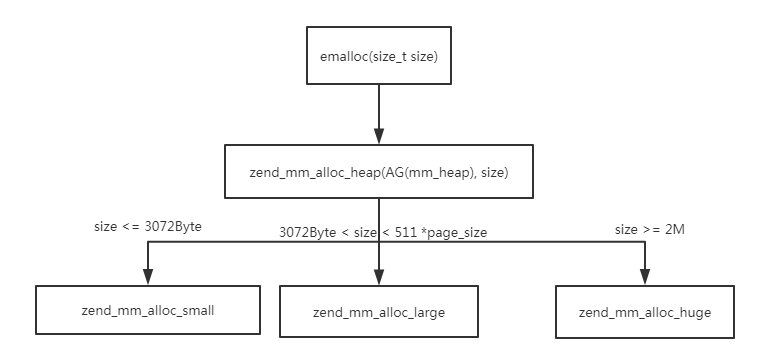
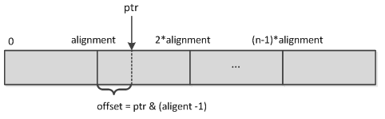
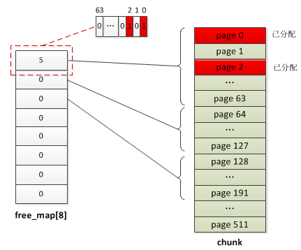
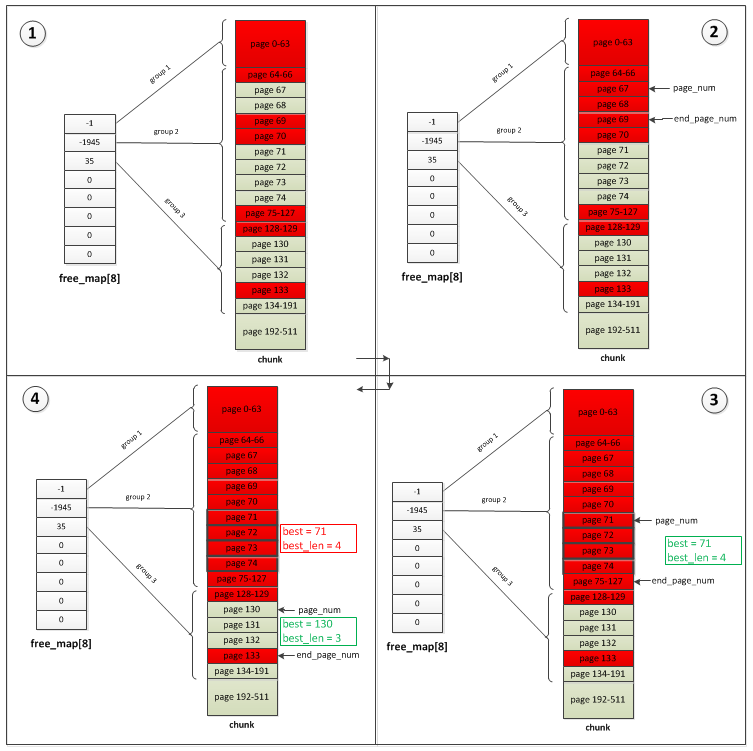
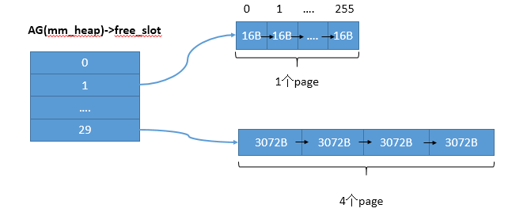
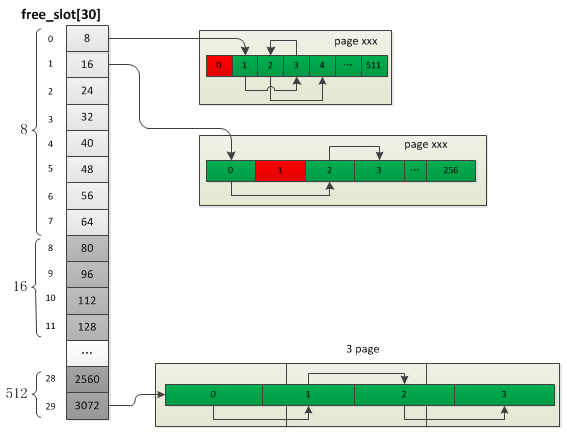

 PHP7 内存管理 （二） 
<!-- more -->

## 内存初始化
```
static zend_mm_heap *zend_mm_init(void)
{
    // 向系统申请2MB大小的chunk
    zend_mm_chunk *chunk = (zend_mm_chunk*)zend_mm_chunk_alloc_int(ZEND_MM_CHUNK_SIZE, ZEND_MM_CHUNK_SIZE);
    zend_mm_heap *heap;

    // heap结构实际是主chunk嵌入的一个结构，后面再分配chunk的heap_slot不再使用
    heap = &chunk->heap_slot;
    chunk->heap = heap;

    // 双向链表
    chunk->next = chunk;
    chunk->prev = chunk;

    // 剩余可用的page数
    chunk->free_pages = ZEND_MM_PAGES - ZEND_MM_FIRST_PAGE;
    chunk->free_tail = ZEND_MM_FIRST_PAGE;
    chunk->num = 0;

    //将第一个page的bit分配标识位设置为1 标识已经被分配 占用
    chunk->free_map[0] = (Z_L(1) << ZEND_MM_FIRST_PAGE) - 1;

    //第一个page的类型为ZEND_MM_IS_LRUN，即large内存
    chunk->map[0] = ZEND_MM_LRUN(ZEND_MM_FIRST_PAGE);

    // 指向主chunk
    heap->main_chunk = chunk; 

    .......

    // huge内存链表
    heap->huge_list = NULL; 
    return heap;
}
```

分配了主chunk，只有第一个chunk的heap会用到，后面分配的chunk不再用到heap，初始化完的结构如下图


## 内存分配
Zend内存分配器按照申请内存的大小有三种不同的实现


```
// 内存分配
ZEND_API void* ZEND_FASTCALL _emalloc(size_t size ZEND_FILE_LINE_DC ZEND_FILE_LINE_ORIG_DC)
{
    // zend_mm_alloc_heap 实现内存分配
    return zend_mm_alloc_heap(AG(mm_heap), size ZEND_FILE_LINE_RELAY_CC ZEND_FILE_LINE_ORIG_RELAY_CC);
}


// 内存分配
static zend_always_inline void *zend_mm_alloc_heap(zend_mm_heap *heap, size_t size ZEND_FILE_LINE_DC ZEND_FILE_LINE_ORIG_DC)
{
    void *ptr;
    if (size <= ZEND_MM_MAX_SMALL_SIZE) {
        // small size
        ptr = zend_mm_alloc_small(heap, size, ZEND_MM_SMALL_SIZE_TO_BIN(size) ZEND_FILE_LINE_RELAY_CC ZEND_FILE_LINE_ORIG_RELAY_CC);
    } else if (size <= ZEND_MM_MAX_LARGE_SIZE) {
        // large size
        ptr = zend_mm_alloc_large(heap, size ZEND_FILE_LINE_RELAY_CC ZEND_FILE_LINE_ORIG_RELAY_CC);
    } else {
        // huge size
        return zend_mm_alloc_huge(heap, size ZEND_FILE_LINE_RELAY_CC ZEND_FILE_LINE_ORIG_RELAY_CC);
    }
}
```

### Huge分配
Huge是指超过2MB大小内存的分配，实际分配时将对齐到n个chunk，分配完以后还有分配一个zend_mm_huge_list结构，这个结构用于管理所有的Huge内存。
```
static void *zend_mm_alloc_huge(zend_mm_heap *heap, size_t size ZEND_FILE_LINE_DC ZEND_FILE_LINE_ORIG_DC)
{
    // 按页大小重置实际要分配的内存
    size_t new_size = ZEND_MM_ALIGNED_SIZE_EX(size, REAL_PAGE_SIZE);

#if ZEND_MM_LIMIT
    // 如果有内存使用限制则check是否已达上限，达到的话进行zend_mm_gc清理后再检查
#endif
    
    // 分配chunk
    ptr = zend_mm_chunk_alloc(heap, new_size, ZEND_MM_CHUNK_SIZE);
    if (UNEXPECTED(ptr == NULL)) {
        /* insufficient memory */
        if (zend_mm_gc(heap) &&
            (ptr = zend_mm_chunk_alloc(heap, new_size, ZEND_MM_CHUNK_SIZE)) != NULL) {
            /* pass */
        } else {
            //申请失败
            zend_mm_safe_error(heap, "Out of memory");
            return NULL;
        }
    }

    // 将申请的内存通过 zend_mm_add_huge_block 插入到链表中
    zend_mm_add_huge_block(heap, ptr, new_size ZEND_FILE_LINE_RELAY_CC ZEND_FILE_LINE_ORIG_RELAY_CC);

    return ptr;
}
```

- 分配chunk是向ZendMM系统申请的唯一粒度，也是Large、Small内存分配的基础。
- 内存地址对齐到chunk的大小2MB，分配chunk地址都是ZEND_MM_CHUNK_SIZE的整数倍。
- 系统返回的地址是随机的，内存池要自己移动到对齐的位置上。


zend_mm_chunk_alloc_int
```
static void *zend_mm_chunk_alloc(zend_mm_heap *heap, size_t size, size_t alignment)
{
    return zend_mm_chunk_alloc_int(size, alignment);
}


static void *zend_mm_chunk_alloc_int(size_t size, size_t alignment)
{
    // 向系统申请size大小的内存
    void *ptr = zend_mm_mmap(size);

    if (ptr == NULL) {
        return NULL;
    } else if (ZEND_MM_ALIGNED_OFFSET(ptr, alignment) == 0) {
        // 判断申请的内存是否为alignment的整数倍 如果是，就不需要处理了
        return ptr;
    } else {
        // 申请的内存不是按照alignment对齐的
        size_t offset;

        // 释放申请的内存
        zend_mm_munmap(ptr, size);
        //重新申请一块内存，这里会多申请一块内存，用于截取到alignment的整数倍，可以忽略REAL_PAGE_SIZE
        ptr = zend_mm_mmap(size + alignment - REAL_PAGE_SIZE);

        // offset 为ptr距离上一个alignment对齐内存位置的大小
        offset = ZEND_MM_ALIGNED_OFFSET(ptr, alignment);
        if (offset != 0) {
            // 该offset为alignment的整数倍
            offset = alignment - offset;
            // 释放多于的内存
            zend_mm_munmap(ptr, offset);

            // 偏移ptr， 对齐到alignment
            ptr = (char*)ptr + offset;
            alignment -= offset;
        }
        if (alignment > REAL_PAGE_SIZE) {
            zend_mm_munmap((char*)ptr + size, alignment - REAL_PAGE_SIZE);
        }

        return ptr;
    }
```


宏ZEND_MM_ALIGNED_OFFSET 计算按alignment对齐的内存地址距离上一个alignment整数倍内存地址的大小 alignment必须为2的n次方，比如一段n*alignment大小的内存，ptr为其中一个位置，那么就可以通过位运算计算得到ptr所属内存块的offset
```
#define ZEND_MM_ALIGNED_OFFSET(size, alignment) \
    (((size_t)(size)) & ((alignment) - 1))
```



容易理解的代码`offset = ptr - int取整(ptr/alignment)*alignment`

### large 分配
- 申请的内存 3072Byte < size < 2044KB时，内存池会选择在chunk上查找对应数量的page返回。
- Large内存申请的粒度是page。

```
static zend_always_inline void *zend_mm_alloc_large(zend_mm_heap *heap, size_t size ZEND_FILE_LINE_DC ZEND_FILE_LINE_ORIG_DC)
{
    // 根据size大小 计算需要分配多少个page
    int pages_count = (int)ZEND_MM_SIZE_TO_NUM(size, ZEND_MM_PAGE_SIZE);

    // 分配page_count个page
    void *ptr = zend_mm_alloc_pages(heap, pages_count ZEND_FILE_LINE_RELAY_CC ZEND_FILE_LINE_ORIG_RELAY_CC);
    return ptr; 
}


// 宏 根据size大小 计算需要分配多少个page
// 假设size = 8k1Byte alignment=4K 则 8K1Byte + 4K -1Byte = 12K / 4K = 3个page
// 假设size = 8k alignment=4K 则 8K + 4K -1Byte = 11K 1023Byte / 4K = 2个page
#define ZEND_MM_SIZE_TO_NUM(size, alignment) \
    (((size_t)(size) + ((alignment) - 1)) / (alignment))

```

`zend_mm_alloc_pages`函数简要概述如下
1. 从第一个chunk开始查找当前chunk下是否有pages_count个连续可用的page，有的话就停止查找。
2. 没有的话则接着查找下一个chunk，如果直到最后一个chunk也没找到则重新分配一个新的chunk并插入chunk链表。

如何判断是否有连续的page，是通过chunk结构中的free_map。free_map实际就是：zend_ulong free_map[16/8]，以 free_map[8] 为例，数组中的8个数字分别表示：0-63、64-127、128-191、192-255、256-319、320-383、384-447、448-511 page的分配与否，比如当前chunk的page 0、page 2已经分配，则:free_map[0] = 5

```
//5:
00000000 00000000 00000000 00000000 00000000 00000000 00000000 00000101
```



```
static void *zend_mm_alloc_pages(zend_mm_heap *heap, int pages_count ZEND_FILE_LINE_DC ZEND_FILE_LINE_ORIG_DC)
{
    zend_mm_chunk *chunk = heap->main_chunk;
    int page_num, len;

    //从第一个chunk开始查找可用page
    while (1) {
        //当前chunk剩余page总数已不够
        if (UNEXPECTED(chunk->free_pages < pages_count)) {
            goto not_found;
        }else{ //查找当前chunk是否有pages_count个连续可用的page
            int best = -1; //已找到可用page起始页
            int best_len = ZEND_MM_PAGES; //已找到chunk的page间隙大小，这个值尽可能接近page_count
            int free_tail = chunk->free_tail;
            zend_mm_bitset *bitset = chunk->free_map;
            zend_mm_bitset tmp = *(bitset++); // zend_mm_bitset tmp = *bitset;  bitset++ 这里是复制出的，不会影响free_map
            int i = 0; 

            //下面就是查找最优page的过程,稍后详细分析
            //find best page
        }

not_found:
        if (chunk->next == heap->main_chunk) { //是否已到最后一个chunk
get_chunk:
            ...
        }else{
            chunk = chunk->next;
        }
    }

found: //找到可用page，page编号为page_num至(page_num + pages_count)
    /* mark run as allocated */
    chunk->free_pages -= pages_count;
    zend_mm_bitset_set_range(chunk->free_map, page_num, pages_count); //将page_num至(page_num + pages_count)page的bit标识位设置为已分配
    chunk->map[page_num] = ZEND_MM_LRUN(pages_count); //map为两个值的组合值，首先表示当前page属于哪种类型，其次表示包含的page页数
    if (page_num == chunk->free_tail) {
        chunk->free_tail = page_num + pages_count;
    }
    return ZEND_MM_PAGE_ADDR(chunk, page_num);
}
```

最优page的检索过程如下 ：
1. 首先从第一个page分组(page 0-63)开始检查，如果当前分组无可用page(即free_map[x] = -1)则进入下一分组，直到当前分组有空闲page，然后进入第二步
2. 当前分组有可用page，首先找到第一个可用page的位置，记作page_num，接着从page_num开始向下找第一个已分配page的位置，记作end_page_num，这个地方需要注意，如果当前分组剩下的page都是可用的则会进入下一分组接着搜索，直到找到为止，这里还会借助chunk->free_tail避免无谓的查找到最后分组
3. 根据上一步找到的page_num、end_page_num可计算得到当前可用内存块大小为len个page，然后与申请的page页数(page_count)比较
    3.1 如果len=page_count则表示找到的内存块符合申请条件且非常完美，直接从page_num开始分配page_count个page
    3.2 如果len>page_count则表示找到的内存块符合条件且空间很充裕，暂且记录下len、page_num，然后继续向下搜索，如果有更合适的则用更合适的替代
    3.3  如果len<page_count则表示当前内存块不够申请的大小，不符合条件，然后将这块空间的全部page设置为已分配(这样下一轮检索就不会再次找到它了)，接着从第一步重新检索

下面从一个例子具体看下，以64bit整形为例，假如当前page分配情况如下图-(1)(group1全部已分配;group2中page 67-68、71-74未分配，其余都已分配;group3中除page 128-129、133已分配外其余都未分配)，现在要申请3个page：


检索过程：
    a.首先会直接跳过group1，直接到group2检索
    b.在group2中找到第一个可用page位置：67，然后向下找第一个不可用page位置：69，找到的可用内存块长度为2，小于3，表示此内存块不可用，这时会将page 67-68标识为已分配，图-(2)
    c.接着再次在group2中查找到第一个可用page位置：71,然后向下找到第一个不可用page位置：75,内存块长度为4，大于3，表示找到一个符合的位置，虽然已经找到可用内存块但并不"完美"，先将这个并不完美的page_num及len保存到best、best_len，如果后面没有比它更完美的就用它了，然后将page 71-74标示为已分配，图-(3)
    d.再次检索，发现group2已无可用page，进入group3，找到可用内存位置：page 130-132，大小比c中找到的合适，所以最终返回的page就是130-132，图-(4)

page分配完成后会将free_map对应整数的bit位从page_num至(page_num+page_count)置为1，同时将chunk->map[page_num]置为ZEND_MM_LRUN(pages_count)，表示page_num至(page_num+page_count)这些page是被Large分配占用的。


### small 分配
- 首先检查申请规格的内存是否已经分配，如果没有分配或者分配的已经用完了，则申请响应页数的page。
- 申请到page以后按固定大小将page切割为slot，slot之间构成单链表。保存在AG(mm_heap)->free_slot

例如16byte、3072byte大小的slot，将分别申请1个、3个page，然后分割为256个16byte的slot，4个3072byte的slot。




详细的分配过程
```
static zend_always_inline void *zend_mm_alloc_small(zend_mm_heap *heap, size_t size, int bin_num ZEND_FILE_LINE_DC ZEND_FILE_LINE_ORIG_DC)
{
    if (EXPECTED(heap->free_slot[bin_num] != NULL)) {
        // 有可用的slot
        zend_mm_free_slot *p = heap->free_slot[bin_num];
        heap->free_slot[bin_num] = p->next_free_slot;
        return (void*)p;
    } else {
        // 新分配slot
        return zend_mm_alloc_small_slow(heap, bin_num ZEND_FILE_LINE_RELAY_CC ZEND_FILE_LINE_ORIG_RELAY_CC);
    }    
}
```

`zend_mm_alloc_small_slow`分配slot操作
```
// bin_num 为 free_slot 数组下
static zend_never_inline void *zend_mm_alloc_small_slow(zend_mm_heap *heap, uint32_t bin_num ZEND_FILE_LINE_DC ZEND_FILE_LINE_ORIG_DC)
{
    zend_mm_chunk *chunk;
    int page_num;
    zend_mm_bin *bin;
    zend_mm_free_slot *p, *end;


    // 分配固定数量的page
    bin = (zend_mm_bin*)zend_mm_alloc_pages(heap, bin_pages[bin_num] ZEND_FILE_LINE_RELAY_CC ZEND_FILE_LINE_ORIG_RELAY_CC);

    if (UNEXPECTED(bin == NULL)) {
        /* insufficient memory */
        return NULL;
    }

    chunk = (zend_mm_chunk*)ZEND_MM_ALIGNED_BASE(bin, ZEND_MM_CHUNK_SIZE);
    page_num = ZEND_MM_ALIGNED_OFFSET(bin, ZEND_MM_CHUNK_SIZE) / ZEND_MM_PAGE_SIZE;
    // 设置各页的分配类型
    chunk->map[page_num] = ZEND_MM_SRUN(bin_num);
    if (bin_pages[bin_num] > 1) {
        uint32_t i = 1;
        
        do {
            chunk->map[page_num+i] = ZEND_MM_NRUN(bin_num, i);
            i++;
        } while (i < bin_pages[bin_num]);
    }

    /* create a linked list of elements from 1 to last 创建slot链表 */
    end = (zend_mm_free_slot*)((char*)bin + (bin_data_size[bin_num] * (bin_elements[bin_num] - 1)));
    // heap->free_slot[bin_num] 指向第2个slot，第1个为当前申请到的slot
    heap->free_slot[bin_num] = p = (zend_mm_free_slot*)((char*)bin + bin_data_size[bin_num]);
    do {
        p->next_free_slot = (zend_mm_free_slot*)((char*)p + bin_data_size[bin_num]);
        p = (zend_mm_free_slot*)((char*)p + bin_data_size[bin_num]);
    } while (p != end);

    /* terminate list using NULL */
    p->next_free_slot = NULL;

    /* return first element  返回slot链表的第一个元素 */
    return (char*)bin;
}
```

参考资料：https://github.com/pangudashu/php7-internal/blob/master/5/zend_alloc.md
