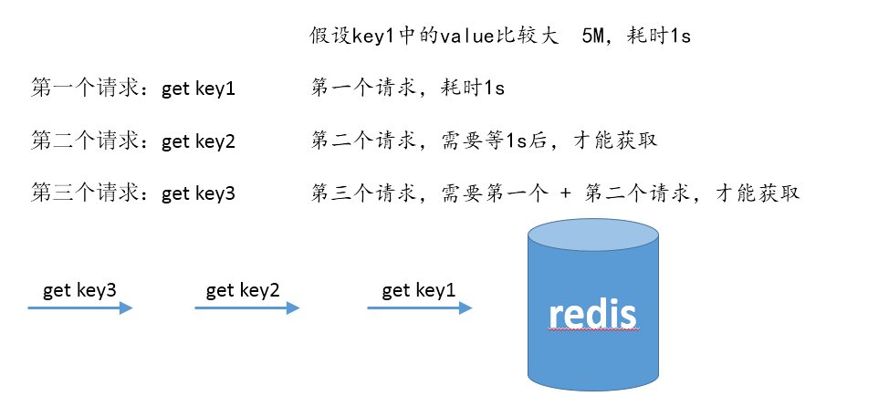

## 大key
> 大key，并不是指redis的key很大，而是指所对应的value值很大

**背景： **     由于value很大，导致一次get的时间很长，又由于redis是单进程，所以后面的命令会阻塞，请求会超时。

**图解：**



**解决方案：** 拆大key，以hash存储为例

```
//将大key映射为多个key来存储该hash。

$redis->hset($hash, $key, $value);

function myHset($hash, $key, $value) {
    $number = crc32($hash);
    $hashKey = $hash . ":shard:". $number % 1024;
    return $redis->hset($hashKey, $key, $value);
}
```

## redis分布式锁（简单的实现，满足大部分需要）
> 分布式锁的应用场景举例：两个请求访问decr库存

```
/**
 * @brief   lock
 * @param   $strKey
 * @param   $intTimeout second
 * @return  bool
 */
public function lock($strKey, $intTimeout = 10) {
    $this->strLockVal = mt_rand();
    // nx 只有键key不存在的时候才会设置key的值
    return $this->redis->set($strKey, $this->strLockVal, array('nx', 'ex' => $intTimeout));
}

/**
 * @brief   unlock
 * @param   $strKey
 * @return  void
 */
public function unlock($strKey) {
    $strRes = $this->redis->get($strKey);
    if ($strRes == $this->strLockVal) {
        $this->redis->del($strKey);
    }
}
```

## mget？mset？
> 一次set、get数据不要太多，否则一次获取会导致redis阻塞。

```
//解决方法 500一份 mset
$arrSetRedisData = array_chunk($arrData, 500, true);
foreach ($arrSetRedisData as $arrChunk) {
    $this->redis->set($arrChunk);
}
```
