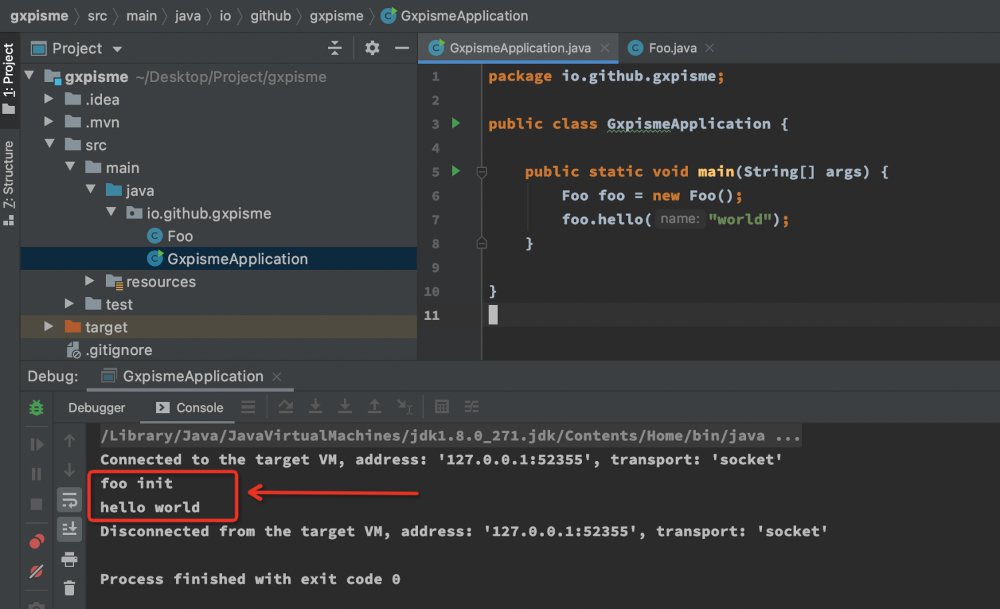
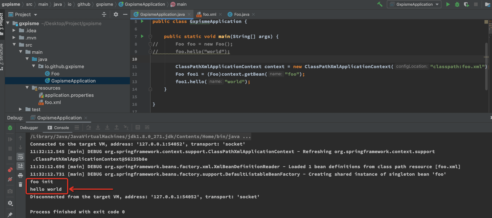
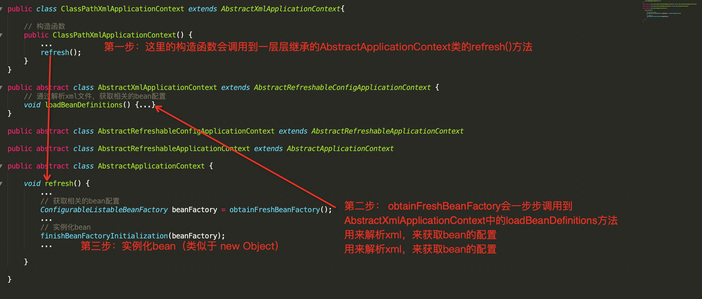
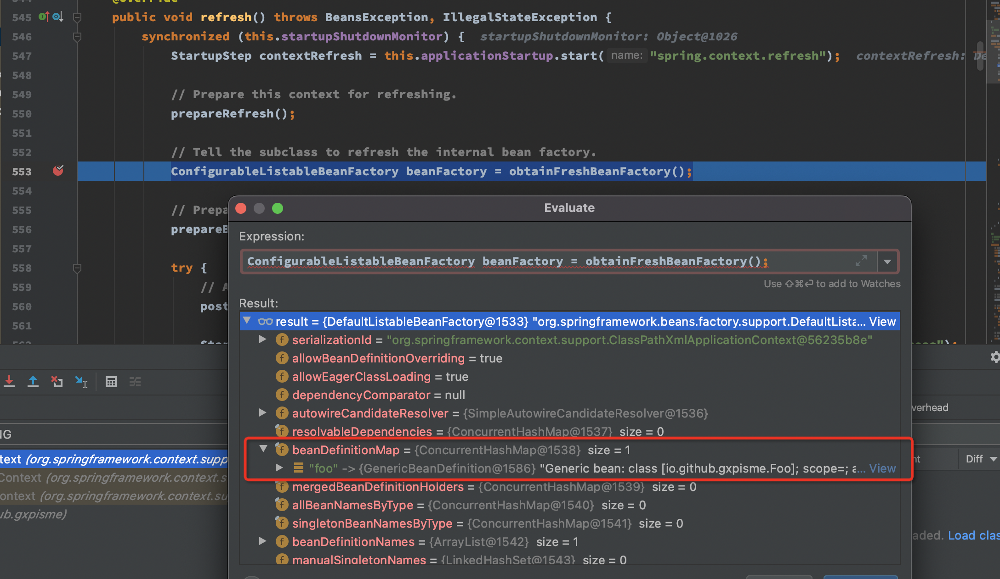
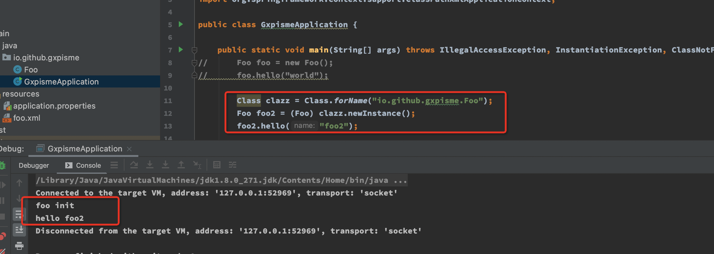
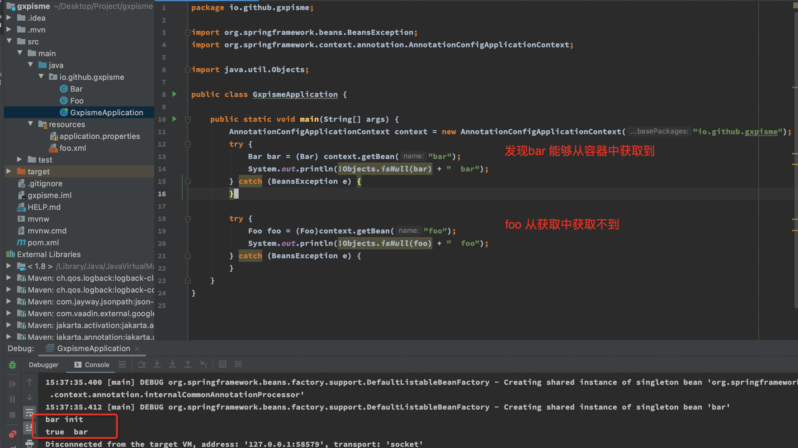
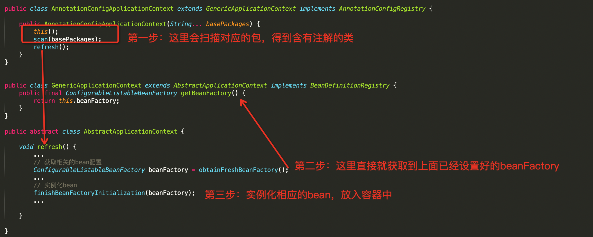
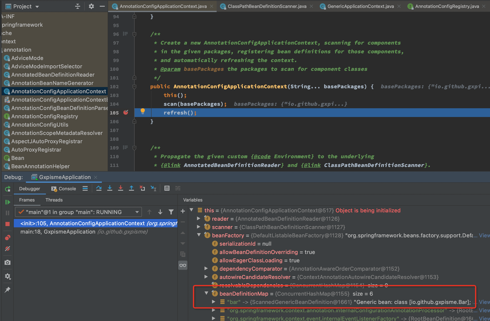
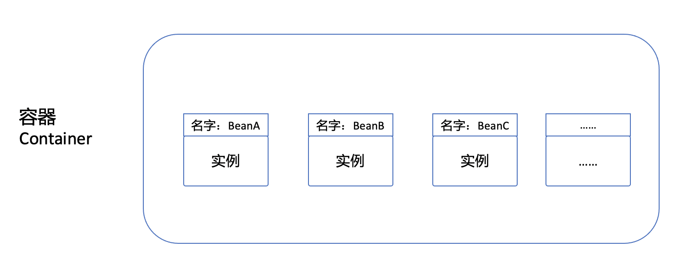

# Spring 注册bean

> 先来说下整体的：主要就是通过解析xml或扫描注解获取到bean的配置，然后通过反射生成bean实例放入容器中

## 如果没有bean的情况是什么样的？

在[https://start.spring.io/](https://start.spring.io/) 直接下载一个jar包，定义一个类Foo

```java
public class Foo {
    public Foo() {
        System.out.println("foo init");
    }

    public void hello(String name) {
        System.out.println("hello " + name);
    }
}
```

启动文件
```java
public class GxpismeApplication {

	public static void main(String[] args) {
        // 直接new即可
		Foo foo = new Foo();
		foo.hello("world");
	}

}
```

整体如下图所示<br />

总结下：<br />
    **按照一般的写法来就是我需要哪个类，就直接new出实例，然后进行调用即可。我之前是写php的，php中都是这样来用的。这个时候控制权在编写代码的人，在后面如果使用bean的话，控制权就交给了容器，可以体会下控制反转的感觉。**
<a name="qz5td"></a>

## [XML方式] 用Bean的情况是什么样的？

还是采用上面的代码。我们再定义一个foo.xml文件

```java
<?xml version="1.0" encoding="UTF-8" ?>
<beans xmlns="http://www.springframework.org/schema/beans"
       xmlns:xsi="http://www.w3.org/2001/XMLSchema-instance"
       xsi:schemaLocation="
        http://www.springframework.org/schema/beans http://www.springframework.org/schema/beans/spring-beans.xsd">

    <!-- bean definitions here -->

    <bean id="foo" class="io.github.gxpisme.Foo"></bean>
</beans>
```
启动文件修改为如下
```java
public class GxpismeApplication {

	public static void main(String[] args) {
//		Foo foo = new Foo();
//		foo.hello("world");

		ClassPathXmlApplicationContext context = new ClassPathXmlApplicationContext("classpath:foo.xml");
		Foo foo1 = (Foo)context.getBean("foo");
		foo1.hello("world");
	}

}
```
整体如下图所示<br />

发现Foo会被执行，并且直接从context中通过`foo`这个名字就能获取到Foo的实例，也能执行方法`hello()`方法。

总结：<br />`new ClassPathXmlApplicationContext("classpath:foo.xml");` 就会解析foo.xml文件，然后生成foo的实例。foo实例放到**容器**中，然后直接从**容器**中就行获取就能得到这个foo实例，就可以执行相应的方法等。
<a name="d6jT3"></a>

### bean是如何注册到容器中的？

> 如果是自己做的话，肯定是解析xml文件，然后生成实例。
> 伪代码：
> obj = paserXML(); // 解析xml文件
> obj.newInstance(); // 生产对象实例


其实代码`new ClassPathXmlApplicationContext("classpath:foo.xml");`也正是这么做的。
<a name="fXzAj"></a>
#### 类继承关系 ClassPathXmlApplicationContext


上图所示：首先将类的继承关系一步步罗列下来，ClassPathXmlApplicationContext一层层继承。
<a name="qwLNW"></a>
#### 第一步
ClassPathXmlApplicationContext的构造函数会调用到最基础的抽象类AbstractApplicationContext中的refresh方法，refresh方法是**核心**。
<a name="IH6AC"></a>
#### 第二步
主要目的是要获取到bean的相关配置，我们把bean配置都放在了xml文件中，所以这一步要解析出bean的相关配置，便于后面的实例化。<br />**看下图调试情况：**<br />打了断点，可以看出下图553行`ConfigurableListableBeanFactory beanFactory = obtainFreshBeanFactory();`

已经从`beanFactory`中的`beanDefinitionMap`中获取到自己定义的`foo`，这也就找到了xml的相关配置。<br />

<a name="W9PkU"></a>
#### 第三步

> 获取到bean的相关配置，就可以进行实例化了，利用java的反射就能实例化这个对象。


`finishBeanFactoryInitialization(beanFactory);`

相当于实现下面的代码。

```java
Class clazz = Class.forName("io.github.gxpisme.Foo");
Foo foo2 = (Foo) clazz.newInstance();
foo2.hello("foo2");
```


<a name="Gh4nl"></a>
## [注解方式] 用Bean的情况是什么样的？
最开始的Foo类，**没有注解**
```java
public class Foo {
    public Foo() {
        System.out.println("foo init");
    }

    public void hello(String name) {
        System.out.println("hello " + name);
    }
}

```
新定义一个Bar类，添加了`**@Component**`注解
```java
@Component
public class Bar {
    public Bar() {
        System.out.println("bar init");
    }

    public void helloBar(String name) {
        System.out.println("hello " + name);
    }
}
```
启动文件修改为如下，指定扫描的包为“io.github.gxpisme”
```java
public class GxpismeApplication {

	public static void main(String[] args) {
        // 这里重要的是扫描的包为“io.github.gxpisme”
		AnnotationConfigApplicationContext context = new AnnotationConfigApplicationContext("io.github.gxpisme");
		try {
			Bar bar = (Bar) context.getBean("bar");
			System.out.println(!Objects.isNull(bar) + "  bar");
		} catch (BeansException e) {
		}

		try {
			Foo foo = (Foo)context.getBean("foo");
			System.out.println(!Objects.isNull(foo) + "  foo");
		} catch (BeansException e) {
		}
	}
}
```
整体如下图所示<br />


`AnnotationConfigApplicationContext`这个类会扫描“io.github.gxpisme”包下含有注解的类。Bar有注解`@Component`，所以就会被扫描到，而Foo类上面并没有注解，并不会扫描到。扫描到的Bar类就会被实例化到容器中，然后就可以从容器中获取到。<br />发现Bar会被执行，并且直接从context中通过bar这个名字就能获取到Bar的实例，也能执行方法`hello()`方法。但是Foo不会被执行。

总结：<br />`new AnnotationConfigApplicationContext("io.github.gxpisme");` 就会扫描"io.github.gxpisme"包下含有注解的类。得到Bar类，然后对Bar进行实例化，把Bar实例放到容器中。然后直接从**容器**中就行获取就能得到这个bar实例，就可以执行相应的方法等。
<a name="GmtpU"></a>
### bean是如何注册到容器中的？
> 如果是自己做的话，肯定是扫描包下的类文件，含有注解的话，就对含有注解的类，然后生成实例。
> 伪代码：
> obj = scanPackage(); // 扫描类文件
> obj.newInstance(); // 生产对象实例


其实代码`new AnnotationConfigApplicationContext("io.github.gxpisme");`也正是这么做的。
<a name="jT3zO"></a>
#### 类继承关系 AnnotationConfigApplicationContext


上图所示：首先将类的继承关系一步步罗列下来，AnnotationConfigApplicationContext一层层继承。
<a name="KJSlo"></a>
#### 第一步
AnnotationConfigApplicationContext的构造函数会调用到最基础的抽象类AbstractApplicationContext中的refresh方法，refresh方法是**核心**。<br />`scan(basePackages);` 这个就把扫描含有注解的类，放到`beanFactory`的`beanDefinitionMap`中了。<br />

<a name="BW92o"></a>
#### 第二步
`ConfigurableListableBeanFactory beanFactory = obtainFreshBeanFactory();`<br />这个就是直接从AnnotationConfigApplicationContext的父类GenericApplicationContext获取到beanFactory，这个beanFactory已经在上一步设置好了。

<a name="uoF7S"></a>
#### 第三步
> 获取到bean的相关配置，就可以进行实例化了，利用java的反射就能实例化这个对象。

`finishBeanFactoryInitialization(beanFactory);`
<a name="XTc2O"></a>

## 容器与Bean的关系
通过xml或注解的方式生成bean，然而这些bean生成了之后都放到哪里了呢？放在了一个大的容器当中。当用的时候直接从容器中获取就可以。bean都有一个全局唯一的名字。可以把容器理解为是一个键值对的HashMap。<br />



